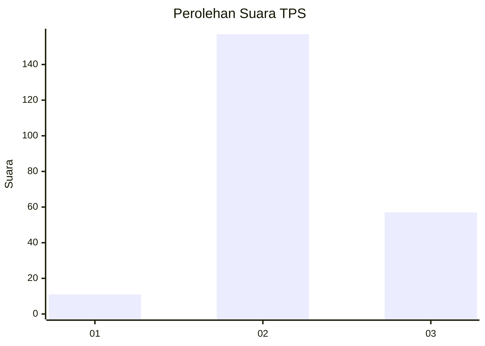
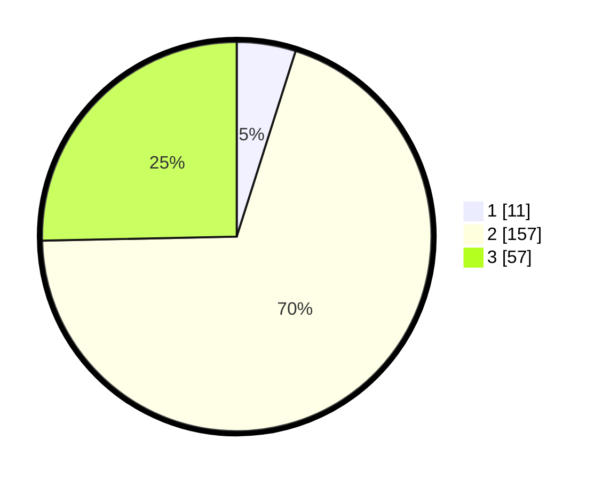

# Hasil

## Grafik

## Tabel

| No. | Nama Paslon    | Suara | Suara (raw) | Persentase |
|:--- |:-------------- | -----:| -----------:| ----------:|
| 1   | ANIES MUHAIMIN | 11    | [11][p-1]   | 4,89       |
| 2   | PRABOWO GIBRAN | 157   | [157][p-2]  | 69,78      |
| 3   | GANJAR MAHFUD  | 57    | [57][p-3]   | 25,33      |

[p-1]: https://github.com/gigit-pemilu/pemilu-2024/blob/main/pilpres/hitung-suara/sub/35-jawa-timur/sub/04-tulungagung/sub/11-ngunut/sub/2011-ngunut/sub/013-tps/sub/paslon-1.txt
[p-2]: https://github.com/gigit-pemilu/pemilu-2024/blob/main/pilpres/hitung-suara/sub/35-jawa-timur/sub/04-tulungagung/sub/11-ngunut/sub/2011-ngunut/sub/013-tps/sub/paslon-2.txt
[p-3]: https://github.com/gigit-pemilu/pemilu-2024/blob/main/pilpres/hitung-suara/sub/35-jawa-timur/sub/04-tulungagung/sub/11-ngunut/sub/2011-ngunut/sub/013-tps/sub/paslon-3.txt

## Foto C Plano

https://sirekap-obj-formc.kpu.go.id/7b67/pemilu/ppwp/35/04/11/20/11/3504112011013-20240217-224453--3da87bc5-f2ef-454c-8d85-2fa82c8e100e.jpg

https://sirekap-obj-formc.kpu.go.id/7b67/pemilu/ppwp/35/04/11/20/11/3504112011013-20240219-195656--cd7a0283-4faa-47a3-af0b-1112e5841894.jpg

https://sirekap-obj-formc.kpu.go.id/7b67/pemilu/ppwp/35/04/11/20/11/3504112011013-20240219-195542--ef04c4c4-cd4d-40dc-ae10-a2e990f6ece7.jpg

## Metadata

| Key        | Value               |
| ---------- | ------------------- |
| Time Stamp | 2024-02-24 22:31:28 |

