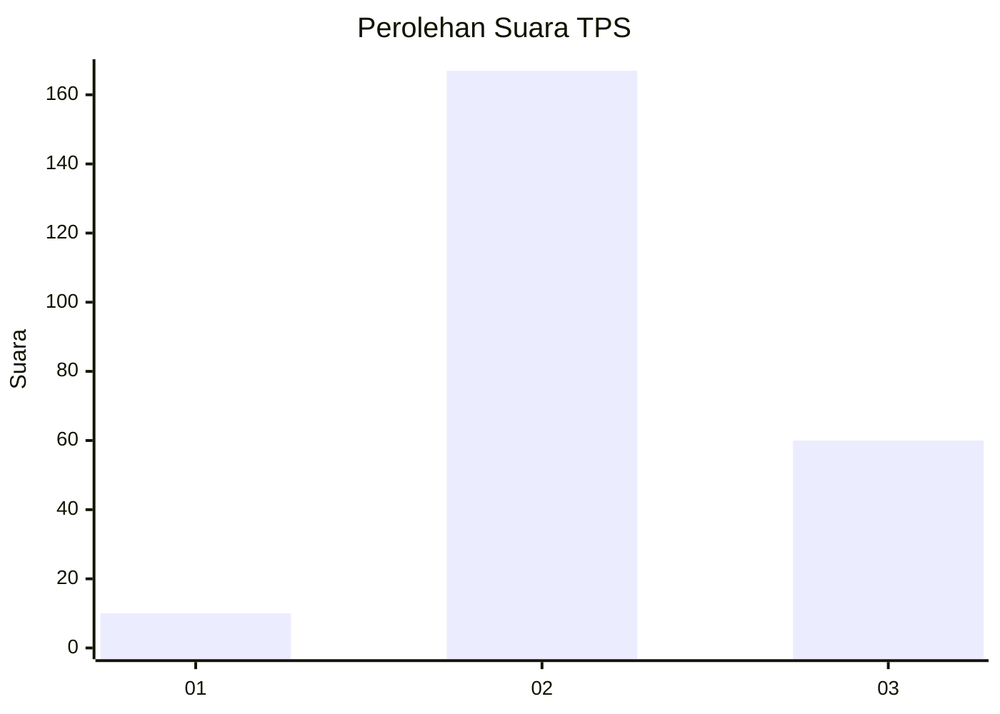
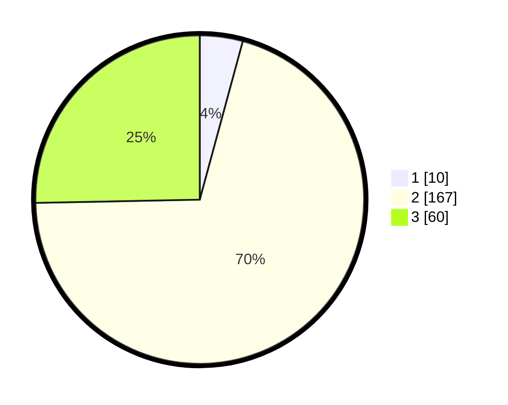

# Hasil

## Grafik

## Tabel

| No. | Nama Paslon    | Suara | Suara (raw) | Persentase |
|:--- |:-------------- | -----:| -----------:| ----------:|
| 1   | ANIES MUHAIMIN | 10    | [10][p-1]   | 4,22       |
| 2   | PRABOWO GIBRAN | 167   | [167][p-2]  | 70,46      |
| 3   | GANJAR MAHFUD  | 60    | [60][p-3]   | 25,32      |

[p-1]: https://github.com/gigit-pemilu/pemilu-2024/blob/main/pilpres/hitung-suara/sub/35-jawa-timur/sub/04-tulungagung/sub/11-ngunut/sub/2017-pulosari/sub/002-tps/sub/paslon-1.txt
[p-2]: https://github.com/gigit-pemilu/pemilu-2024/blob/main/pilpres/hitung-suara/sub/35-jawa-timur/sub/04-tulungagung/sub/11-ngunut/sub/2017-pulosari/sub/002-tps/sub/paslon-2.txt
[p-3]: https://github.com/gigit-pemilu/pemilu-2024/blob/main/pilpres/hitung-suara/sub/35-jawa-timur/sub/04-tulungagung/sub/11-ngunut/sub/2017-pulosari/sub/002-tps/sub/paslon-3.txt

## Foto C Plano

https://sirekap-obj-formc.kpu.go.id/7489/pemilu/ppwp/35/04/11/20/17/3504112017002-20240216-171340--e43b67fa-9b81-4028-ad90-140a8b2e3067.jpg

https://sirekap-obj-formc.kpu.go.id/7489/pemilu/ppwp/35/04/11/20/17/3504112017002-20240215-180533--cb301c54-fa70-48e2-a0ef-fa82f02e0bba.jpg

https://sirekap-obj-formc.kpu.go.id/7489/pemilu/ppwp/35/04/11/20/17/3504112017002-20240217-122910--84747cf9-4db8-4345-a01b-d091a9d92e3b.jpg

## Metadata

| Key        | Value               |
| ---------- | ------------------- |
| Time Stamp | 2024-02-17 13:37:34 |

