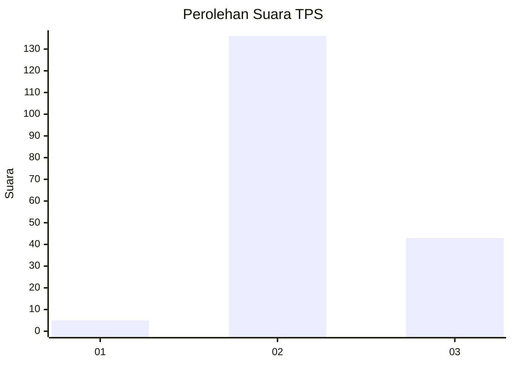
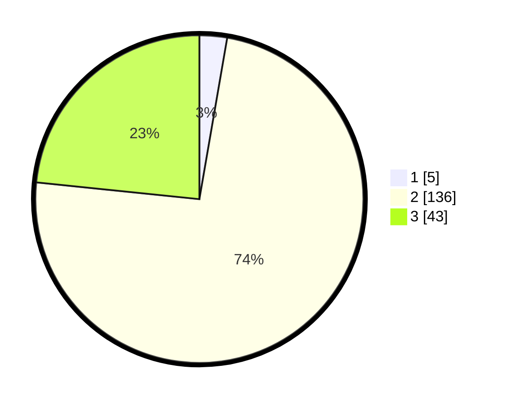

# Hasil

## Grafik

## Tabel

| No. | Nama Paslon    | Suara | Suara (raw) | Persentase |
|:--- |:-------------- | -----:| -----------:| ----------:|
| 1   | ANIES MUHAIMIN | 5     | [5][p-1]    | 2,72       |
| 2   | PRABOWO GIBRAN | 136   | [136][p-2]  | 73,91      |
| 3   | GANJAR MAHFUD  | 43    | [43][p-3]   | 23,37      |

[p-1]: https://github.com/gigit-pemilu/pemilu-2024-35-jawa-timur/blob/main/pilpres/hitung-suara/sub/35-jawa-timur/sub/04-tulungagung/sub/11-ngunut/sub/2018-pulotondo/sub/011-tps/sub/paslon-1.txt
[p-2]: https://github.com/gigit-pemilu/pemilu-2024-35-jawa-timur/blob/main/pilpres/hitung-suara/sub/35-jawa-timur/sub/04-tulungagung/sub/11-ngunut/sub/2018-pulotondo/sub/011-tps/sub/paslon-2.txt
[p-3]: https://github.com/gigit-pemilu/pemilu-2024-35-jawa-timur/blob/main/pilpres/hitung-suara/sub/35-jawa-timur/sub/04-tulungagung/sub/11-ngunut/sub/2018-pulotondo/sub/011-tps/sub/paslon-3.txt

## Foto C Plano

https://sirekap-obj-formc.kpu.go.id/18eb/pemilu/ppwp/35/04/11/20/18/3504112018011-20240215-020214--77e90e3a-83bd-4c8b-b07d-d5b7c64f7667.jpg

https://sirekap-obj-formc.kpu.go.id/18eb/pemilu/ppwp/35/04/11/20/18/3504112018011-20240216-122155--044ee619-938a-4c9e-90d2-929c85fbbbaf.jpg

https://sirekap-obj-formc.kpu.go.id/18eb/pemilu/ppwp/35/04/11/20/18/3504112018011-20240215-021823--c31bf95b-dcb9-4d0b-b8cf-48637961d62d.jpg

## Metadata

| Key        | Value               |
| ---------- | ------------------- |
| Time Stamp | 2024-02-16 22:01:00 |

