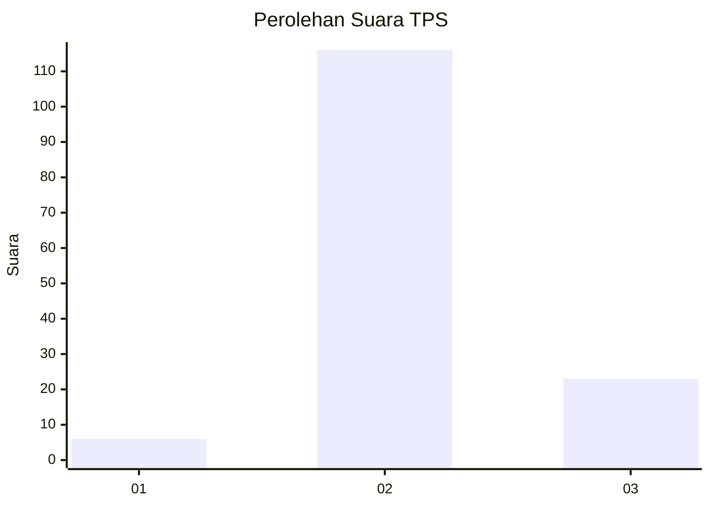
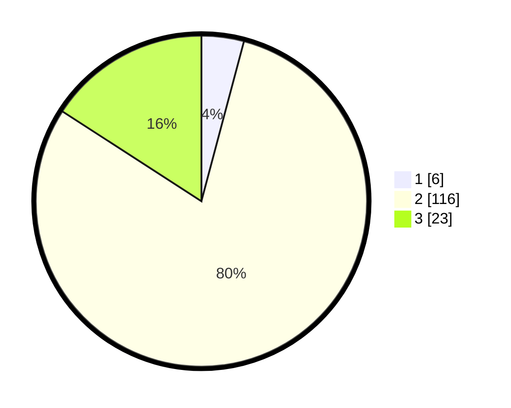

# Hasil

## Grafik

## Tabel

| No. | Nama Paslon    | Suara | Suara (raw) | Persentase |
|:--- |:-------------- | -----:| -----------:| ----------:|
| 1   | ANIES MUHAIMIN | 6     | [6][p-1]    | 4,14       |
| 2   | PRABOWO GIBRAN | 116   | [116][p-2]  | 80,00      |
| 3   | GANJAR MAHFUD  | 23    | [23][p-3]   | 15,86      |

[p-1]: https://github.com/gigit-pemilu/pemilu-2024/blob/main/pilpres/hitung-suara/sub/35-jawa-timur/sub/04-tulungagung/sub/12-pucanglaban/sub/2001-pucanglaban/sub/003-tps/sub/paslon-1.txt
[p-2]: https://github.com/gigit-pemilu/pemilu-2024/blob/main/pilpres/hitung-suara/sub/35-jawa-timur/sub/04-tulungagung/sub/12-pucanglaban/sub/2001-pucanglaban/sub/003-tps/sub/paslon-2.txt
[p-3]: https://github.com/gigit-pemilu/pemilu-2024/blob/main/pilpres/hitung-suara/sub/35-jawa-timur/sub/04-tulungagung/sub/12-pucanglaban/sub/2001-pucanglaban/sub/003-tps/sub/paslon-3.txt

## Foto C Plano

https://sirekap-obj-formc.kpu.go.id/d99e/pemilu/ppwp/35/04/12/20/01/3504122001003-20240215-214101--d481e7f7-1989-4002-a33d-693d2b81acbc.jpg

https://sirekap-obj-formc.kpu.go.id/d99e/pemilu/ppwp/35/04/12/20/01/3504122001003-20240214-191306--52d98509-5082-4c81-be41-e33cc205dc06.jpg

https://sirekap-obj-formc.kpu.go.id/d99e/pemilu/ppwp/35/04/12/20/01/3504122001003-20240214-191314--6c0e64d7-8896-4417-8a73-ced9df239355.jpg

## Metadata

| Key        | Value               |
| ---------- | ------------------- |
| Time Stamp | 2024-02-15 22:00:27 |

## DATA PEMILIH TETAP

Jumlah pemilih dalam DPT: **199**.
 * L: **101**.
 * P: **98**.

## DATA PENGGUNA HAK PILIH

Jumlah pengguna hak pilih dalam DPT: **145**.
 * L: **71**.
 * P: **74**.

Jumlah pengguna hak pilih dalam DPTb: **6**.
 * L: **6**.
 * P: **0**.

Jumlah pengguna hak pilih dalam DPK: **0**.
 * L: **0**.
 * P: **0**.

Jumlah pengguna hak pilih: **151**.
 * L: **77**.
 * P: **74**.

## JUMLAH SUARA SAH DAN TIDAK SAH

JUMLAH SELURUH SUARA SAH: **145**.

JUMLAH SUARA TIDAK SAH: **6**.

JUMLAH SELURUH SUARA SAH DAN SUARA TIDAK SAH: **151**.

