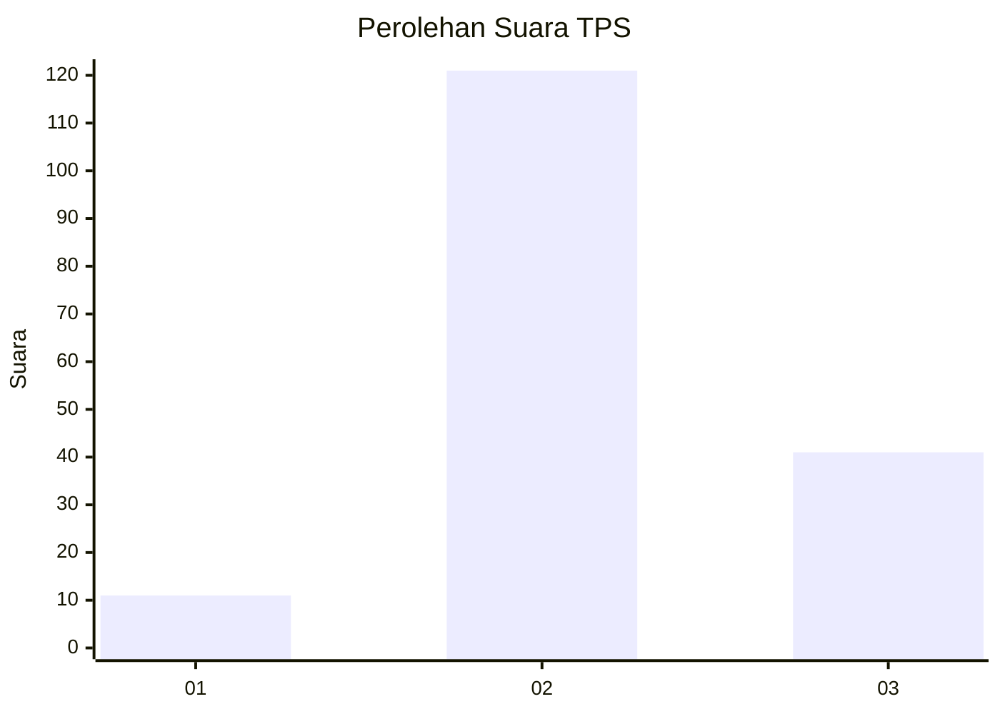
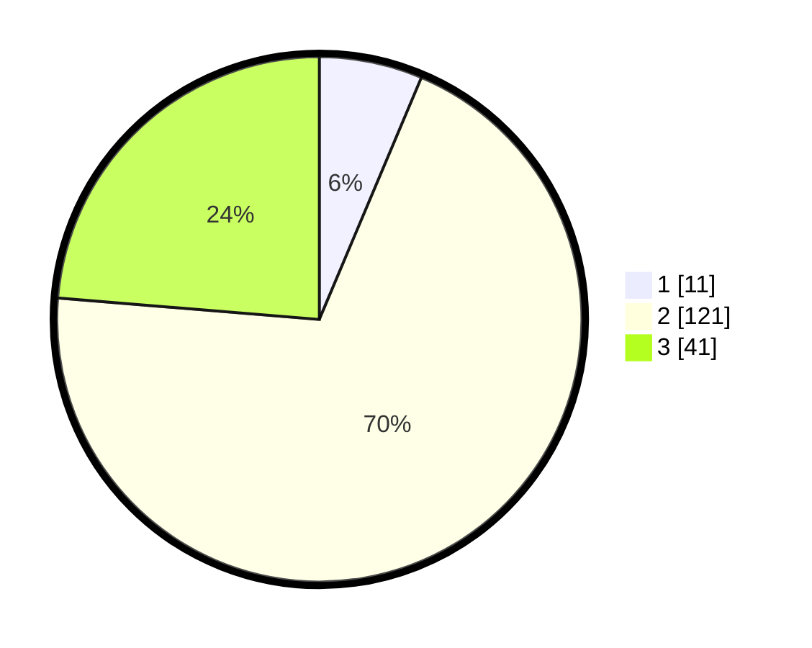

# Hasil

## Grafik

## Tabel

| No. | Nama Paslon    | Suara | Suara (raw) | Persentase |
|:--- |:-------------- | -----:| -----------:| ----------:|
| 1   | ANIES MUHAIMIN | 11    | [11][p-1]   | 6,36       |
| 2   | PRABOWO GIBRAN | 121   | [121][p-2]  | 69,94      |
| 3   | GANJAR MAHFUD  | 41    | [41][p-3]   | 23,70      |

[p-1]: https://github.com/gigit-pemilu/pemilu-2024-35-jawa-timur/blob/main/pilpres/hitung-suara/sub/35-jawa-timur/sub/04-tulungagung/sub/12-pucanglaban/sub/2001-pucanglaban/sub/004-tps/sub/paslon-1.txt
[p-2]: https://github.com/gigit-pemilu/pemilu-2024-35-jawa-timur/blob/main/pilpres/hitung-suara/sub/35-jawa-timur/sub/04-tulungagung/sub/12-pucanglaban/sub/2001-pucanglaban/sub/004-tps/sub/paslon-2.txt
[p-3]: https://github.com/gigit-pemilu/pemilu-2024-35-jawa-timur/blob/main/pilpres/hitung-suara/sub/35-jawa-timur/sub/04-tulungagung/sub/12-pucanglaban/sub/2001-pucanglaban/sub/004-tps/sub/paslon-3.txt

## Foto C Plano

https://sirekap-obj-formc.kpu.go.id/7714/pemilu/ppwp/35/04/12/20/01/3504122001004-20240215-002236--ff7cc7fa-3a68-4334-a712-78da1500baf6.jpg

https://sirekap-obj-formc.kpu.go.id/7714/pemilu/ppwp/35/04/12/20/01/3504122001004-20240215-002507--865d92c8-655a-43d5-ad89-06385bfdef27.jpg

## Metadata

| Key        | Value               |
| ---------- | ------------------- |
| Time Stamp | 2024-02-25 22:00:00 |

