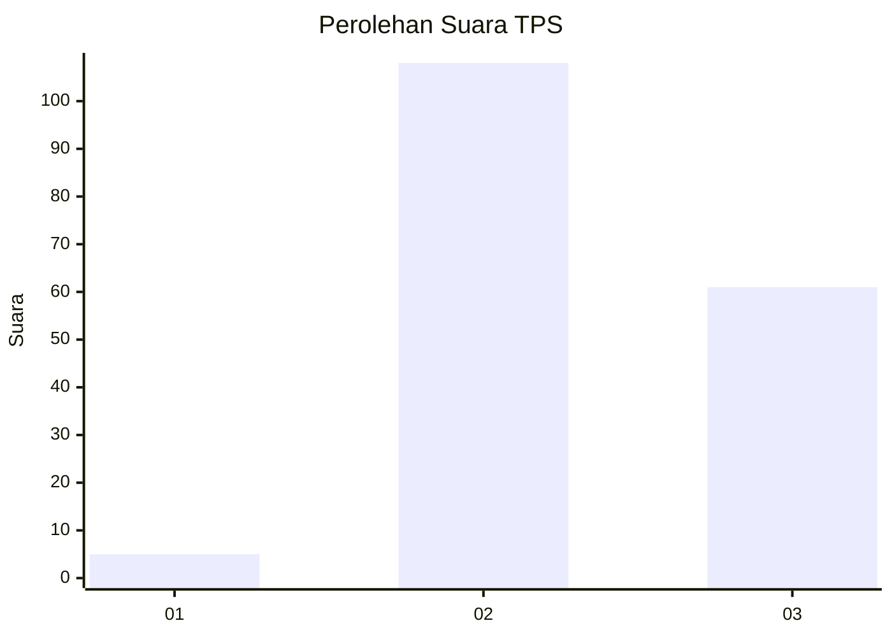
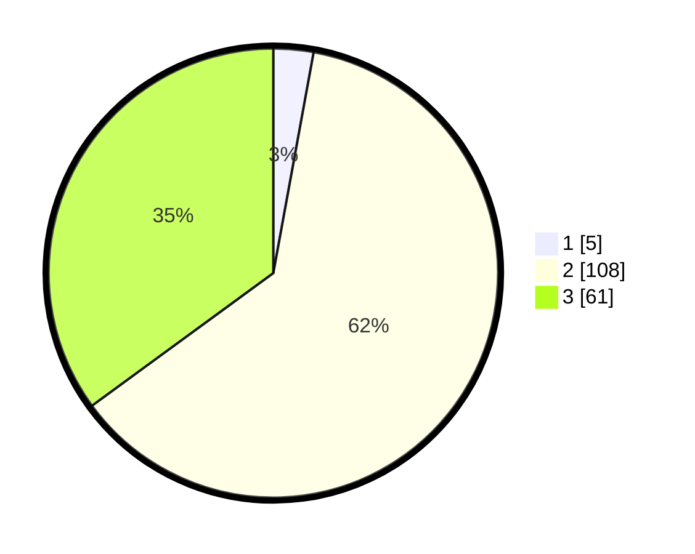

# Hasil

## Grafik

## Tabel

| No. | Nama Paslon    | Suara | Suara (raw) | Persentase |
|:--- |:-------------- | -----:| -----------:| ----------:|
| 1   | ANIES MUHAIMIN | 5     | [5][p-1]    | 2,87       |
| 2   | PRABOWO GIBRAN | 108   | [108][p-2]  | 62,07      |
| 3   | GANJAR MAHFUD  | 61    | [61][p-3]   | 35,06      |

[p-1]: https://github.com/gigit-pemilu/pemilu-2024-35-jawa-timur/blob/main/pilpres/hitung-suara/sub/35-jawa-timur/sub/04-tulungagung/sub/12-pucanglaban/sub/2001-pucanglaban/sub/005-tps/sub/paslon-1.txt
[p-2]: https://github.com/gigit-pemilu/pemilu-2024-35-jawa-timur/blob/main/pilpres/hitung-suara/sub/35-jawa-timur/sub/04-tulungagung/sub/12-pucanglaban/sub/2001-pucanglaban/sub/005-tps/sub/paslon-2.txt
[p-3]: https://github.com/gigit-pemilu/pemilu-2024-35-jawa-timur/blob/main/pilpres/hitung-suara/sub/35-jawa-timur/sub/04-tulungagung/sub/12-pucanglaban/sub/2001-pucanglaban/sub/005-tps/sub/paslon-3.txt

## Foto C Plano

https://sirekap-obj-formc.kpu.go.id/e5ef/pemilu/ppwp/35/04/12/20/01/3504122001005-20240216-215418--5020edf3-9c0c-4f97-bebb-b884a3886a91.jpg

https://sirekap-obj-formc.kpu.go.id/e5ef/pemilu/ppwp/35/04/12/20/01/3504122001005-20240216-215734--9e0137f8-08f0-4f17-a18e-d26688ffb0fe.jpg

https://sirekap-obj-formc.kpu.go.id/e5ef/pemilu/ppwp/35/04/12/20/01/3504122001005-20240216-215948--fb53760e-a19b-4d1b-b356-b5b2672e160c.jpg

## Metadata

| Key        | Value               |
| ---------- | ------------------- |
| Time Stamp | 2024-02-16 22:01:00 |

## DATA PEMILIH TETAP

Jumlah pemilih dalam DPT: **217**.
 * L: **111**.
 * P: **106**.

## DATA PENGGUNA HAK PILIH

Jumlah pengguna hak pilih dalam DPT: **173**.
 * L: **89**.
 * P: **84**.

Jumlah pengguna hak pilih dalam DPTb: **4**.
 * L: **3**.
 * P: **1**.

Jumlah pengguna hak pilih dalam DPK: **0**.
 * L: **0**.
 * P: **0**.

Jumlah pengguna hak pilih: **0**.
 * L: **0**.
 * P: **0**.

## JUMLAH SUARA SAH DAN TIDAK SAH

JUMLAH SELURUH SUARA SAH: **174**.

JUMLAH SUARA TIDAK SAH: **3**.

JUMLAH SELURUH SUARA SAH DAN SUARA TIDAK SAH: **177**.

