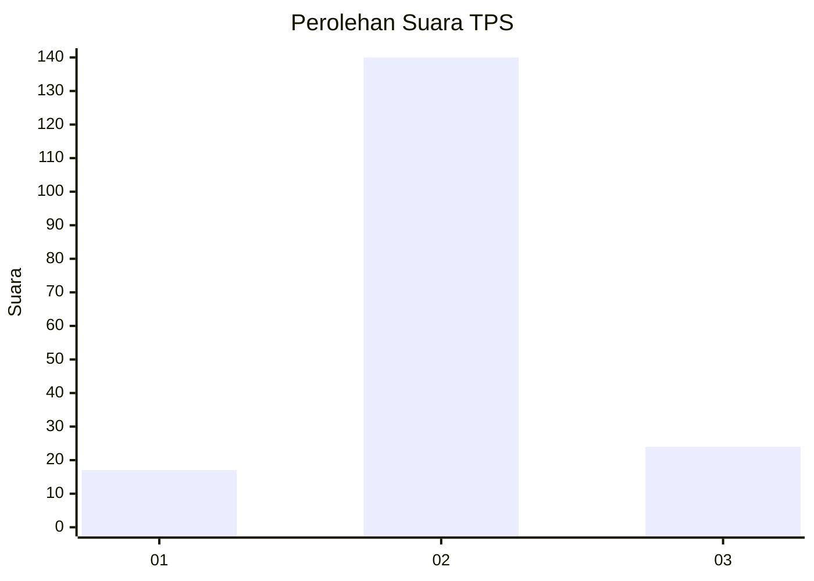
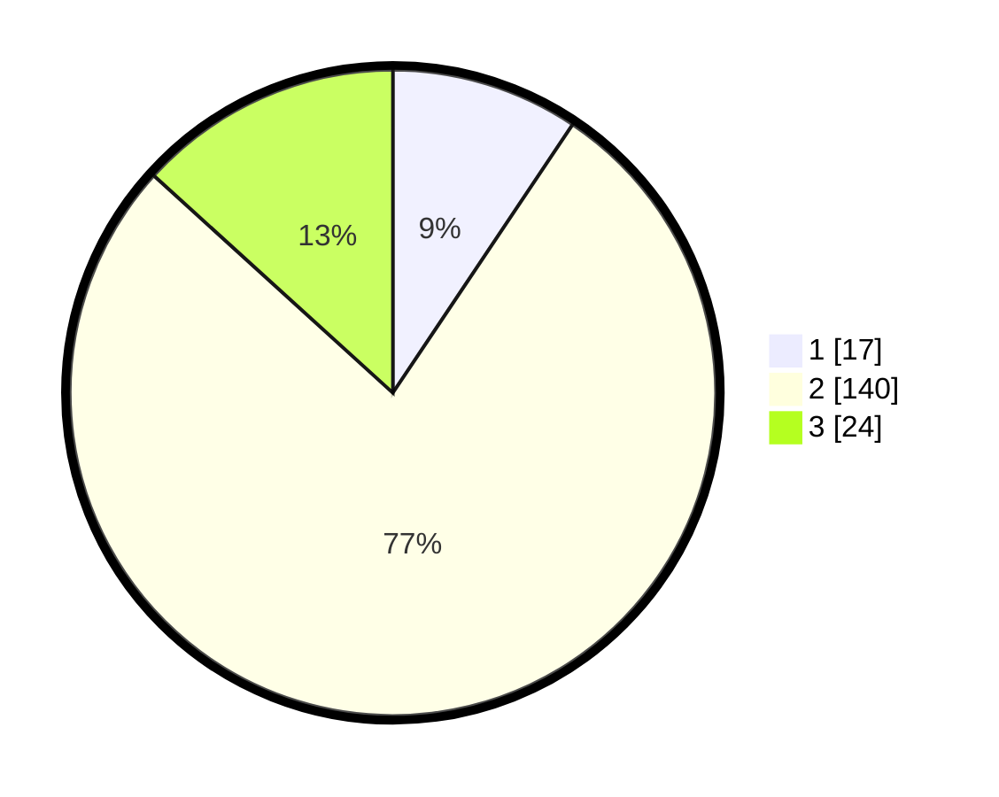

# Hasil

## Grafik

## Tabel

| No. | Nama Paslon    | Suara | Suara (raw) | Persentase |
|:--- |:-------------- | -----:| -----------:| ----------:|
| 1   | ANIES MUHAIMIN | 17    | [17][p-1]   | 9,39       |
| 2   | PRABOWO GIBRAN | 140   | [140][p-2]  | 77,35      |
| 3   | GANJAR MAHFUD  | 24    | [24][p-3]   | 13,26      |

[p-1]: https://github.com/gigit-pemilu/pemilu-2024/blob/main/pilpres/hitung-suara/sub/35-jawa-timur/sub/04-tulungagung/sub/12-pucanglaban/sub/2001-pucanglaban/sub/006-tps/sub/paslon-1.txt
[p-2]: https://github.com/gigit-pemilu/pemilu-2024/blob/main/pilpres/hitung-suara/sub/35-jawa-timur/sub/04-tulungagung/sub/12-pucanglaban/sub/2001-pucanglaban/sub/006-tps/sub/paslon-2.txt
[p-3]: https://github.com/gigit-pemilu/pemilu-2024/blob/main/pilpres/hitung-suara/sub/35-jawa-timur/sub/04-tulungagung/sub/12-pucanglaban/sub/2001-pucanglaban/sub/006-tps/sub/paslon-3.txt

## Foto C Plano

https://sirekap-obj-formc.kpu.go.id/6067/pemilu/ppwp/35/04/12/20/01/3504122001006-20240217-193502--8f98687e-4978-4517-9719-999070f77261.jpg

https://sirekap-obj-formc.kpu.go.id/6067/pemilu/ppwp/35/04/12/20/01/3504122001006-20240217-192254--e16b05c5-5e53-47c7-ad62-48a6e3fdccac.jpg

https://sirekap-obj-formc.kpu.go.id/6067/pemilu/ppwp/35/04/12/20/01/3504122001006-20240217-193304--7e30cba9-663d-4dcf-9685-5d4d5cc0fd1a.jpg

## Metadata

| Key        | Value               |
| ---------- | ------------------- |
| Time Stamp | 2024-02-19 06:16:00 |

## DATA PEMILIH TETAP

Jumlah pemilih dalam DPT: **209**.
 * L: **101**.
 * P: **108**.

## DATA PENGGUNA HAK PILIH

Jumlah pengguna hak pilih dalam DPT: **175**.
 * L: **85**.
 * P: **90**.

Jumlah pengguna hak pilih dalam DPTb: **3**.
 * L: **3**.
 * P: **0**.

Jumlah pengguna hak pilih dalam DPK: **5**.
 * L: **3**.
 * P: **2**.

Jumlah pengguna hak pilih: **183**.
 * L: **91**.
 * P: **92**.

## JUMLAH SUARA SAH DAN TIDAK SAH

JUMLAH SELURUH SUARA SAH: **181**.

JUMLAH SUARA TIDAK SAH: **2**.

JUMLAH SELURUH SUARA SAH DAN SUARA TIDAK SAH: **183**.

