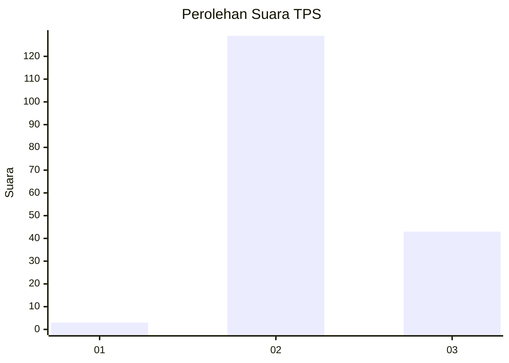
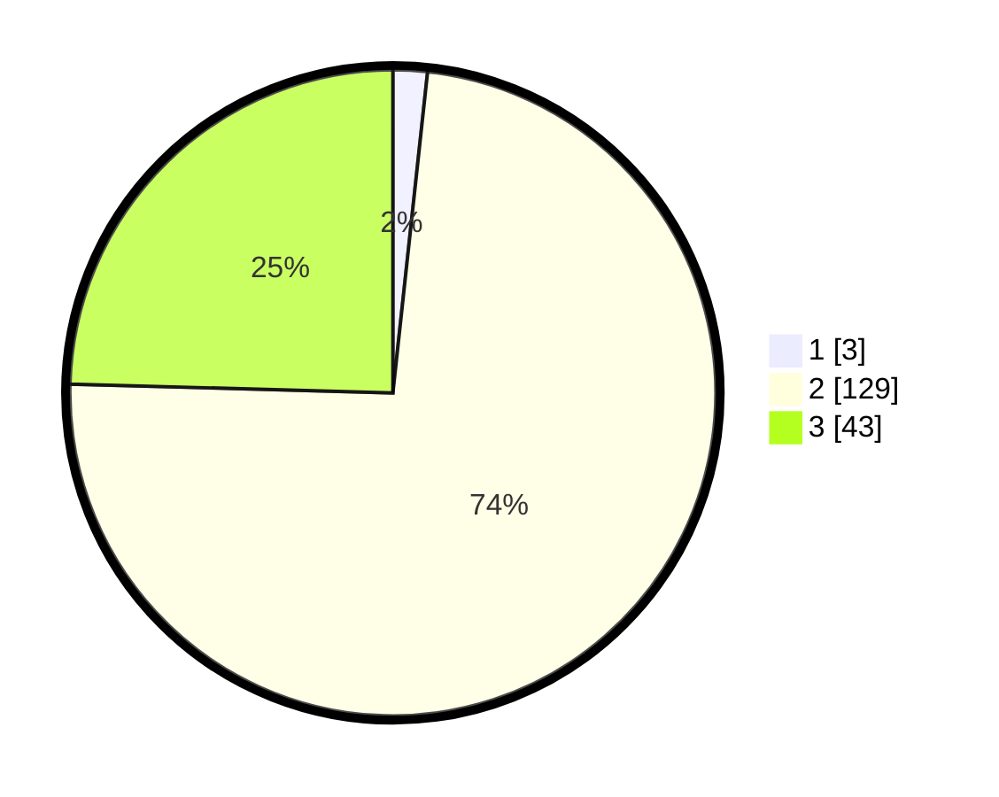

# Hasil

## Grafik

## Tabel

| No. | Nama Paslon    | Suara | Suara (raw) | Persentase |
|:--- |:-------------- | -----:| -----------:| ----------:|
| 1   | ANIES MUHAIMIN | 3     | [3][p-1]    | 1,71       |
| 2   | PRABOWO GIBRAN | 129   | [129][p-2]  | 73,71      |
| 3   | GANJAR MAHFUD  | 43    | [43][p-3]   | 24,57      |

[p-1]: https://github.com/gigit-pemilu/pemilu-2024-35-jawa-timur/blob/main/pilpres/hitung-suara/sub/35-jawa-timur/sub/04-tulungagung/sub/12-pucanglaban/sub/2001-pucanglaban/sub/008-tps/sub/paslon-1.txt
[p-2]: https://github.com/gigit-pemilu/pemilu-2024-35-jawa-timur/blob/main/pilpres/hitung-suara/sub/35-jawa-timur/sub/04-tulungagung/sub/12-pucanglaban/sub/2001-pucanglaban/sub/008-tps/sub/paslon-2.txt
[p-3]: https://github.com/gigit-pemilu/pemilu-2024-35-jawa-timur/blob/main/pilpres/hitung-suara/sub/35-jawa-timur/sub/04-tulungagung/sub/12-pucanglaban/sub/2001-pucanglaban/sub/008-tps/sub/paslon-3.txt

## Foto C Plano

https://sirekap-obj-formc.kpu.go.id/c9a2/pemilu/ppwp/35/04/12/20/01/3504122001008-20240214-232031--24121f04-4e0c-4dbd-abb2-e81e7998a32a.jpg

https://sirekap-obj-formc.kpu.go.id/c9a2/pemilu/ppwp/35/04/12/20/01/3504122001008-20240214-232647--4607aef5-2937-431d-9c01-f3f7a36c203b.jpg

https://sirekap-obj-formc.kpu.go.id/c9a2/pemilu/ppwp/35/04/12/20/01/3504122001008-20240214-231909--4a9982ae-a2af-4ff4-8bd8-57280f55051f.jpg

## Metadata

| Key        | Value               |
| ---------- | ------------------- |
| Time Stamp | 2024-02-16 21:01:00 |

