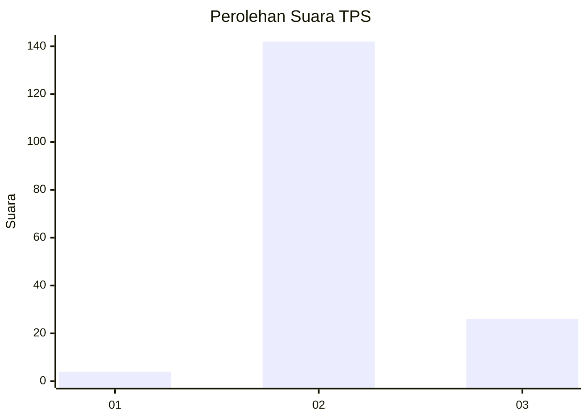
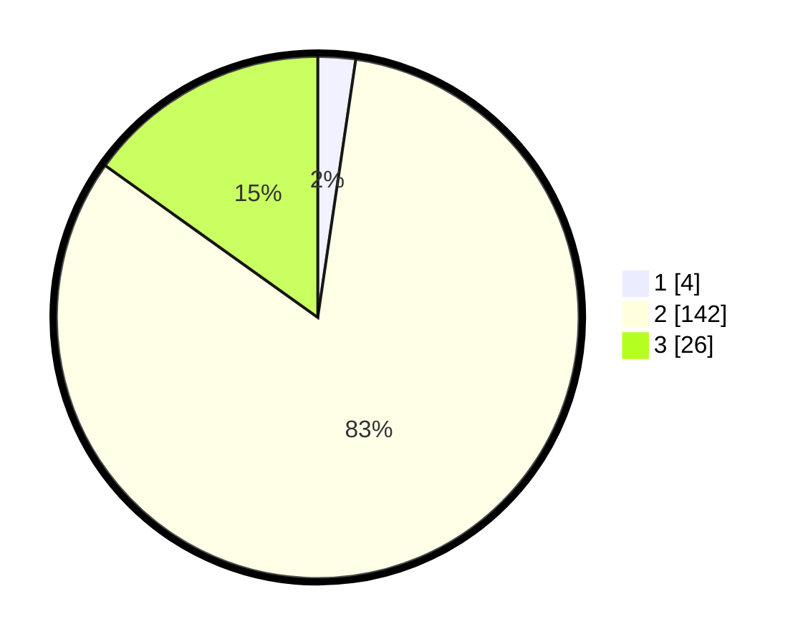

# Hasil

## Grafik

## Tabel

| No. | Nama Paslon    | Suara | Suara (raw) | Persentase |
|:--- |:-------------- | -----:| -----------:| ----------:|
| 1   | ANIES MUHAIMIN | 4     | [4][p-1]    | 2,33       |
| 2   | PRABOWO GIBRAN | 142   | [142][p-2]  | 82,56      |
| 3   | GANJAR MAHFUD  | 26    | [26][p-3]   | 15,12      |

[p-1]: https://github.com/gigit-pemilu/pemilu-2024/blob/main/pilpres/hitung-suara/sub/35-jawa-timur/sub/04-tulungagung/sub/12-pucanglaban/sub/2008-sumberdadap/sub/002-tps/sub/paslon-1.txt
[p-2]: https://github.com/gigit-pemilu/pemilu-2024/blob/main/pilpres/hitung-suara/sub/35-jawa-timur/sub/04-tulungagung/sub/12-pucanglaban/sub/2008-sumberdadap/sub/002-tps/sub/paslon-2.txt
[p-3]: https://github.com/gigit-pemilu/pemilu-2024/blob/main/pilpres/hitung-suara/sub/35-jawa-timur/sub/04-tulungagung/sub/12-pucanglaban/sub/2008-sumberdadap/sub/002-tps/sub/paslon-3.txt

## Foto C Plano

https://sirekap-obj-formc.kpu.go.id/2733/pemilu/ppwp/35/04/12/20/08/3504122008002-20240215-015047--2e341e2c-9ca9-4533-aec4-58cc902e3a4d.jpg

https://sirekap-obj-formc.kpu.go.id/2733/pemilu/ppwp/35/04/12/20/08/3504122008002-20240215-015152--9b5d8ad0-d59f-411e-86e0-1b303198fe78.jpg

https://sirekap-obj-formc.kpu.go.id/2733/pemilu/ppwp/35/04/12/20/08/3504122008002-20240215-015257--0478e35d-0a22-46a0-a114-bf826024358a.jpg

## Metadata

| Key        | Value               |
| ---------- | ------------------- |
| Time Stamp | 2024-02-19 06:16:00 |

