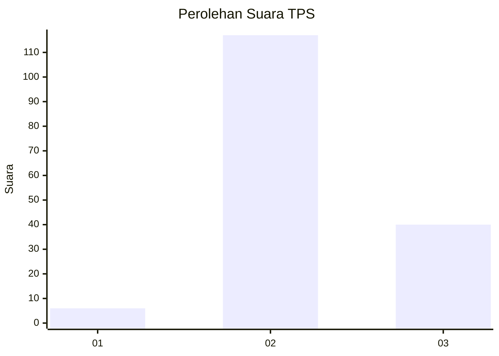
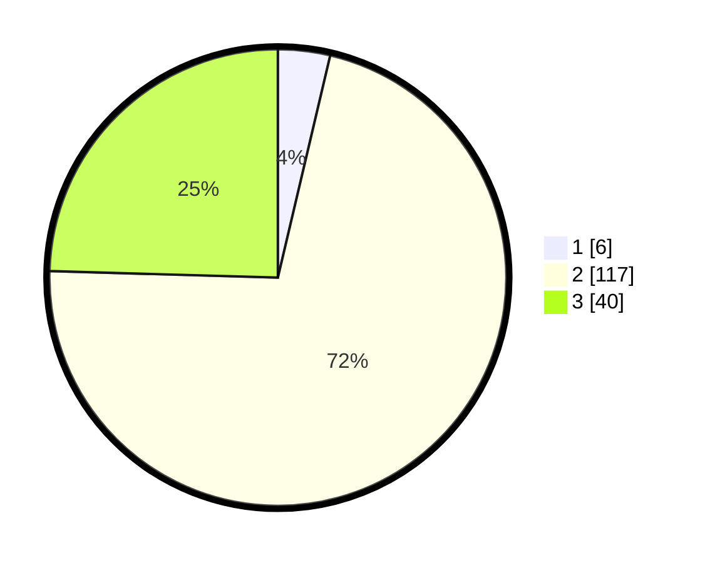

# Hasil

## Grafik

## Tabel

| No. | Nama Paslon    | Suara | Suara (raw) | Persentase |
|:--- |:-------------- | -----:| -----------:| ----------:|
| 1   | ANIES MUHAIMIN | 6     | [6][p-1]    | 3,68       |
| 2   | PRABOWO GIBRAN | 117   | [117][p-2]  | 71,78      |
| 3   | GANJAR MAHFUD  | 40    | [40][p-3]   | 24,54      |

[p-1]: https://github.com/gigit-pemilu/pemilu-2024/blob/main/pilpres/hitung-suara/sub/35-jawa-timur/sub/04-tulungagung/sub/12-pucanglaban/sub/2009-demuk/sub/024-tps/sub/paslon-1.txt
[p-2]: https://github.com/gigit-pemilu/pemilu-2024/blob/main/pilpres/hitung-suara/sub/35-jawa-timur/sub/04-tulungagung/sub/12-pucanglaban/sub/2009-demuk/sub/024-tps/sub/paslon-2.txt
[p-3]: https://github.com/gigit-pemilu/pemilu-2024/blob/main/pilpres/hitung-suara/sub/35-jawa-timur/sub/04-tulungagung/sub/12-pucanglaban/sub/2009-demuk/sub/024-tps/sub/paslon-3.txt

## Foto C Plano

https://sirekap-obj-formc.kpu.go.id/a1e9/pemilu/ppwp/35/04/12/20/09/3504122009024-20240217-140155--1c69e554-e1b6-4bcf-950a-54f68eb12cef.jpg

https://sirekap-obj-formc.kpu.go.id/a1e9/pemilu/ppwp/35/04/12/20/09/3504122009024-20240217-141027--b46345e4-6dbf-4ffc-b594-6de39d1a5d0e.jpg

https://sirekap-obj-formc.kpu.go.id/a1e9/pemilu/ppwp/35/04/12/20/09/3504122009024-20240217-141154--9c8cd4a7-eb4e-4c1b-93e8-2d2fb59007f4.jpg

## Metadata

| Key        | Value               |
| ---------- | ------------------- |
| Time Stamp | 2024-02-21 11:00:00 |

