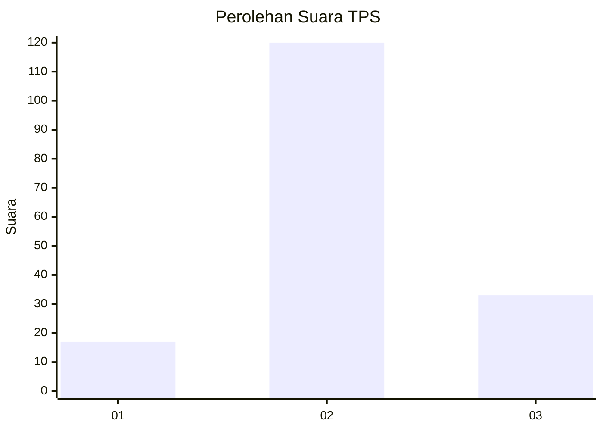
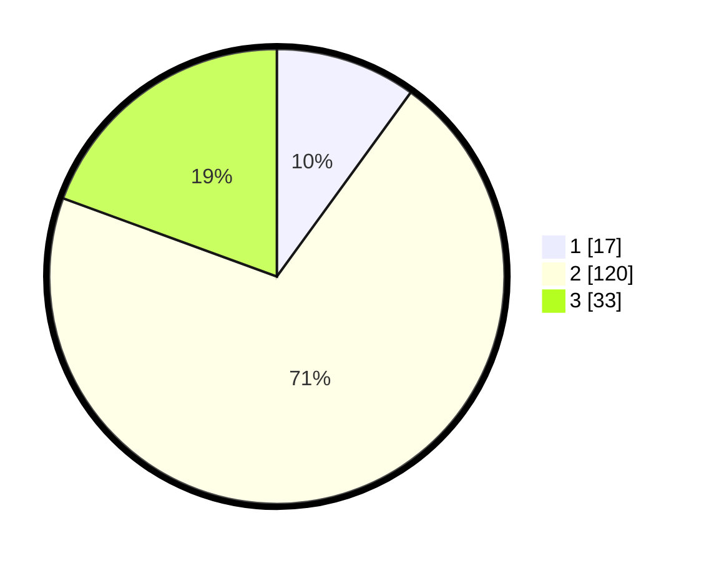

# Hasil

## Grafik

## Tabel

| No. | Nama Paslon    | Suara | Suara (raw) | Persentase |
|:--- |:-------------- | -----:| -----------:| ----------:|
| 1   | ANIES MUHAIMIN | 17    | [17][p-1]   | 10,00      |
| 2   | PRABOWO GIBRAN | 120   | [120][p-2]  | 70,59      |
| 3   | GANJAR MAHFUD  | 33    | [33][p-3]   | 19,41      |

[p-1]: https://github.com/gigit-pemilu/pemilu-2024/blob/main/pilpres/hitung-suara/sub/35-jawa-timur/sub/04-tulungagung/sub/13-rejotangan/sub/2001-tenggur/sub/002-tps/sub/paslon-1.txt
[p-2]: https://github.com/gigit-pemilu/pemilu-2024/blob/main/pilpres/hitung-suara/sub/35-jawa-timur/sub/04-tulungagung/sub/13-rejotangan/sub/2001-tenggur/sub/002-tps/sub/paslon-2.txt
[p-3]: https://github.com/gigit-pemilu/pemilu-2024/blob/main/pilpres/hitung-suara/sub/35-jawa-timur/sub/04-tulungagung/sub/13-rejotangan/sub/2001-tenggur/sub/002-tps/sub/paslon-3.txt

## Foto C Plano

https://sirekap-obj-formc.kpu.go.id/1ef1/pemilu/ppwp/35/04/13/20/01/3504132001002-20240216-155414--69c4f9ca-3d9d-4d8d-86c7-ce06fc68492f.jpg

https://sirekap-obj-formc.kpu.go.id/1ef1/pemilu/ppwp/35/04/13/20/01/3504132001002-20240216-201305--a5d432ca-765d-47e2-90c2-88c771405ca2.jpg

https://sirekap-obj-formc.kpu.go.id/1ef1/pemilu/ppwp/35/04/13/20/01/3504132001002-20240216-195246--40090a9c-f494-46d9-874b-9a6228d8224e.jpg

## Metadata

| Key        | Value               |
| ---------- | ------------------- |
| Time Stamp | 2024-02-16 22:30:00 |

## DATA PEMILIH TETAP

Jumlah pemilih dalam DPT: **235**.
 * L: **116**.
 * P: **119**.

## DATA PENGGUNA HAK PILIH

Jumlah pengguna hak pilih dalam DPT: **172**.
 * L: **79**.
 * P: **93**.

Jumlah pengguna hak pilih dalam DPTb: **0**.
 * L: **0**.
 * P: **0**.

Jumlah pengguna hak pilih dalam DPK: **2**.
 * L: **1**.
 * P: **1**.

Jumlah pengguna hak pilih: **174**.
 * L: **80**.
 * P: **94**.

## JUMLAH SUARA SAH DAN TIDAK SAH

JUMLAH SELURUH SUARA SAH: **170**.

JUMLAH SUARA TIDAK SAH: **4**.

JUMLAH SELURUH SUARA SAH DAN SUARA TIDAK SAH: **174**.

