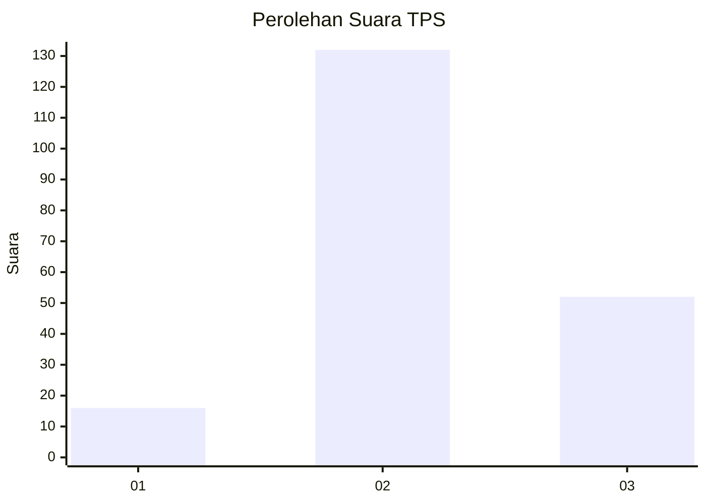
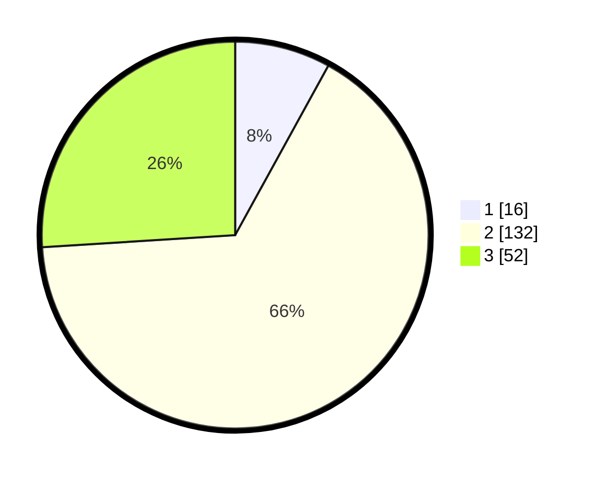

# Hasil

## Grafik

## Tabel

| No. | Nama Paslon    | Suara | Suara (raw) | Persentase |
|:--- |:-------------- | -----:| -----------:| ----------:|
| 1   | ANIES MUHAIMIN | 16    | [16][p-1]   | 8,00       |
| 2   | PRABOWO GIBRAN | 132   | [132][p-2]  | 66,00      |
| 3   | GANJAR MAHFUD  | 52    | [52][p-3]   | 26,00      |

[p-1]: https://github.com/gigit-pemilu/pemilu-2024/blob/main/pilpres/hitung-suara/sub/35-jawa-timur/sub/04-tulungagung/sub/13-rejotangan/sub/2002-panjerejo/sub/014-tps/sub/paslon-1.txt
[p-2]: https://github.com/gigit-pemilu/pemilu-2024/blob/main/pilpres/hitung-suara/sub/35-jawa-timur/sub/04-tulungagung/sub/13-rejotangan/sub/2002-panjerejo/sub/014-tps/sub/paslon-2.txt
[p-3]: https://github.com/gigit-pemilu/pemilu-2024/blob/main/pilpres/hitung-suara/sub/35-jawa-timur/sub/04-tulungagung/sub/13-rejotangan/sub/2002-panjerejo/sub/014-tps/sub/paslon-3.txt

## Foto C Plano

https://sirekap-obj-formc.kpu.go.id/caee/pemilu/ppwp/35/04/13/20/02/3504132002014-20240215-234447--d07b4dee-f755-4b3c-96b5-86c45db1a218.jpg

https://sirekap-obj-formc.kpu.go.id/caee/pemilu/ppwp/35/04/13/20/02/3504132002014-20240215-234013--94ae6ba1-bb5d-49c4-8eca-a66706fbcc6b.jpg

https://sirekap-obj-formc.kpu.go.id/caee/pemilu/ppwp/35/04/13/20/02/3504132002014-20240215-012943--a0122c69-2757-46fb-bbf3-8a96b2da11bc.jpg

## Metadata

| Key        | Value               |
| ---------- | ------------------- |
| Time Stamp | 2024-02-17 00:00:00 |

