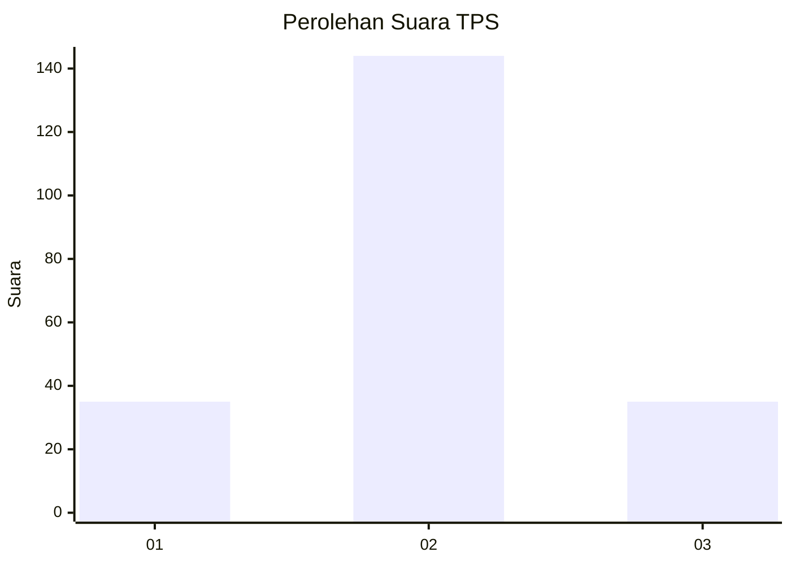
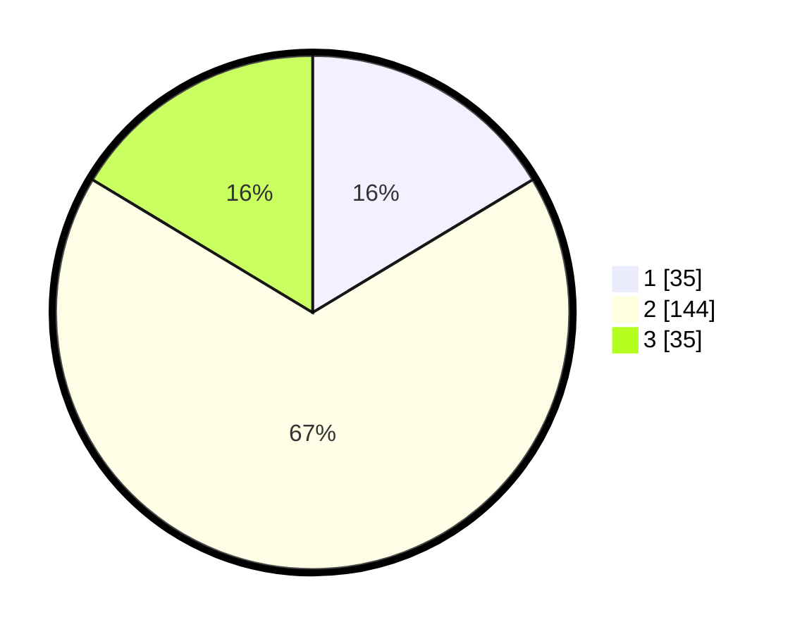

# Hasil

## Grafik

## Tabel

| No. | Nama Paslon    | Suara | Suara (raw) | Persentase |
|:--- |:-------------- | -----:| -----------:| ----------:|
| 1   | ANIES MUHAIMIN | 35    | [35][p-1]   | 16,36      |
| 2   | PRABOWO GIBRAN | 144   | [144][p-2]  | 67,29      |
| 3   | GANJAR MAHFUD  | 35    | [35][p-3]   | 16,36      |

[p-1]: https://github.com/gigit-pemilu/pemilu-2024/blob/main/pilpres/hitung-suara/sub/35-jawa-timur/sub/04-tulungagung/sub/13-rejotangan/sub/2007-banjarejo/sub/002-tps/sub/paslon-1.txt
[p-2]: https://github.com/gigit-pemilu/pemilu-2024/blob/main/pilpres/hitung-suara/sub/35-jawa-timur/sub/04-tulungagung/sub/13-rejotangan/sub/2007-banjarejo/sub/002-tps/sub/paslon-2.txt
[p-3]: https://github.com/gigit-pemilu/pemilu-2024/blob/main/pilpres/hitung-suara/sub/35-jawa-timur/sub/04-tulungagung/sub/13-rejotangan/sub/2007-banjarejo/sub/002-tps/sub/paslon-3.txt

## Foto C Plano

https://sirekap-obj-formc.kpu.go.id/35ba/pemilu/ppwp/35/04/13/20/07/3504132007002-20240214-200025--7d87eb69-a026-4e59-b010-f871983a3385.jpg

https://sirekap-obj-formc.kpu.go.id/35ba/pemilu/ppwp/35/04/13/20/07/3504132007002-20240214-200205--f5e1a20d-f107-4668-9d09-268d86e004f7.jpg

https://sirekap-obj-formc.kpu.go.id/35ba/pemilu/ppwp/35/04/13/20/07/3504132007002-20240214-200253--abd1a2c5-dd41-4df5-b927-ae4f23d75970.jpg

## Metadata

| Key        | Value               |
| ---------- | ------------------- |
| Time Stamp | 2024-02-24 22:31:28 |

