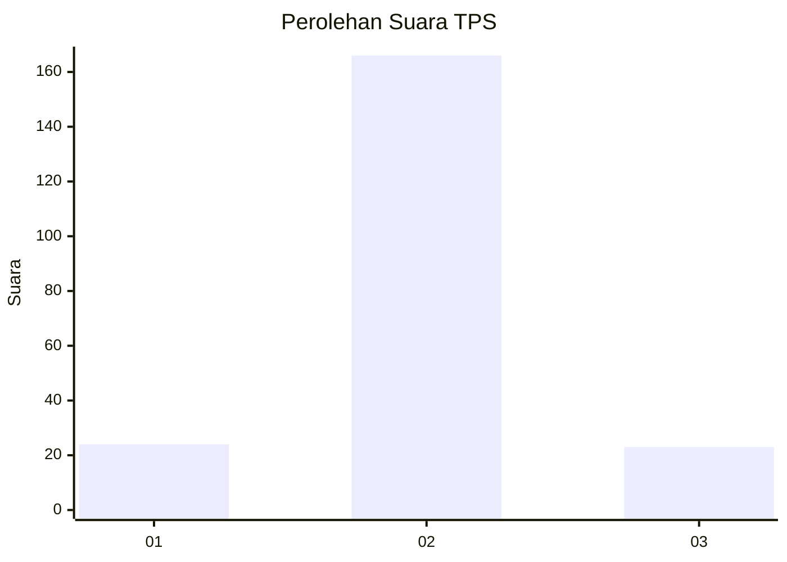
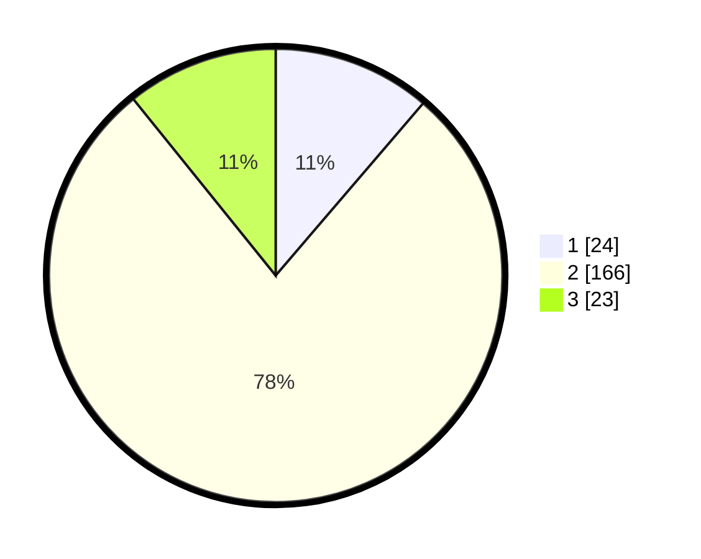

# Hasil

## Grafik

## Tabel

| No. | Nama Paslon    | Suara | Suara (raw) | Persentase |
|:--- |:-------------- | -----:| -----------:| ----------:|
| 1   | ANIES MUHAIMIN | 24    | [24][p-1]   | 11,27      |
| 2   | PRABOWO GIBRAN | 166   | [166][p-2]  | 77,93      |
| 3   | GANJAR MAHFUD  | 23    | [23][p-3]   | 10,80      |

[p-1]: https://github.com/gigit-pemilu/pemilu-2024/blob/main/pilpres/hitung-suara/sub/35-jawa-timur/sub/04-tulungagung/sub/13-rejotangan/sub/2007-banjarejo/sub/009-tps/sub/paslon-1.txt
[p-2]: https://github.com/gigit-pemilu/pemilu-2024/blob/main/pilpres/hitung-suara/sub/35-jawa-timur/sub/04-tulungagung/sub/13-rejotangan/sub/2007-banjarejo/sub/009-tps/sub/paslon-2.txt
[p-3]: https://github.com/gigit-pemilu/pemilu-2024/blob/main/pilpres/hitung-suara/sub/35-jawa-timur/sub/04-tulungagung/sub/13-rejotangan/sub/2007-banjarejo/sub/009-tps/sub/paslon-3.txt

## Foto C Plano

https://sirekap-obj-formc.kpu.go.id/70ab/pemilu/ppwp/35/04/13/20/07/3504132007009-20240214-214818--acba35e4-9462-4e6a-9a51-739217ebc592.jpg

https://sirekap-obj-formc.kpu.go.id/70ab/pemilu/ppwp/35/04/13/20/07/3504132007009-20240214-215022--0a0e951b-94d6-4bea-8de0-6aeb17eae85d.jpg

https://sirekap-obj-formc.kpu.go.id/70ab/pemilu/ppwp/35/04/13/20/07/3504132007009-20240214-215822--624a31d9-5c08-4d8c-993c-36b04c0cf6a7.jpg

## Metadata

| Key        | Value               |
| ---------- | ------------------- |
| Time Stamp | 2024-02-25 15:00:00 |

