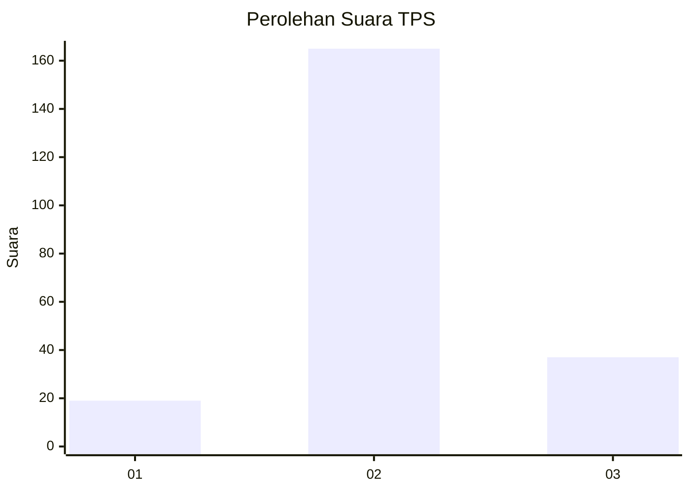
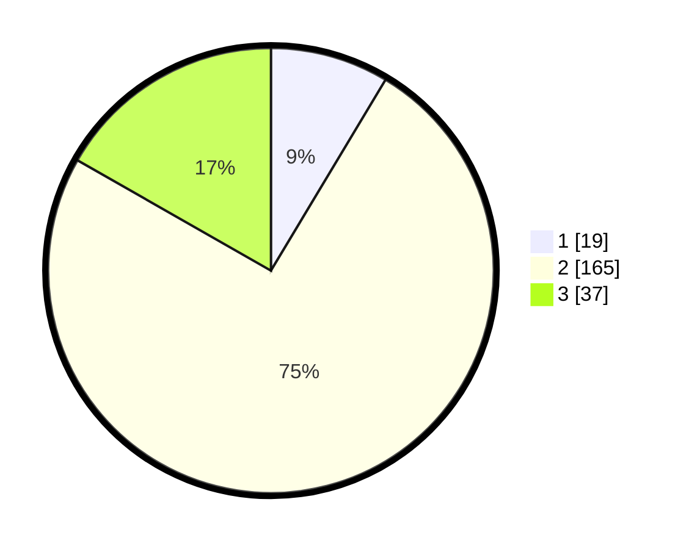

# Hasil

## Grafik

## Tabel

| No. | Nama Paslon    | Suara | Suara (raw) | Persentase |
|:--- |:-------------- | -----:| -----------:| ----------:|
| 1   | ANIES MUHAIMIN | 19    | [19][p-1]   | 8,60       |
| 2   | PRABOWO GIBRAN | 165   | [165][p-2]  | 74,66      |
| 3   | GANJAR MAHFUD  | 37    | [37][p-3]   | 16,74      |

[p-1]: https://github.com/gigit-pemilu/pemilu-2024-35-jawa-timur/blob/main/pilpres/hitung-suara/sub/35-jawa-timur/sub/04-tulungagung/sub/13-rejotangan/sub/2007-banjarejo/sub/014-tps/sub/paslon-1.txt
[p-2]: https://github.com/gigit-pemilu/pemilu-2024-35-jawa-timur/blob/main/pilpres/hitung-suara/sub/35-jawa-timur/sub/04-tulungagung/sub/13-rejotangan/sub/2007-banjarejo/sub/014-tps/sub/paslon-2.txt
[p-3]: https://github.com/gigit-pemilu/pemilu-2024-35-jawa-timur/blob/main/pilpres/hitung-suara/sub/35-jawa-timur/sub/04-tulungagung/sub/13-rejotangan/sub/2007-banjarejo/sub/014-tps/sub/paslon-3.txt

## Foto C Plano

https://sirekap-obj-formc.kpu.go.id/081d/pemilu/ppwp/35/04/13/20/07/3504132007014-20240215-023523--84e8515c-2f16-4a49-bd21-2b180449375a.jpg

https://sirekap-obj-formc.kpu.go.id/081d/pemilu/ppwp/35/04/13/20/07/3504132007014-20240215-023635--c5e295e8-7150-47fc-89ed-9bb34b8e6ca8.jpg

https://sirekap-obj-formc.kpu.go.id/081d/pemilu/ppwp/35/04/13/20/07/3504132007014-20240215-023705--90ec59ce-e42d-46ae-964e-6227f8f27f54.jpg

## Metadata

| Key        | Value               |
| ---------- | ------------------- |
| Time Stamp | 2024-02-25 16:00:00 |

