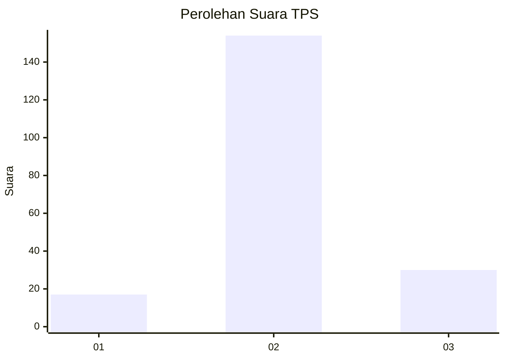

# Hasil

## Grafik

## Tabel

| No. | Nama Paslon    | Suara | Suara (raw) | Persentase |
|:--- |:-------------- | -----:| -----------:| ----------:|
| 1   | ANIES MUHAIMIN | 17    | [17][p-1]   | 8,46       |
| 2   | PRABOWO GIBRAN | 154   | [154][p-2]  | 76,62      |
| 3   | GANJAR MAHFUD  | 30    | [30][p-3]   | 14,93      |

[p-1]: https://github.com/gigit-pemilu/pemilu-2024-35-jawa-timur/blob/main/pilpres/hitung-suara/sub/35-jawa-timur/sub/04-tulungagung/sub/13-rejotangan/sub/2008-tanen/sub/005-tps/sub/paslon-1.txt
[p-2]: https://github.com/gigit-pemilu/pemilu-2024-35-jawa-timur/blob/main/pilpres/hitung-suara/sub/35-jawa-timur/sub/04-tulungagung/sub/13-rejotangan/sub/2008-tanen/sub/005-tps/sub/paslon-2.txt
[p-3]: https://github.com/gigit-pemilu/pemilu-2024-35-jawa-timur/blob/main/pilpres/hitung-suara/sub/35-jawa-timur/sub/04-tulungagung/sub/13-rejotangan/sub/2008-tanen/sub/005-tps/sub/paslon-3.txt

## Foto C Plano

https://sirekap-obj-formc.kpu.go.id/6b97/pemilu/ppwp/35/04/13/20/08/3504132008005-20240214-155855--752b28cd-7d7d-4acc-9b59-7d7794c972ae.jpg

https://sirekap-obj-formc.kpu.go.id/6b97/pemilu/ppwp/35/04/13/20/08/3504132008005-20240214-155909--5a11874d-b482-40ba-a48f-ecb1b41a7239.jpg

https://sirekap-obj-formc.kpu.go.id/6b97/pemilu/ppwp/35/04/13/20/08/3504132008005-20240214-155906--0c2ab99c-8a16-43c7-b3da-aab9fb5c62d4.jpg

## Metadata

| Key        | Value               |
| ---------- | ------------------- |
| Time Stamp | 2024-02-25 12:00:00 |

