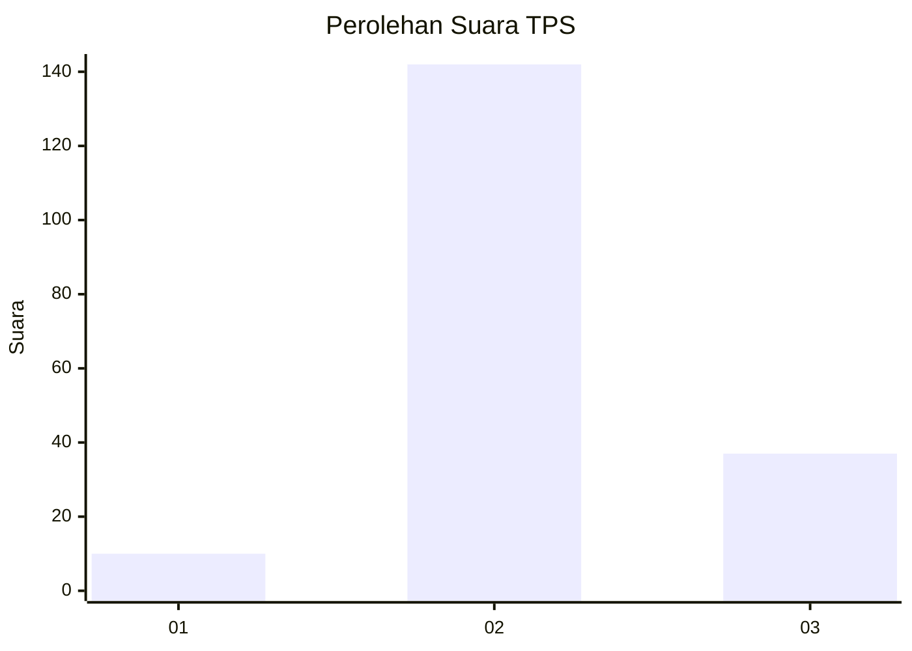

# Hasil

## Grafik

## Tabel

| No. | Nama Paslon    | Suara | Suara (raw) | Persentase |
|:--- |:-------------- | -----:| -----------:| ----------:|
| 1   | ANIES MUHAIMIN | 10    | [10][p-1]   | 5,29       |
| 2   | PRABOWO GIBRAN | 142   | [142][p-2]  | 75,13      |
| 3   | GANJAR MAHFUD  | 37    | [37][p-3]   | 19,58      |

[p-1]: https://github.com/gigit-pemilu/pemilu-2024/blob/main/pilpres/hitung-suara/sub/35-jawa-timur/sub/04-tulungagung/sub/13-rejotangan/sub/2009-sumberagung/sub/008-tps/sub/paslon-1.txt
[p-2]: https://github.com/gigit-pemilu/pemilu-2024/blob/main/pilpres/hitung-suara/sub/35-jawa-timur/sub/04-tulungagung/sub/13-rejotangan/sub/2009-sumberagung/sub/008-tps/sub/paslon-2.txt
[p-3]: https://github.com/gigit-pemilu/pemilu-2024/blob/main/pilpres/hitung-suara/sub/35-jawa-timur/sub/04-tulungagung/sub/13-rejotangan/sub/2009-sumberagung/sub/008-tps/sub/paslon-3.txt

## Foto C Plano

https://sirekap-obj-formc.kpu.go.id/3511/pemilu/ppwp/35/04/13/20/09/3504132009008-20240214-235404--657a246d-1ce6-42ae-93b4-178578483859.jpg

https://sirekap-obj-formc.kpu.go.id/3511/pemilu/ppwp/35/04/13/20/09/3504132009008-20240215-000050--00c22147-3dea-421d-944b-75ba9bae2ff3.jpg

https://sirekap-obj-formc.kpu.go.id/3511/pemilu/ppwp/35/04/13/20/09/3504132009008-20240215-000202--3b20bdbc-2d9b-4009-9b2a-969c77e0fe3e.jpg

## Metadata

| Key        | Value               |
| ---------- | ------------------- |
| Time Stamp | 2024-02-24 22:31:28 |

