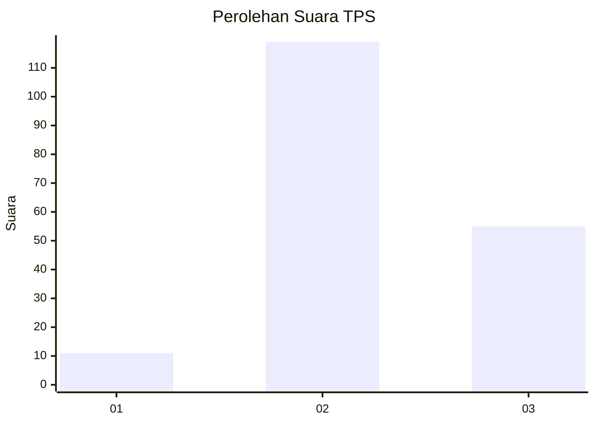

# Hasil

## Grafik

## Tabel

| No. | Nama Paslon    | Suara | Suara (raw) | Persentase |
|:--- |:-------------- | -----:| -----------:| ----------:|
| 1   | ANIES MUHAIMIN | 11    | [11][p-1]   | 5,95       |
| 2   | PRABOWO GIBRAN | 119   | [119][p-2]  | 64,32      |
| 3   | GANJAR MAHFUD  | 55    | [55][p-3]   | 29,73      |

[p-1]: https://github.com/gigit-pemilu/pemilu-2024/blob/main/pilpres/hitung-suara/sub/35-jawa-timur/sub/04-tulungagung/sub/13-rejotangan/sub/2009-sumberagung/sub/022-tps/sub/paslon-1.txt
[p-2]: https://github.com/gigit-pemilu/pemilu-2024/blob/main/pilpres/hitung-suara/sub/35-jawa-timur/sub/04-tulungagung/sub/13-rejotangan/sub/2009-sumberagung/sub/022-tps/sub/paslon-2.txt
[p-3]: https://github.com/gigit-pemilu/pemilu-2024/blob/main/pilpres/hitung-suara/sub/35-jawa-timur/sub/04-tulungagung/sub/13-rejotangan/sub/2009-sumberagung/sub/022-tps/sub/paslon-3.txt

## Foto C Plano

https://sirekap-obj-formc.kpu.go.id/8725/pemilu/ppwp/35/04/13/20/09/3504132009022-20240216-165834--94552fc1-a671-4a85-8725-eae9cda5f32a.jpg

https://sirekap-obj-formc.kpu.go.id/8725/pemilu/ppwp/35/04/13/20/09/3504132009022-20240214-232833--fb81ffe2-594c-4540-993a-6ec01033bfcd.jpg

https://sirekap-obj-formc.kpu.go.id/8725/pemilu/ppwp/35/04/13/20/09/3504132009022-20240215-023035--edc6494b-68d5-406a-9971-311dc7c4bc9b.jpg

## Metadata

| Key        | Value               |
| ---------- | ------------------- |
| Time Stamp | 2024-02-24 22:31:28 |

