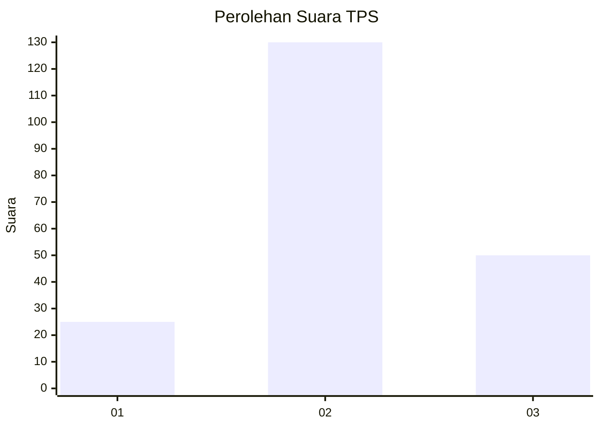
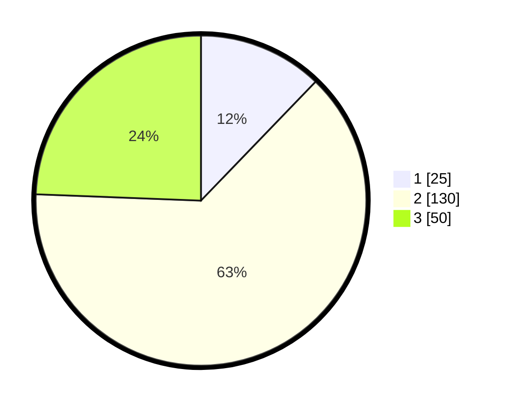

# Hasil

## Grafik

## Tabel

| No. | Nama Paslon    | Suara | Suara (raw) | Persentase |
|:--- |:-------------- | -----:| -----------:| ----------:|
| 1   | ANIES MUHAIMIN | 25    | [25][p-1]   | 12,20      |
| 2   | PRABOWO GIBRAN | 130   | [130][p-2]  | 63,41      |
| 3   | GANJAR MAHFUD  | 50    | [50][p-3]   | 24,39      |

[p-1]: https://github.com/gigit-pemilu/pemilu-2024/blob/main/pilpres/hitung-suara/sub/35-jawa-timur/sub/04-tulungagung/sub/13-rejotangan/sub/2010-blimbing/sub/006-tps/sub/paslon-1.txt
[p-2]: https://github.com/gigit-pemilu/pemilu-2024/blob/main/pilpres/hitung-suara/sub/35-jawa-timur/sub/04-tulungagung/sub/13-rejotangan/sub/2010-blimbing/sub/006-tps/sub/paslon-2.txt
[p-3]: https://github.com/gigit-pemilu/pemilu-2024/blob/main/pilpres/hitung-suara/sub/35-jawa-timur/sub/04-tulungagung/sub/13-rejotangan/sub/2010-blimbing/sub/006-tps/sub/paslon-3.txt

## Foto C Plano

https://sirekap-obj-formc.kpu.go.id/3078/pemilu/ppwp/35/04/13/20/10/3504132010006-20240219-155358--ceb97ea0-79f2-4d6c-bca8-6375db8369c0.jpg

https://sirekap-obj-formc.kpu.go.id/3078/pemilu/ppwp/35/04/13/20/10/3504132010006-20240219-154906--11bcf1b2-8d62-48f3-9e08-5b70816e467d.jpg

https://sirekap-obj-formc.kpu.go.id/3078/pemilu/ppwp/35/04/13/20/10/3504132010006-20240219-155210--b1b3502f-76d6-44c0-8385-1340ca1c92fe.jpg

## Metadata

| Key        | Value               |
| ---------- | ------------------- |
| Time Stamp | 2024-02-25 16:00:00 |

