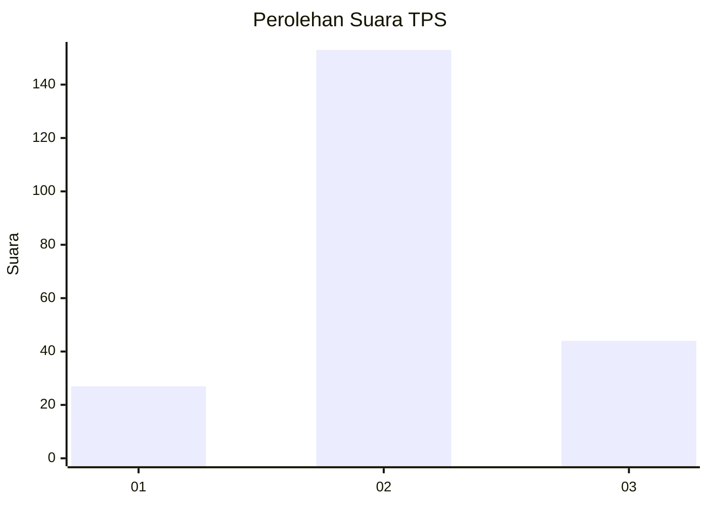
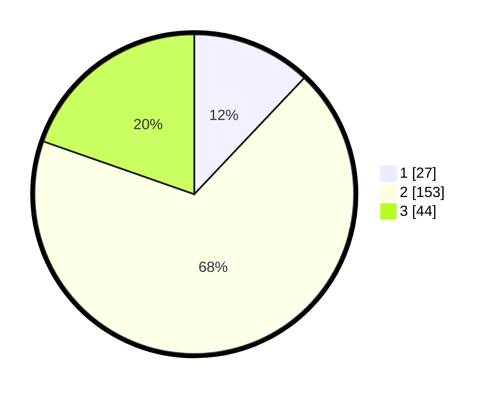

# Hasil

## Grafik

## Tabel

| No. | Nama Paslon    | Suara | Suara (raw) | Persentase |
|:--- |:-------------- | -----:| -----------:| ----------:|
| 1   | ANIES MUHAIMIN | 27    | [27][p-1]   | 12,05      |
| 2   | PRABOWO GIBRAN | 153   | [153][p-2]  | 68,30      |
| 3   | GANJAR MAHFUD  | 44    | [44][p-3]   | 19,64      |

[p-1]: https://github.com/gigit-pemilu/pemilu-2024-35-jawa-timur/blob/main/pilpres/hitung-suara/sub/35-jawa-timur/sub/04-tulungagung/sub/13-rejotangan/sub/2013-tegalrejo/sub/006-tps/sub/paslon-1.txt
[p-2]: https://github.com/gigit-pemilu/pemilu-2024-35-jawa-timur/blob/main/pilpres/hitung-suara/sub/35-jawa-timur/sub/04-tulungagung/sub/13-rejotangan/sub/2013-tegalrejo/sub/006-tps/sub/paslon-2.txt
[p-3]: https://github.com/gigit-pemilu/pemilu-2024-35-jawa-timur/blob/main/pilpres/hitung-suara/sub/35-jawa-timur/sub/04-tulungagung/sub/13-rejotangan/sub/2013-tegalrejo/sub/006-tps/sub/paslon-3.txt

## Foto C Plano

https://sirekap-obj-formc.kpu.go.id/3674/pemilu/ppwp/35/04/13/20/13/3504132013006-20240214-215000--b2badbff-16b9-42cf-aa73-2e89361ba6ec.jpg

https://sirekap-obj-formc.kpu.go.id/3674/pemilu/ppwp/35/04/13/20/13/3504132013006-20240214-223201--24dee701-abbe-44b1-9234-bb90f9b38419.jpg

https://sirekap-obj-formc.kpu.go.id/3674/pemilu/ppwp/35/04/13/20/13/3504132013006-20240214-223333--6514c6a2-7b2a-431d-af2f-0fcb1127c6b5.jpg

## Metadata

| Key        | Value               |
| ---------- | ------------------- |
| Time Stamp | 2024-02-15 15:30:25 |

