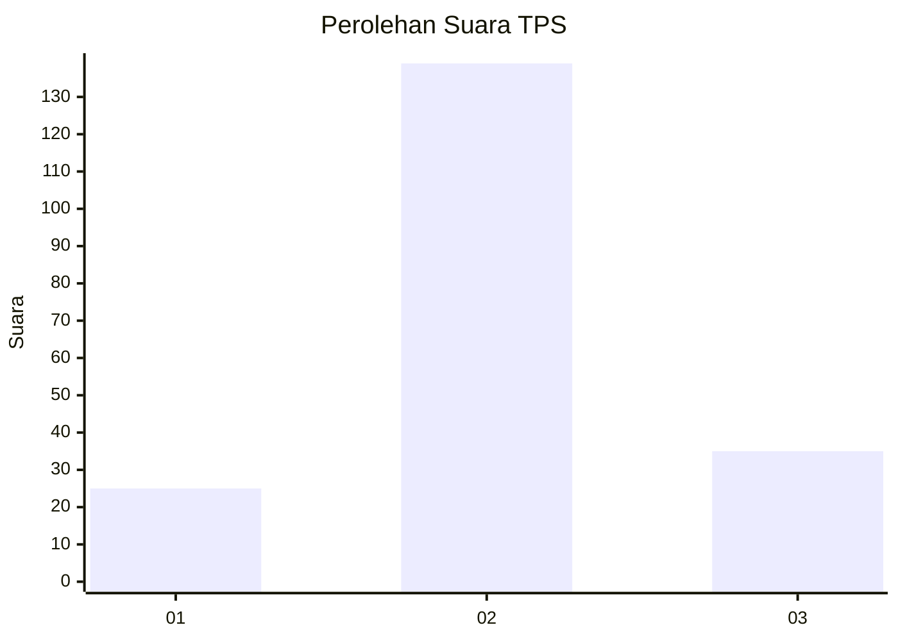
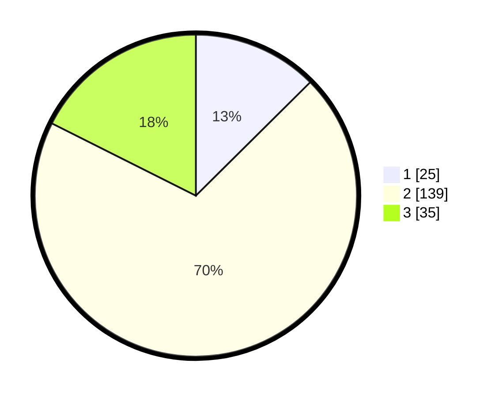

# Hasil

## Grafik

## Tabel

| No. | Nama Paslon    | Suara | Suara (raw) | Persentase |
|:--- |:-------------- | -----:| -----------:| ----------:|
| 1   | ANIES MUHAIMIN | 25    | [25][p-1]   | 12,56      |
| 2   | PRABOWO GIBRAN | 139   | [139][p-2]  | 69,85      |
| 3   | GANJAR MAHFUD  | 35    | [35][p-3]   | 17,59      |

[p-1]: https://github.com/gigit-pemilu/pemilu-2024/blob/main/pilpres/hitung-suara/sub/35-jawa-timur/sub/04-tulungagung/sub/13-rejotangan/sub/2014-ariyojeding/sub/018-tps/sub/paslon-1.txt
[p-2]: https://github.com/gigit-pemilu/pemilu-2024/blob/main/pilpres/hitung-suara/sub/35-jawa-timur/sub/04-tulungagung/sub/13-rejotangan/sub/2014-ariyojeding/sub/018-tps/sub/paslon-2.txt
[p-3]: https://github.com/gigit-pemilu/pemilu-2024/blob/main/pilpres/hitung-suara/sub/35-jawa-timur/sub/04-tulungagung/sub/13-rejotangan/sub/2014-ariyojeding/sub/018-tps/sub/paslon-3.txt

## Foto C Plano

https://sirekap-obj-formc.kpu.go.id/3a4c/pemilu/ppwp/35/04/13/20/14/3504132014018-20240215-060558--7776b842-6320-4941-9ac1-3ed206251350.jpg

https://sirekap-obj-formc.kpu.go.id/3a4c/pemilu/ppwp/35/04/13/20/14/3504132014018-20240214-225022--70b714d0-55be-4bc6-9a9d-7d2c4e1579e4.jpg

https://sirekap-obj-formc.kpu.go.id/3a4c/pemilu/ppwp/35/04/13/20/14/3504132014018-20240214-225238--10bbb976-2350-4b8b-b3d5-6ea3633a1109.jpg

## Metadata

| Key        | Value               |
| ---------- | ------------------- |
| Time Stamp | 2024-02-25 15:00:00 |

