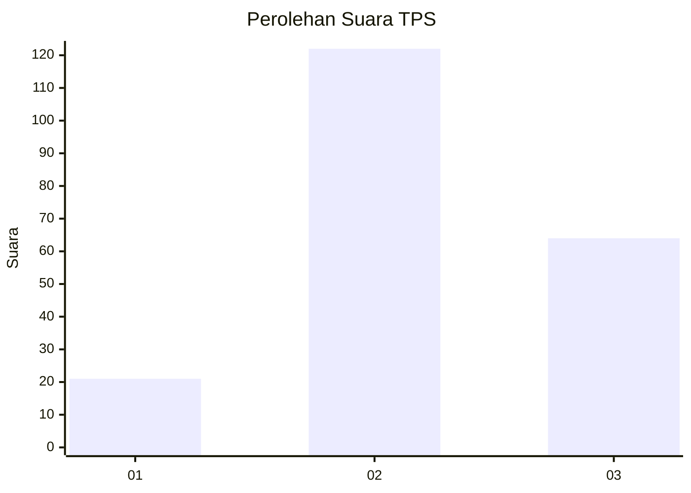
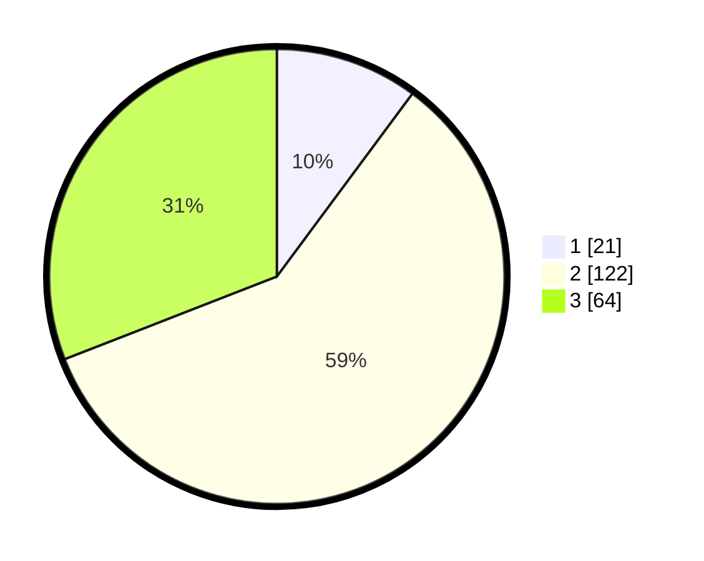

# Hasil

## Grafik

## Tabel

| No. | Nama Paslon    | Suara | Suara (raw) | Persentase |
|:--- |:-------------- | -----:| -----------:| ----------:|
| 1   | ANIES MUHAIMIN | 21    | [21][p-1]   | 10,14      |
| 2   | PRABOWO GIBRAN | 122   | [122][p-2]  | 58,94      |
| 3   | GANJAR MAHFUD  | 64    | [64][p-3]   | 30,92      |

[p-1]: https://github.com/gigit-pemilu/pemilu-2024/blob/main/pilpres/hitung-suara/sub/35-jawa-timur/sub/04-tulungagung/sub/13-rejotangan/sub/2015-tenggong/sub/002-tps/sub/paslon-1.txt
[p-2]: https://github.com/gigit-pemilu/pemilu-2024/blob/main/pilpres/hitung-suara/sub/35-jawa-timur/sub/04-tulungagung/sub/13-rejotangan/sub/2015-tenggong/sub/002-tps/sub/paslon-2.txt
[p-3]: https://github.com/gigit-pemilu/pemilu-2024/blob/main/pilpres/hitung-suara/sub/35-jawa-timur/sub/04-tulungagung/sub/13-rejotangan/sub/2015-tenggong/sub/002-tps/sub/paslon-3.txt

## Foto C Plano

https://sirekap-obj-formc.kpu.go.id/02dd/pemilu/ppwp/35/04/13/20/15/3504132015002-20240216-142920--5bfb549f-e77c-4bf0-9256-32e3bbcfbb9f.jpg

https://sirekap-obj-formc.kpu.go.id/02dd/pemilu/ppwp/35/04/13/20/15/3504132015002-20240216-142145--a340ad36-b52a-47e6-90f9-c20a4e7ce56c.jpg

https://sirekap-obj-formc.kpu.go.id/02dd/pemilu/ppwp/35/04/13/20/15/3504132015002-20240216-142738--ac16706e-38c0-41cb-aa72-201f7d6908c6.jpg

## Metadata

| Key        | Value               |
| ---------- | ------------------- |
| Time Stamp | 2024-02-24 22:31:28 |

