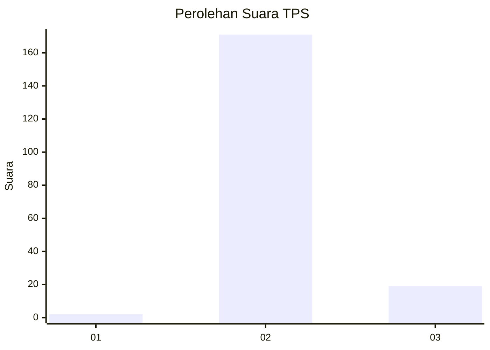
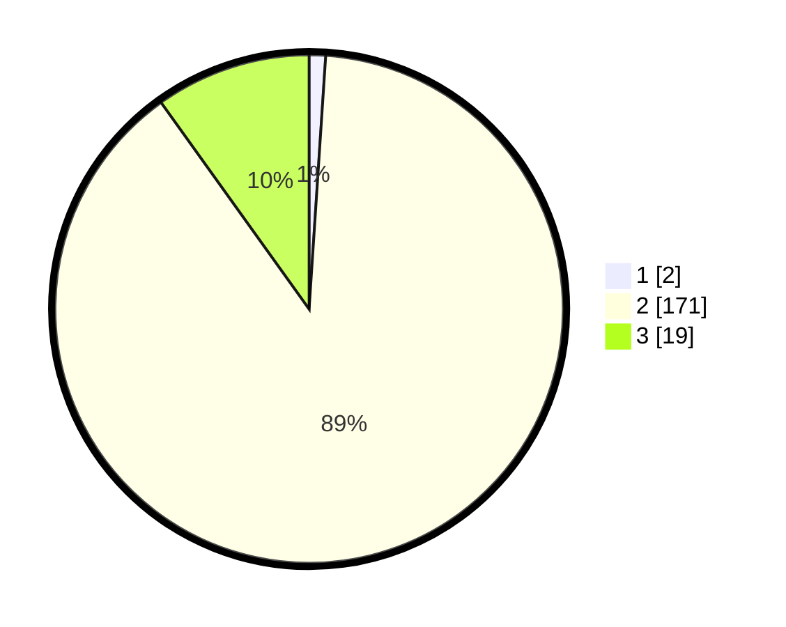

# Hasil

## Grafik

## Tabel

| No. | Nama Paslon    | Suara | Suara (raw) | Persentase |
|:--- |:-------------- | -----:| -----------:| ----------:|
| 1   | ANIES MUHAIMIN | 2     | [2][p-1]    | 1,04       |
| 2   | PRABOWO GIBRAN | 171   | [171][p-2]  | 89,06      |
| 3   | GANJAR MAHFUD  | 19    | [19][p-3]   | 9,90       |

[p-1]: https://github.com/gigit-pemilu/pemilu-2024-35-jawa-timur/blob/main/pilpres/hitung-suara/sub/35-jawa-timur/sub/04-tulungagung/sub/14-kalidawir/sub/2001-kalibatur/sub/001-tps/sub/paslon-1.txt
[p-2]: https://github.com/gigit-pemilu/pemilu-2024-35-jawa-timur/blob/main/pilpres/hitung-suara/sub/35-jawa-timur/sub/04-tulungagung/sub/14-kalidawir/sub/2001-kalibatur/sub/001-tps/sub/paslon-2.txt
[p-3]: https://github.com/gigit-pemilu/pemilu-2024-35-jawa-timur/blob/main/pilpres/hitung-suara/sub/35-jawa-timur/sub/04-tulungagung/sub/14-kalidawir/sub/2001-kalibatur/sub/001-tps/sub/paslon-3.txt

## Foto C Plano

https://sirekap-obj-formc.kpu.go.id/2d32/pemilu/ppwp/35/04/14/20/01/3504142001001-20240216-011844--d859cb24-720c-4b1b-bce7-7be7cfccd5bf.jpg

https://sirekap-obj-formc.kpu.go.id/2d32/pemilu/ppwp/35/04/14/20/01/3504142001001-20240214-190218--a4abdf10-32ca-4ea7-821f-c37487740e06.jpg

https://sirekap-obj-formc.kpu.go.id/2d32/pemilu/ppwp/35/04/14/20/01/3504142001001-20240214-202920--e43d9447-2cdd-4824-8428-e95c482eebfb.jpg

## Metadata

| Key        | Value               |
| ---------- | ------------------- |
| Time Stamp | 2024-02-16 01:30:27 |

