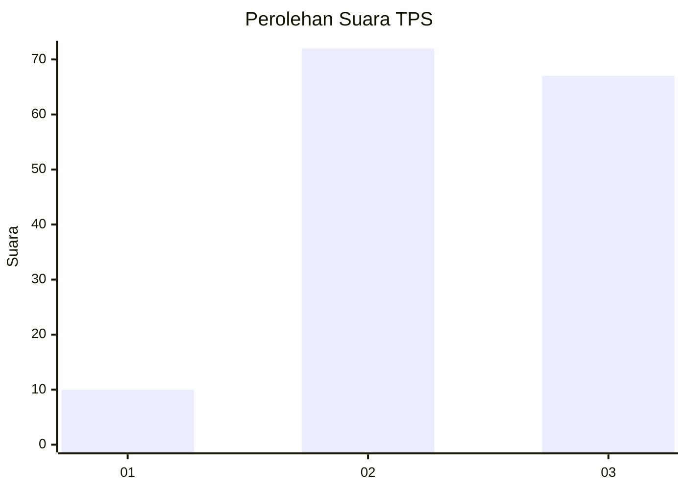
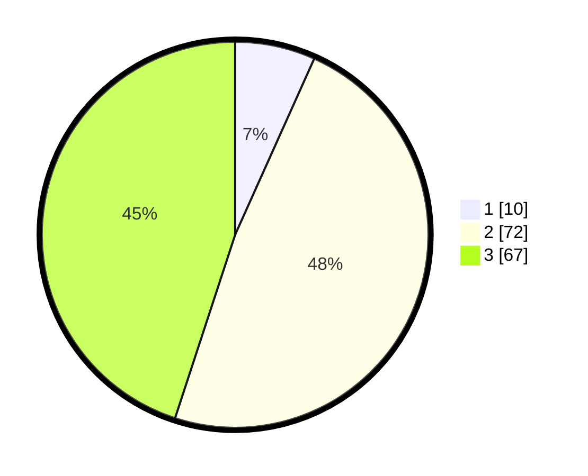

# Hasil

## Grafik

## Tabel

| No. | Nama Paslon    | Suara | Suara (raw) | Persentase |
|:--- |:-------------- | -----:| -----------:| ----------:|
| 1   | ANIES MUHAIMIN | 10    | [10][p-1]   | 6,71       |
| 2   | PRABOWO GIBRAN | 72    | [72][p-2]   | 48,32      |
| 3   | GANJAR MAHFUD  | 67    | [67][p-3]   | 44,97      |

[p-1]: https://github.com/gigit-pemilu/pemilu-2024/blob/main/pilpres/hitung-suara/sub/35-jawa-timur/sub/04-tulungagung/sub/14-kalidawir/sub/2001-kalibatur/sub/013-tps/sub/paslon-1.txt
[p-2]: https://github.com/gigit-pemilu/pemilu-2024/blob/main/pilpres/hitung-suara/sub/35-jawa-timur/sub/04-tulungagung/sub/14-kalidawir/sub/2001-kalibatur/sub/013-tps/sub/paslon-2.txt
[p-3]: https://github.com/gigit-pemilu/pemilu-2024/blob/main/pilpres/hitung-suara/sub/35-jawa-timur/sub/04-tulungagung/sub/14-kalidawir/sub/2001-kalibatur/sub/013-tps/sub/paslon-3.txt

## Foto C Plano

https://sirekap-obj-formc.kpu.go.id/184b/pemilu/ppwp/35/04/14/20/01/3504142001013-20240215-011059--240c7b9f-ad52-44cf-ae5d-e3ccc263f5d4.jpg

https://sirekap-obj-formc.kpu.go.id/184b/pemilu/ppwp/35/04/14/20/01/3504142001013-20240215-011159--7ab872ed-8605-4006-8c45-41f1fb2c6a8e.jpg

https://sirekap-obj-formc.kpu.go.id/184b/pemilu/ppwp/35/04/14/20/01/3504142001013-20240215-011258--ff04adcc-ee69-4b44-a393-68f4182e5861.jpg

## Metadata

| Key        | Value               |
| ---------- | ------------------- |
| Time Stamp | 2024-02-25 13:00:00 |

