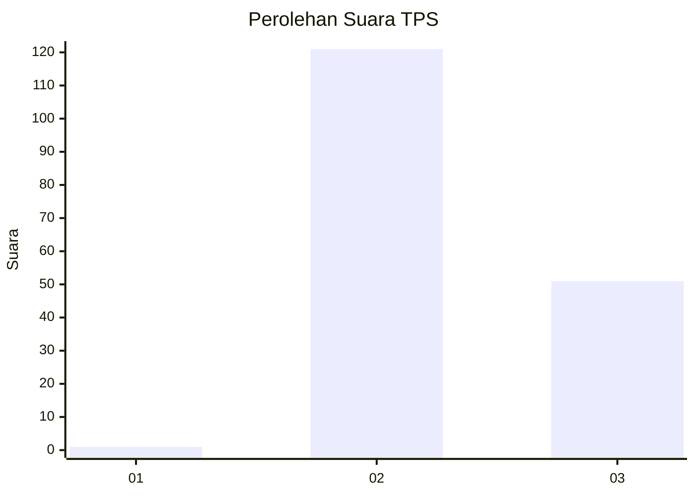
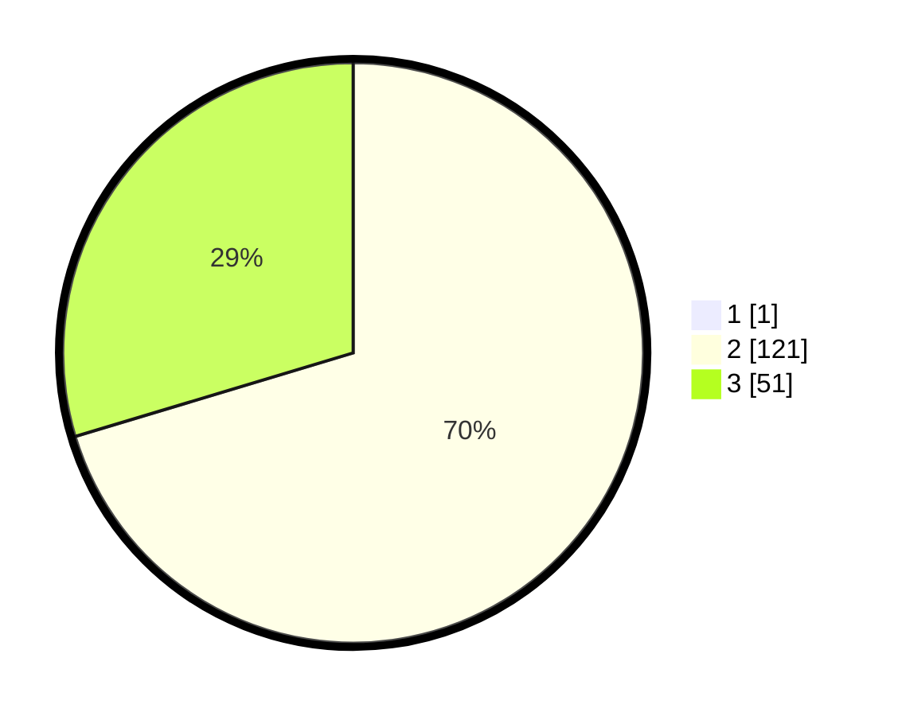

# Hasil

## Grafik

## Tabel

| No. | Nama Paslon    | Suara | Suara (raw) | Persentase |
|:--- |:-------------- | -----:| -----------:| ----------:|
| 1   | ANIES MUHAIMIN | 1     | [1][p-1]    | 0,58       |
| 2   | PRABOWO GIBRAN | 121   | [121][p-2]  | 69,94      |
| 3   | GANJAR MAHFUD  | 51    | [51][p-3]   | 29,48      |

[p-1]: https://github.com/gigit-pemilu/pemilu-2024-35-jawa-timur/blob/main/pilpres/hitung-suara/sub/35-jawa-timur/sub/04-tulungagung/sub/14-kalidawir/sub/2006-banyuurip/sub/004-tps/sub/paslon-1.txt
[p-2]: https://github.com/gigit-pemilu/pemilu-2024-35-jawa-timur/blob/main/pilpres/hitung-suara/sub/35-jawa-timur/sub/04-tulungagung/sub/14-kalidawir/sub/2006-banyuurip/sub/004-tps/sub/paslon-2.txt
[p-3]: https://github.com/gigit-pemilu/pemilu-2024-35-jawa-timur/blob/main/pilpres/hitung-suara/sub/35-jawa-timur/sub/04-tulungagung/sub/14-kalidawir/sub/2006-banyuurip/sub/004-tps/sub/paslon-3.txt

## Foto C Plano

https://sirekap-obj-formc.kpu.go.id/4b7f/pemilu/ppwp/35/04/14/20/06/3504142006004-20240216-190451--1a2a31b2-327a-4c0c-844e-d81441ed962c.jpg

https://sirekap-obj-formc.kpu.go.id/4b7f/pemilu/ppwp/35/04/14/20/06/3504142006004-20240216-181857--a774c551-5428-4a1d-ab54-a2c2ade8f7de.jpg

https://sirekap-obj-formc.kpu.go.id/4b7f/pemilu/ppwp/35/04/14/20/06/3504142006004-20240216-181328--b5de15da-d042-48c4-b82e-90f4f95e0243.jpg

## Metadata

| Key        | Value               |
| ---------- | ------------------- |
| Time Stamp | 2024-02-24 22:31:28 |

