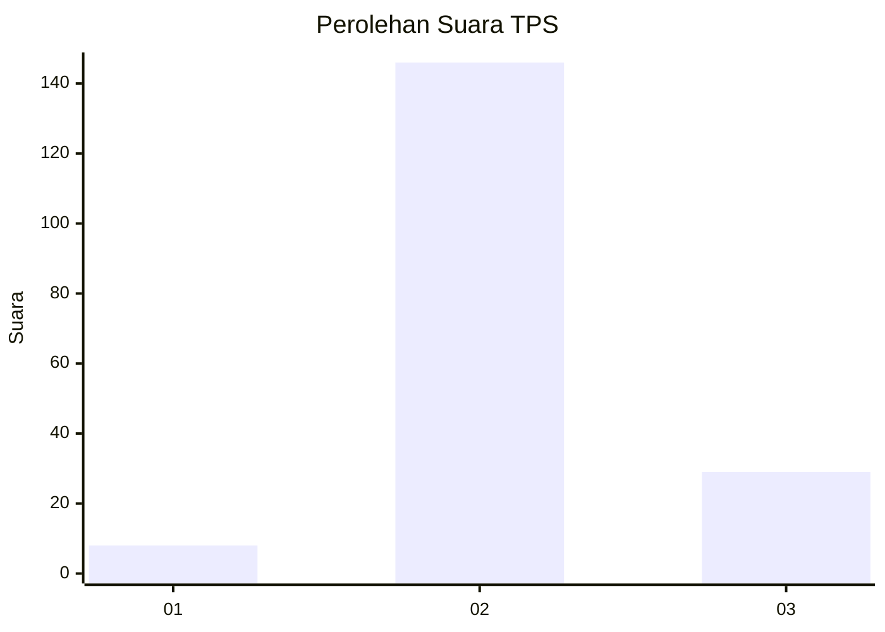
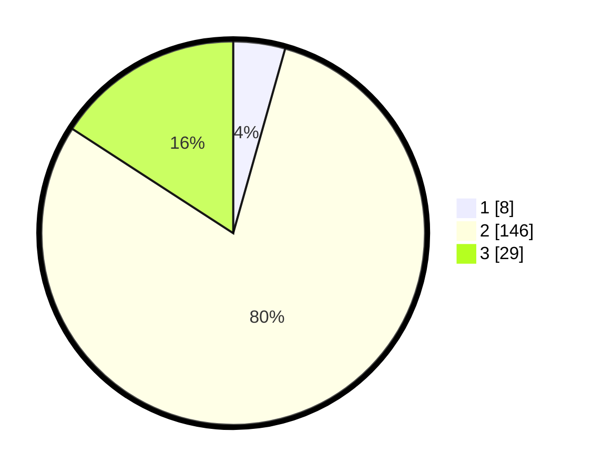

# Hasil

## Grafik

## Tabel

| No. | Nama Paslon    | Suara | Suara (raw) | Persentase |
|:--- |:-------------- | -----:| -----------:| ----------:|
| 1   | ANIES MUHAIMIN | 8     | [8][p-1]    | 4,37       |
| 2   | PRABOWO GIBRAN | 146   | [146][p-2]  | 79,78      |
| 3   | GANJAR MAHFUD  | 29    | [29][p-3]   | 15,85      |

[p-1]: https://github.com/gigit-pemilu/pemilu-2024/blob/main/pilpres/hitung-suara/sub/35-jawa-timur/sub/04-tulungagung/sub/14-kalidawir/sub/2006-banyuurip/sub/008-tps/sub/paslon-1.txt
[p-2]: https://github.com/gigit-pemilu/pemilu-2024/blob/main/pilpres/hitung-suara/sub/35-jawa-timur/sub/04-tulungagung/sub/14-kalidawir/sub/2006-banyuurip/sub/008-tps/sub/paslon-2.txt
[p-3]: https://github.com/gigit-pemilu/pemilu-2024/blob/main/pilpres/hitung-suara/sub/35-jawa-timur/sub/04-tulungagung/sub/14-kalidawir/sub/2006-banyuurip/sub/008-tps/sub/paslon-3.txt

## Foto C Plano

https://sirekap-obj-formc.kpu.go.id/7dcb/pemilu/ppwp/35/04/14/20/06/3504142006008-20240216-174954--0673aa6b-87a8-491c-9ee6-d68f4e9d4bad.jpg

https://sirekap-obj-formc.kpu.go.id/7dcb/pemilu/ppwp/35/04/14/20/06/3504142006008-20240216-175120--86349bfc-f56c-44bb-bae1-d639092cbb2d.jpg

https://sirekap-obj-formc.kpu.go.id/7dcb/pemilu/ppwp/35/04/14/20/06/3504142006008-20240216-175231--53c3b738-76f9-4a8e-a38a-7949cca7a1d6.jpg

## Metadata

| Key        | Value               |
| ---------- | ------------------- |
| Time Stamp | 2024-02-25 16:00:00 |

