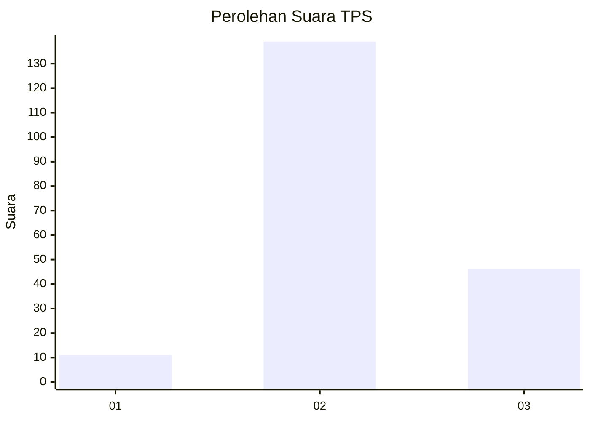
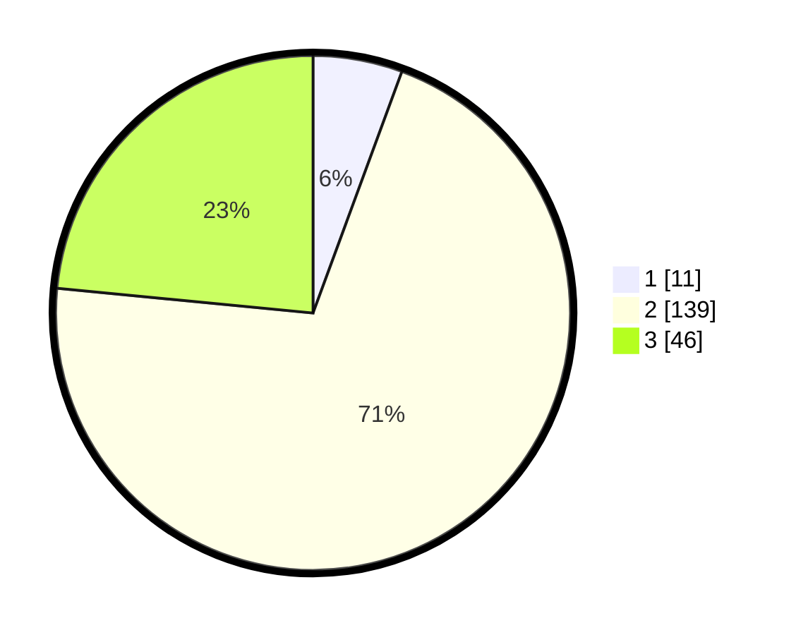

# Hasil

## Grafik

## Tabel

| No. | Nama Paslon    | Suara | Suara (raw) | Persentase |
|:--- |:-------------- | -----:| -----------:| ----------:|
| 1   | ANIES MUHAIMIN | 11    | [11][p-1]   | 5,61       |
| 2   | PRABOWO GIBRAN | 139   | [139][p-2]  | 70,92      |
| 3   | GANJAR MAHFUD  | 46    | [46][p-3]   | 23,47      |

[p-1]: https://github.com/gigit-pemilu/pemilu-2024/blob/main/pilpres/hitung-suara/sub/35-jawa-timur/sub/04-tulungagung/sub/14-kalidawir/sub/2008-joho/sub/014-tps/sub/paslon-1.txt
[p-2]: https://github.com/gigit-pemilu/pemilu-2024/blob/main/pilpres/hitung-suara/sub/35-jawa-timur/sub/04-tulungagung/sub/14-kalidawir/sub/2008-joho/sub/014-tps/sub/paslon-2.txt
[p-3]: https://github.com/gigit-pemilu/pemilu-2024/blob/main/pilpres/hitung-suara/sub/35-jawa-timur/sub/04-tulungagung/sub/14-kalidawir/sub/2008-joho/sub/014-tps/sub/paslon-3.txt

## Foto C Plano

https://sirekap-obj-formc.kpu.go.id/7311/pemilu/ppwp/35/04/14/20/08/3504142008014-20240214-212008--b363ae59-d2db-4ae1-9b9a-cda6d8cee4f1.jpg

https://sirekap-obj-formc.kpu.go.id/7311/pemilu/ppwp/35/04/14/20/08/3504142008014-20240216-151600--fb3ce9eb-fdb6-49ab-a0ec-ee89a88c3d03.jpg

https://sirekap-obj-formc.kpu.go.id/7311/pemilu/ppwp/35/04/14/20/08/3504142008014-20240216-151600--c9dd3133-93ae-43f1-81c4-ec7080628c31.jpg

## Metadata

| Key        | Value               |
| ---------- | ------------------- |
| Time Stamp | 2024-02-21 22:00:00 |

