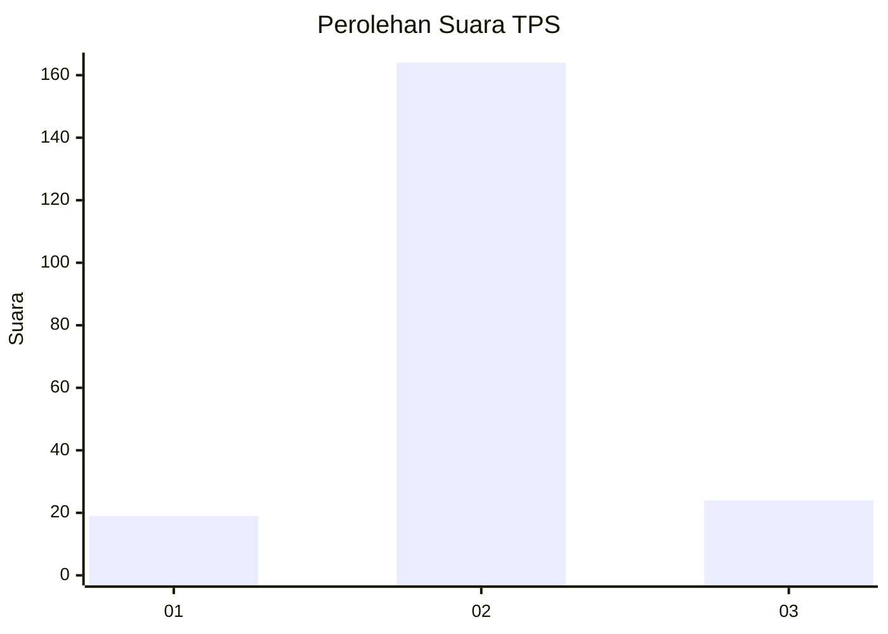
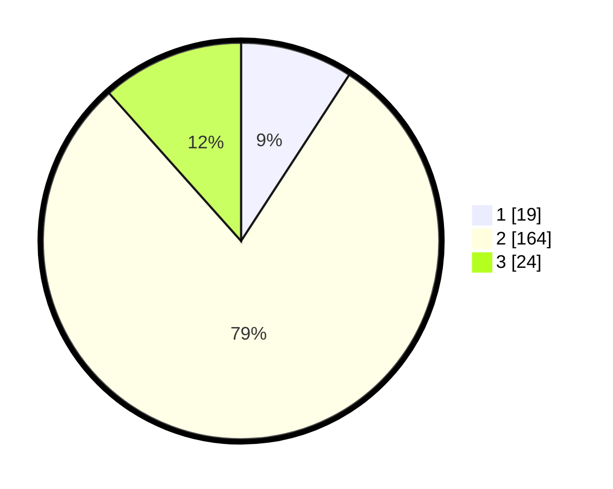

# Hasil

## Grafik

## Tabel

| No. | Nama Paslon    | Suara | Suara (raw) | Persentase |
|:--- |:-------------- | -----:| -----------:| ----------:|
| 1   | ANIES MUHAIMIN | 19    | [19][p-1]   | 9,18       |
| 2   | PRABOWO GIBRAN | 164   | [164][p-2]  | 79,23      |
| 3   | GANJAR MAHFUD  | 24    | [24][p-3]   | 11,59      |

[p-1]: https://github.com/gigit-pemilu/pemilu-2024/blob/main/pilpres/hitung-suara/sub/35-jawa-timur/sub/04-tulungagung/sub/14-kalidawir/sub/2017-pagersari/sub/009-tps/sub/paslon-1.txt
[p-2]: https://github.com/gigit-pemilu/pemilu-2024/blob/main/pilpres/hitung-suara/sub/35-jawa-timur/sub/04-tulungagung/sub/14-kalidawir/sub/2017-pagersari/sub/009-tps/sub/paslon-2.txt
[p-3]: https://github.com/gigit-pemilu/pemilu-2024/blob/main/pilpres/hitung-suara/sub/35-jawa-timur/sub/04-tulungagung/sub/14-kalidawir/sub/2017-pagersari/sub/009-tps/sub/paslon-3.txt

## Foto C Plano

https://sirekap-obj-formc.kpu.go.id/d3b0/pemilu/ppwp/35/04/14/20/17/3504142017009-20240216-205358--fed1b123-8a4d-4b3a-a345-1a30b278b51f.jpg

https://sirekap-obj-formc.kpu.go.id/d3b0/pemilu/ppwp/35/04/14/20/17/3504142017009-20240216-211325--f3f78e74-774e-4b11-8a73-3bdb782defb3.jpg

https://sirekap-obj-formc.kpu.go.id/d3b0/pemilu/ppwp/35/04/14/20/17/3504142017009-20240216-204237--355eddde-10f7-4435-b0a8-41c2b07f354e.jpg

## Metadata

| Key        | Value               |
| ---------- | ------------------- |
| Time Stamp | 2024-02-21 18:00:00 |

