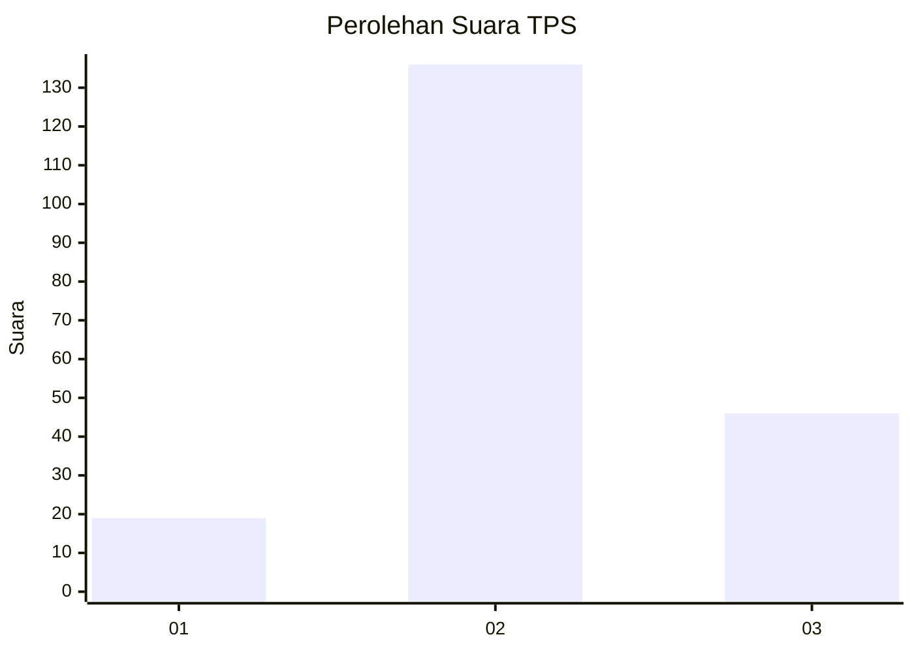
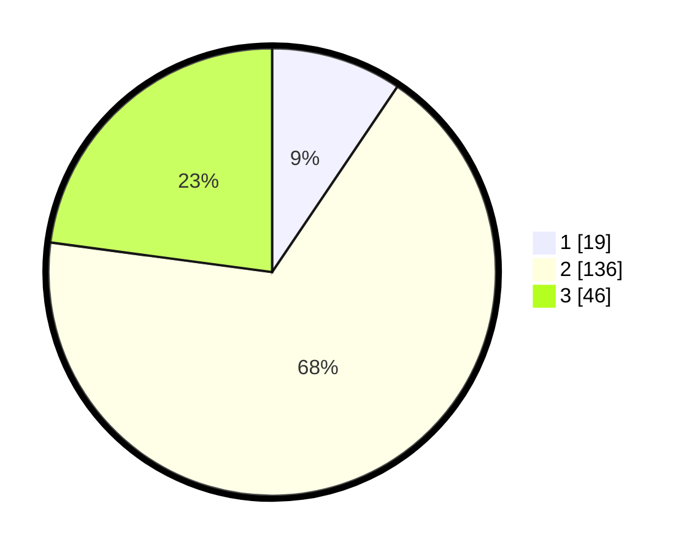

# Hasil

## Grafik

## Tabel

| No. | Nama Paslon    | Suara | Suara (raw) | Persentase |
|:--- |:-------------- | -----:| -----------:| ----------:|
| 1   | ANIES MUHAIMIN | 19    | [19][p-1]   | 9,45       |
| 2   | PRABOWO GIBRAN | 136   | [136][p-2]  | 67,66      |
| 3   | GANJAR MAHFUD  | 46    | [46][p-3]   | 22,89      |

[p-1]: https://github.com/gigit-pemilu/pemilu-2024/blob/main/pilpres/hitung-suara/sub/35-jawa-timur/sub/04-tulungagung/sub/15-besuki/sub/2001-besole/sub/002-tps/sub/paslon-1.txt
[p-2]: https://github.com/gigit-pemilu/pemilu-2024/blob/main/pilpres/hitung-suara/sub/35-jawa-timur/sub/04-tulungagung/sub/15-besuki/sub/2001-besole/sub/002-tps/sub/paslon-2.txt
[p-3]: https://github.com/gigit-pemilu/pemilu-2024/blob/main/pilpres/hitung-suara/sub/35-jawa-timur/sub/04-tulungagung/sub/15-besuki/sub/2001-besole/sub/002-tps/sub/paslon-3.txt

## Foto C Plano

https://sirekap-obj-formc.kpu.go.id/92d7/pemilu/ppwp/35/04/15/20/01/3504152001002-20240214-234628--7944b121-bd8c-46dc-9045-8a5513346ba1.jpg

https://sirekap-obj-formc.kpu.go.id/92d7/pemilu/ppwp/35/04/15/20/01/3504152001002-20240214-234642--f0ab6502-9ae2-4562-bd78-0ff2030b8906.jpg

https://sirekap-obj-formc.kpu.go.id/92d7/pemilu/ppwp/35/04/15/20/01/3504152001002-20240214-234707--121fb731-d49a-42b7-9317-fa2d62486da4.jpg

## Metadata

| Key        | Value               |
| ---------- | ------------------- |
| Time Stamp | 2024-02-19 06:16:00 |

