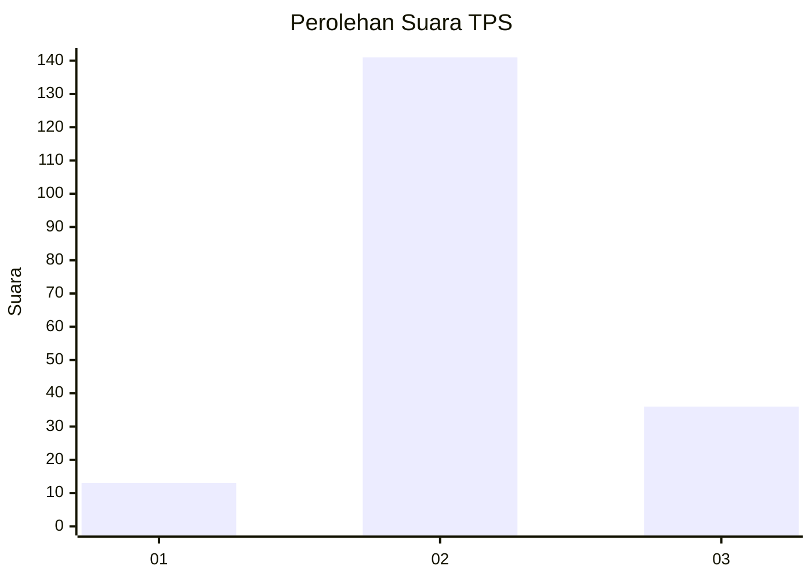
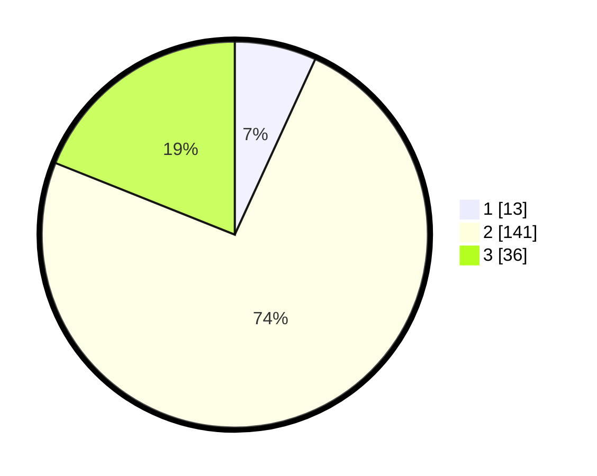

# Hasil

## Grafik

## Tabel

| No. | Nama Paslon    | Suara | Suara (raw) | Persentase |
|:--- |:-------------- | -----:| -----------:| ----------:|
| 1   | ANIES MUHAIMIN | 13    | [13][p-1]   | 6,84       |
| 2   | PRABOWO GIBRAN | 141   | [141][p-2]  | 74,21      |
| 3   | GANJAR MAHFUD  | 36    | [36][p-3]   | 18,95      |

[p-1]: https://github.com/gigit-pemilu/pemilu-2024/blob/main/pilpres/hitung-suara/sub/35-jawa-timur/sub/04-tulungagung/sub/15-besuki/sub/2001-besole/sub/003-tps/sub/paslon-1.txt
[p-2]: https://github.com/gigit-pemilu/pemilu-2024/blob/main/pilpres/hitung-suara/sub/35-jawa-timur/sub/04-tulungagung/sub/15-besuki/sub/2001-besole/sub/003-tps/sub/paslon-2.txt
[p-3]: https://github.com/gigit-pemilu/pemilu-2024/blob/main/pilpres/hitung-suara/sub/35-jawa-timur/sub/04-tulungagung/sub/15-besuki/sub/2001-besole/sub/003-tps/sub/paslon-3.txt

## Foto C Plano

https://sirekap-obj-formc.kpu.go.id/9010/pemilu/ppwp/35/04/15/20/01/3504152001003-20240214-223040--459887a3-d36e-4b49-8d20-a9012566d752.jpg

https://sirekap-obj-formc.kpu.go.id/9010/pemilu/ppwp/35/04/15/20/01/3504152001003-20240214-223121--86d1c226-41ab-48e6-afdd-001a5a2c47cb.jpg

https://sirekap-obj-formc.kpu.go.id/9010/pemilu/ppwp/35/04/15/20/01/3504152001003-20240214-223154--f9ed4b8f-9230-4b4f-933a-8c38743b3a62.jpg

## Metadata

| Key        | Value               |
| ---------- | ------------------- |
| Time Stamp | 2024-02-19 06:16:00 |

