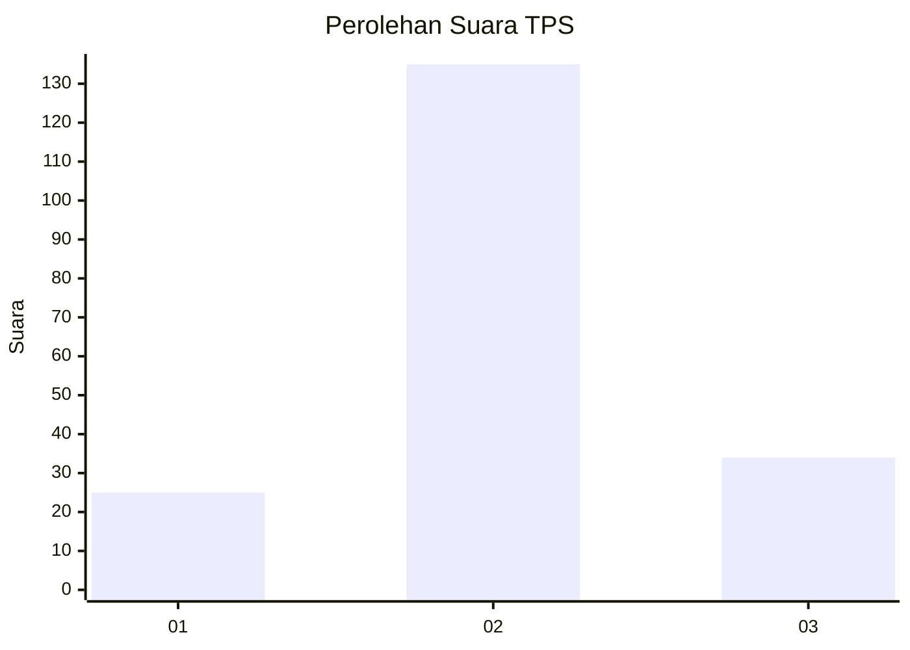
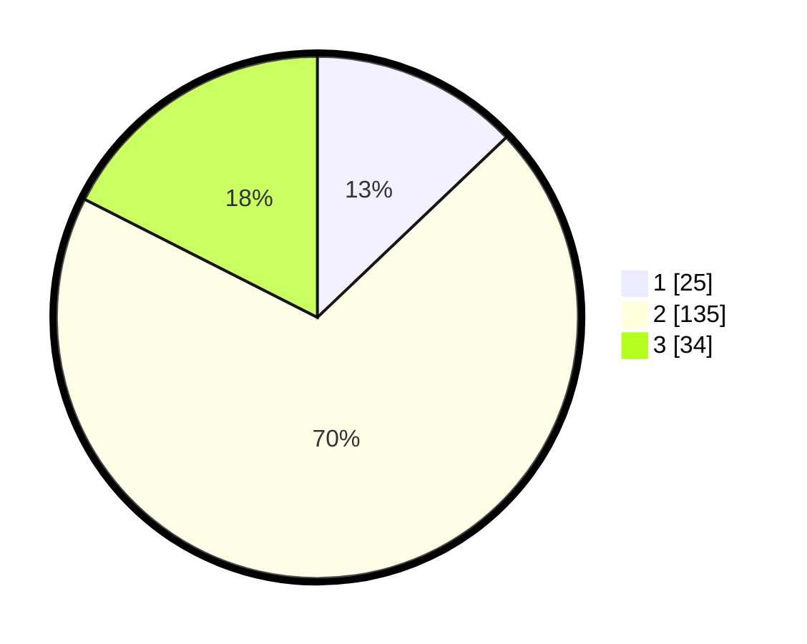

# Hasil

## Grafik

## Tabel

| No. | Nama Paslon    | Suara | Suara (raw) | Persentase |
|:--- |:-------------- | -----:| -----------:| ----------:|
| 1   | ANIES MUHAIMIN | 25    | [25][p-1]   | 12,89      |
| 2   | PRABOWO GIBRAN | 135   | [135][p-2]  | 69,59      |
| 3   | GANJAR MAHFUD  | 34    | [34][p-3]   | 17,53      |

[p-1]: https://github.com/gigit-pemilu/pemilu-2024/blob/main/pilpres/hitung-suara/sub/35-jawa-timur/sub/04-tulungagung/sub/15-besuki/sub/2001-besole/sub/005-tps/sub/paslon-1.txt
[p-2]: https://github.com/gigit-pemilu/pemilu-2024/blob/main/pilpres/hitung-suara/sub/35-jawa-timur/sub/04-tulungagung/sub/15-besuki/sub/2001-besole/sub/005-tps/sub/paslon-2.txt
[p-3]: https://github.com/gigit-pemilu/pemilu-2024/blob/main/pilpres/hitung-suara/sub/35-jawa-timur/sub/04-tulungagung/sub/15-besuki/sub/2001-besole/sub/005-tps/sub/paslon-3.txt

## Foto C Plano

https://sirekap-obj-formc.kpu.go.id/1024/pemilu/ppwp/35/04/15/20/01/3504152001005-20240215-015238--5884ac05-6704-46d5-9279-13ffe1f00124.jpg

https://sirekap-obj-formc.kpu.go.id/1024/pemilu/ppwp/35/04/15/20/01/3504152001005-20240215-015414--5b9d34ae-560a-4d89-95c0-d8c133ff84f9.jpg

https://sirekap-obj-formc.kpu.go.id/1024/pemilu/ppwp/35/04/15/20/01/3504152001005-20240215-015720--161a7913-d432-4a0c-abdb-3c00bc8bfa93.jpg

## Metadata

| Key        | Value               |
| ---------- | ------------------- |
| Time Stamp | 2024-02-19 06:16:00 |

