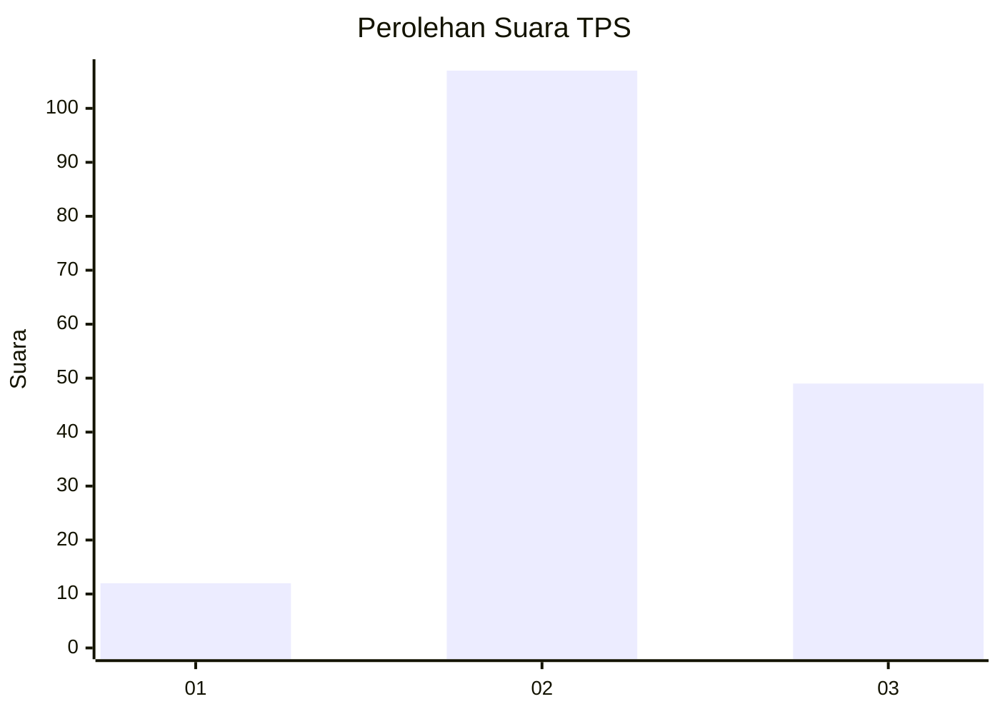
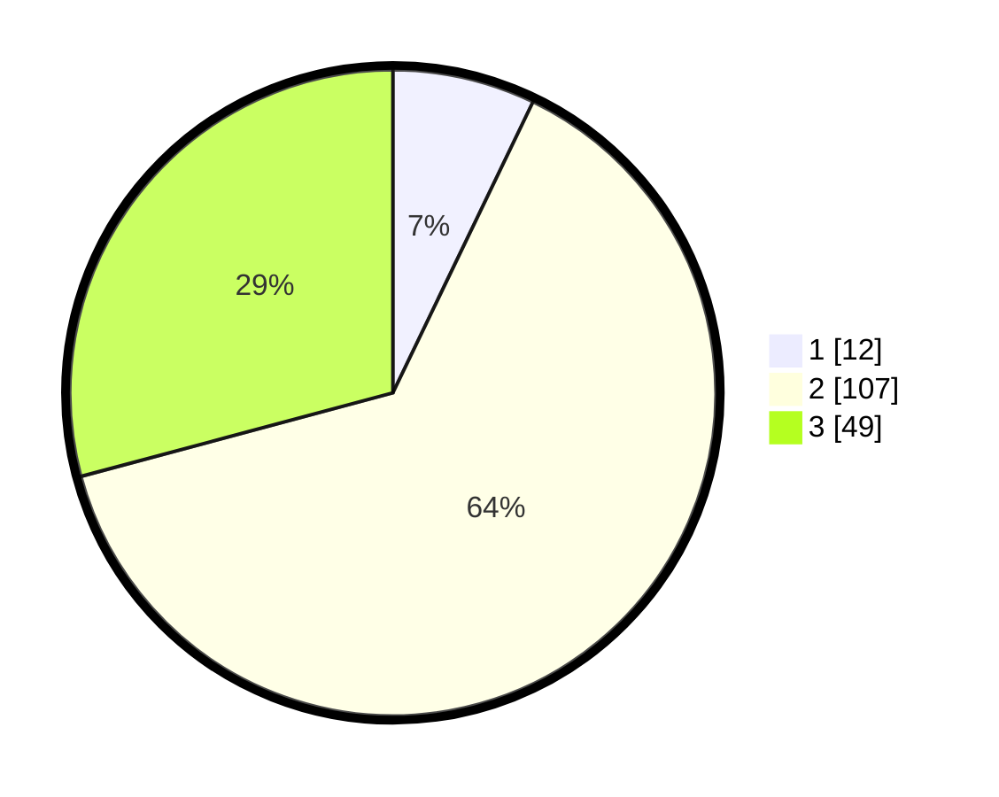

# Hasil

## Grafik

## Tabel

| No. | Nama Paslon    | Suara | Suara (raw) | Persentase |
|:--- |:-------------- | -----:| -----------:| ----------:|
| 1   | ANIES MUHAIMIN | 12    | [12][p-1]   | 7,14       |
| 2   | PRABOWO GIBRAN | 107   | [107][p-2]  | 63,69      |
| 3   | GANJAR MAHFUD  | 49    | [49][p-3]   | 29,17      |

[p-1]: https://github.com/gigit-pemilu/pemilu-2024-35-jawa-timur/blob/main/pilpres/hitung-suara/sub/35-jawa-timur/sub/04-tulungagung/sub/15-besuki/sub/2001-besole/sub/009-tps/sub/paslon-1.txt
[p-2]: https://github.com/gigit-pemilu/pemilu-2024-35-jawa-timur/blob/main/pilpres/hitung-suara/sub/35-jawa-timur/sub/04-tulungagung/sub/15-besuki/sub/2001-besole/sub/009-tps/sub/paslon-2.txt
[p-3]: https://github.com/gigit-pemilu/pemilu-2024-35-jawa-timur/blob/main/pilpres/hitung-suara/sub/35-jawa-timur/sub/04-tulungagung/sub/15-besuki/sub/2001-besole/sub/009-tps/sub/paslon-3.txt

## Foto C Plano

https://sirekap-obj-formc.kpu.go.id/6969/pemilu/ppwp/35/04/15/20/01/3504152001009-20240214-212025--d41c52b6-dab7-416e-94e7-cf1a3ffafcb7.jpg

https://sirekap-obj-formc.kpu.go.id/6969/pemilu/ppwp/35/04/15/20/01/3504152001009-20240214-203958--321fc8b2-77d1-4f2a-ac8a-af5b40ed0cd8.jpg

https://sirekap-obj-formc.kpu.go.id/6969/pemilu/ppwp/35/04/15/20/01/3504152001009-20240214-204003--1b182852-fa58-499c-b274-7bace50efd48.jpg

## Metadata

| Key        | Value               |
| ---------- | ------------------- |
| Time Stamp | 2024-02-15 02:10:27 |

