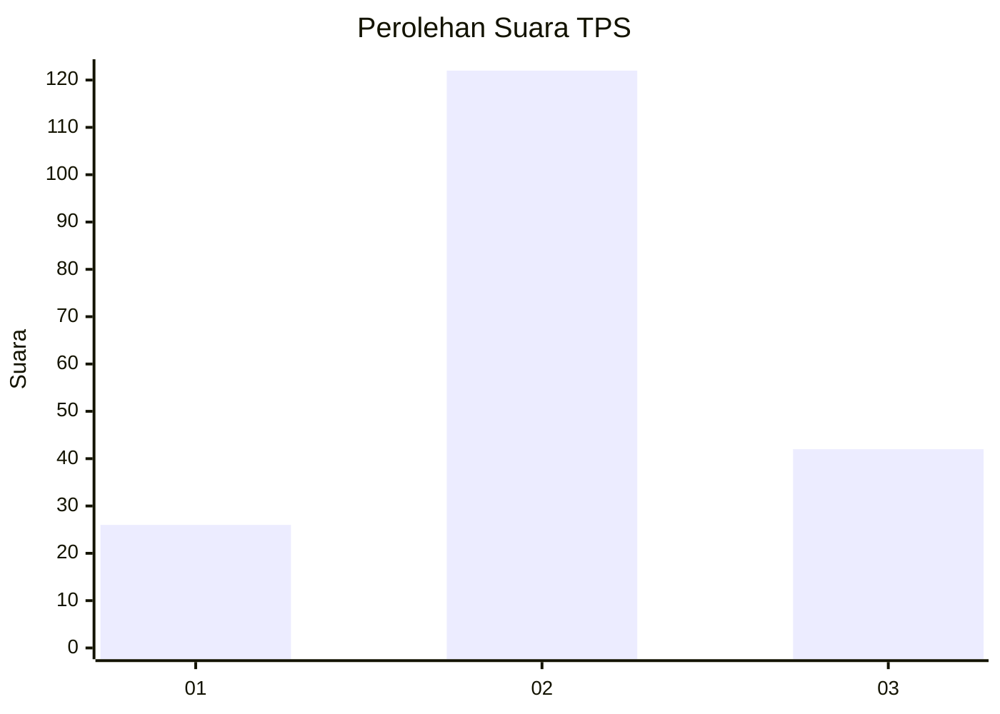
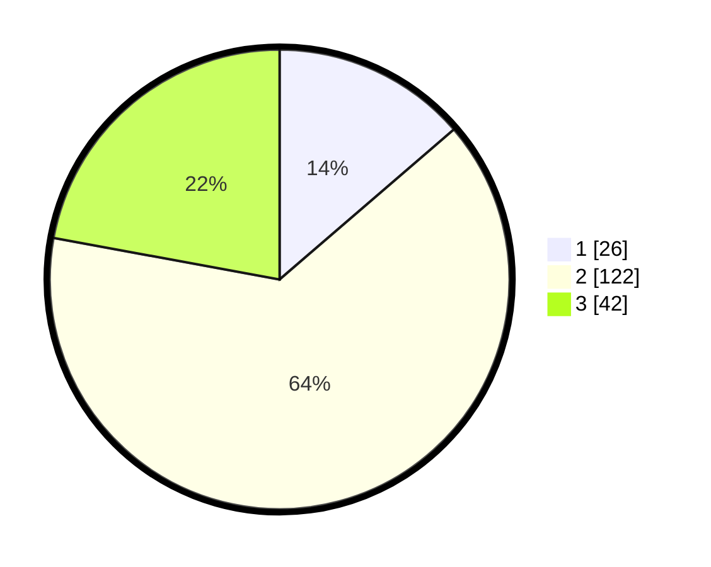

# Hasil

## Grafik

## Tabel

| No. | Nama Paslon    | Suara | Suara (raw) | Persentase |
|:--- |:-------------- | -----:| -----------:| ----------:|
| 1   | ANIES MUHAIMIN | 26    | [26][p-1]   | 13,68      |
| 2   | PRABOWO GIBRAN | 122   | [122][p-2]  | 64,21      |
| 3   | GANJAR MAHFUD  | 42    | [42][p-3]   | 22,11      |

[p-1]: https://github.com/gigit-pemilu/pemilu-2024-35-jawa-timur/blob/main/pilpres/hitung-suara/sub/35-jawa-timur/sub/04-tulungagung/sub/15-besuki/sub/2001-besole/sub/014-tps/sub/paslon-1.txt
[p-2]: https://github.com/gigit-pemilu/pemilu-2024-35-jawa-timur/blob/main/pilpres/hitung-suara/sub/35-jawa-timur/sub/04-tulungagung/sub/15-besuki/sub/2001-besole/sub/014-tps/sub/paslon-2.txt
[p-3]: https://github.com/gigit-pemilu/pemilu-2024-35-jawa-timur/blob/main/pilpres/hitung-suara/sub/35-jawa-timur/sub/04-tulungagung/sub/15-besuki/sub/2001-besole/sub/014-tps/sub/paslon-3.txt

## Foto C Plano

https://sirekap-obj-formc.kpu.go.id/4901/pemilu/ppwp/35/04/15/20/01/3504152001014-20240214-232539--6ce20180-168f-4ac2-b717-d3fc1f8e79e1.jpg

https://sirekap-obj-formc.kpu.go.id/4901/pemilu/ppwp/35/04/15/20/01/3504152001014-20240214-232637--0637c6fb-84be-4fad-ad39-5ecb2f7abeee.jpg

https://sirekap-obj-formc.kpu.go.id/4901/pemilu/ppwp/35/04/15/20/01/3504152001014-20240214-232749--2728950d-a767-4ebe-86d8-4306bed65dba.jpg

## Metadata

| Key        | Value               |
| ---------- | ------------------- |
| Time Stamp | 2024-02-19 06:16:00 |

