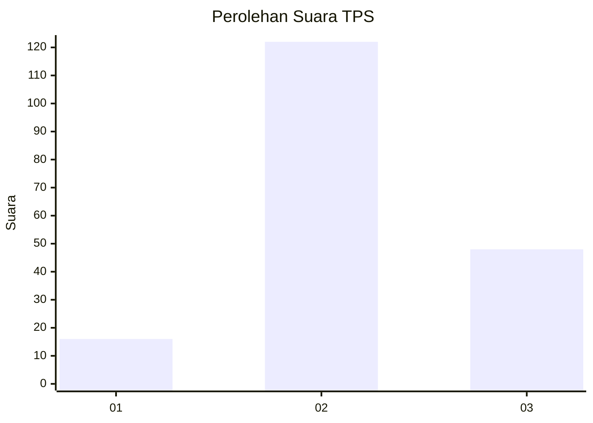
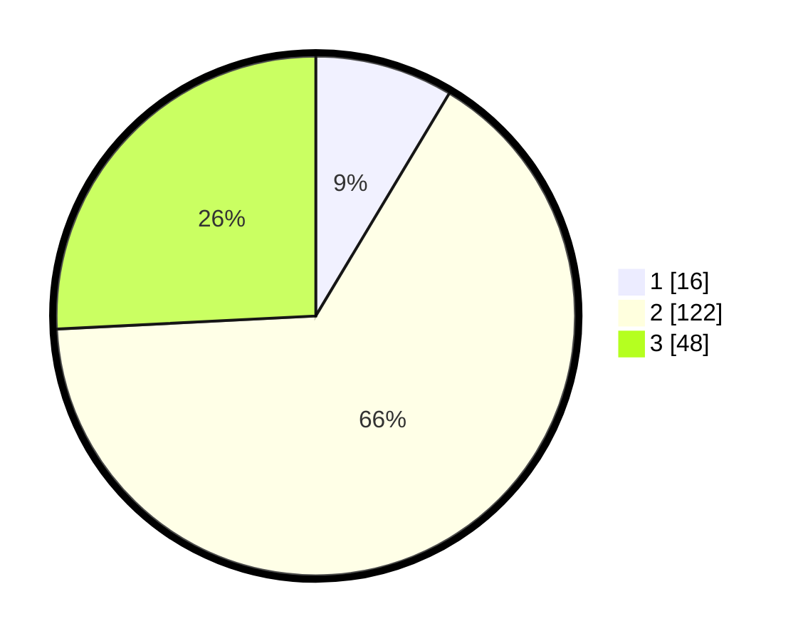

# Hasil

## Grafik

## Tabel

| No. | Nama Paslon    | Suara | Suara (raw) | Persentase |
|:--- |:-------------- | -----:| -----------:| ----------:|
| 1   | ANIES MUHAIMIN | 16    | [16][p-1]   | 8,60       |
| 2   | PRABOWO GIBRAN | 122   | [122][p-2]  | 65,59      |
| 3   | GANJAR MAHFUD  | 48    | [48][p-3]   | 25,81      |

[p-1]: https://github.com/gigit-pemilu/pemilu-2024/blob/main/pilpres/hitung-suara/sub/35-jawa-timur/sub/04-tulungagung/sub/15-besuki/sub/2001-besole/sub/015-tps/sub/paslon-1.txt
[p-2]: https://github.com/gigit-pemilu/pemilu-2024/blob/main/pilpres/hitung-suara/sub/35-jawa-timur/sub/04-tulungagung/sub/15-besuki/sub/2001-besole/sub/015-tps/sub/paslon-2.txt
[p-3]: https://github.com/gigit-pemilu/pemilu-2024/blob/main/pilpres/hitung-suara/sub/35-jawa-timur/sub/04-tulungagung/sub/15-besuki/sub/2001-besole/sub/015-tps/sub/paslon-3.txt

## Foto C Plano

https://sirekap-obj-formc.kpu.go.id/7532/pemilu/ppwp/35/04/15/20/01/3504152001015-20240214-222630--9ef89645-2780-425c-99e9-681001c56a2c.jpg

https://sirekap-obj-formc.kpu.go.id/7532/pemilu/ppwp/35/04/15/20/01/3504152001015-20240214-223126--7578d704-9604-4b22-a9c3-bb94dd05c6d2.jpg

https://sirekap-obj-formc.kpu.go.id/7532/pemilu/ppwp/35/04/15/20/01/3504152001015-20240214-222433--aac5650d-86e4-4331-8090-8b578f87b3e8.jpg

## Metadata

| Key        | Value               |
| ---------- | ------------------- |
| Time Stamp | 2024-02-19 06:16:00 |

