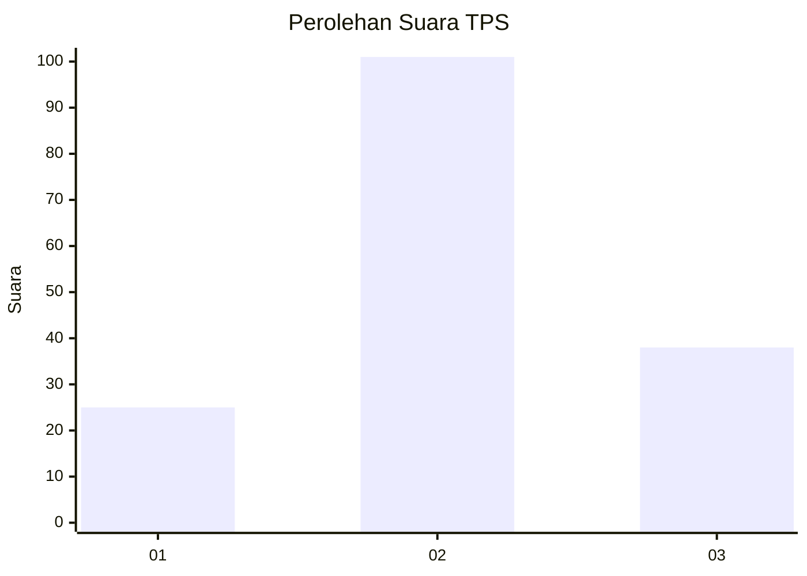
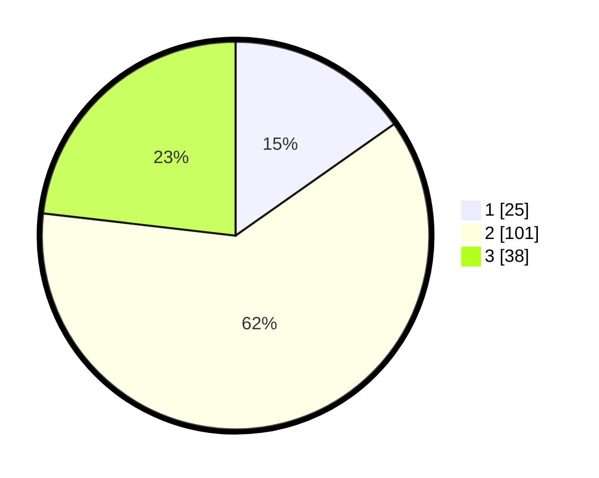

# Hasil

## Grafik

## Tabel

| No. | Nama Paslon    | Suara | Suara (raw) | Persentase |
|:--- |:-------------- | -----:| -----------:| ----------:|
| 1   | ANIES MUHAIMIN | 25    | [25][p-1]   | 15,24      |
| 2   | PRABOWO GIBRAN | 101   | [101][p-2]  | 61,59      |
| 3   | GANJAR MAHFUD  | 38    | [38][p-3]   | 23,17      |

[p-1]: https://github.com/gigit-pemilu/pemilu-2024/blob/main/pilpres/hitung-suara/sub/35-jawa-timur/sub/04-tulungagung/sub/15-besuki/sub/2001-besole/sub/018-tps/sub/paslon-1.txt
[p-2]: https://github.com/gigit-pemilu/pemilu-2024/blob/main/pilpres/hitung-suara/sub/35-jawa-timur/sub/04-tulungagung/sub/15-besuki/sub/2001-besole/sub/018-tps/sub/paslon-2.txt
[p-3]: https://github.com/gigit-pemilu/pemilu-2024/blob/main/pilpres/hitung-suara/sub/35-jawa-timur/sub/04-tulungagung/sub/15-besuki/sub/2001-besole/sub/018-tps/sub/paslon-3.txt

## Foto C Plano

https://sirekap-obj-formc.kpu.go.id/2d7b/pemilu/ppwp/35/04/15/20/01/3504152001018-20240214-223842--772d7f0b-87bb-415b-a8ae-aa90f3ae27eb.jpg

https://sirekap-obj-formc.kpu.go.id/2d7b/pemilu/ppwp/35/04/15/20/01/3504152001018-20240214-204633--a5c7aaa3-f4e1-4694-9c0b-6913565495d2.jpg

https://sirekap-obj-formc.kpu.go.id/2d7b/pemilu/ppwp/35/04/15/20/01/3504152001018-20240214-204654--03338462-ed6f-4d0b-95d3-6e841583de99.jpg

## Metadata

| Key        | Value               |
| ---------- | ------------------- |
| Time Stamp | 2024-02-15 12:00:28 |

