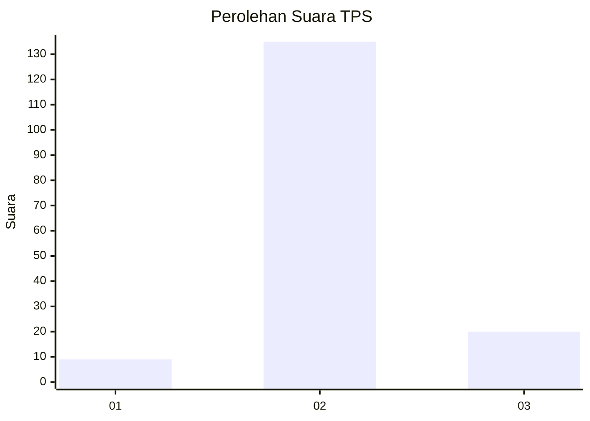
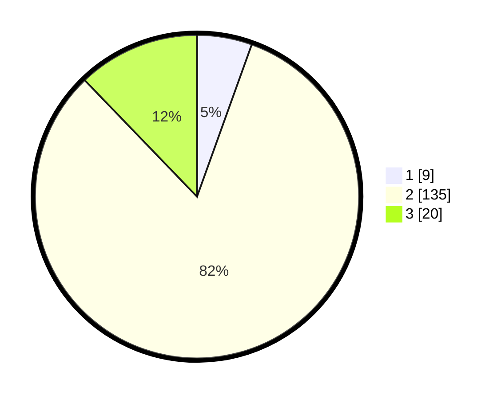

# Hasil

## Grafik

## Tabel

| No. | Nama Paslon    | Suara | Suara (raw) | Persentase |
|:--- |:-------------- | -----:| -----------:| ----------:|
| 1   | ANIES MUHAIMIN | 9     | [9][p-1]    | 5,49       |
| 2   | PRABOWO GIBRAN | 135   | [135][p-2]  | 82,32      |
| 3   | GANJAR MAHFUD  | 20    | [20][p-3]   | 12,20      |

[p-1]: https://github.com/gigit-pemilu/pemilu-2024/blob/main/pilpres/hitung-suara/sub/35-jawa-timur/sub/04-tulungagung/sub/15-besuki/sub/2001-besole/sub/024-tps/sub/paslon-1.txt
[p-2]: https://github.com/gigit-pemilu/pemilu-2024/blob/main/pilpres/hitung-suara/sub/35-jawa-timur/sub/04-tulungagung/sub/15-besuki/sub/2001-besole/sub/024-tps/sub/paslon-2.txt
[p-3]: https://github.com/gigit-pemilu/pemilu-2024/blob/main/pilpres/hitung-suara/sub/35-jawa-timur/sub/04-tulungagung/sub/15-besuki/sub/2001-besole/sub/024-tps/sub/paslon-3.txt

## Foto C Plano

https://sirekap-obj-formc.kpu.go.id/6447/pemilu/ppwp/35/04/15/20/01/3504152001024-20240214-141103--de18082a-6fb1-44a7-ab82-3d3ba4eadd32.jpg

https://sirekap-obj-formc.kpu.go.id/6447/pemilu/ppwp/35/04/15/20/01/3504152001024-20240214-141142--d56647b5-717b-47d3-8952-d939f351d396.jpg

https://sirekap-obj-formc.kpu.go.id/6447/pemilu/ppwp/35/04/15/20/01/3504152001024-20240214-212202--d6b59feb-ac54-4e24-b104-0029b27e7635.jpg

## Metadata

| Key        | Value               |
| ---------- | ------------------- |
| Time Stamp | 2024-02-19 06:16:00 |

