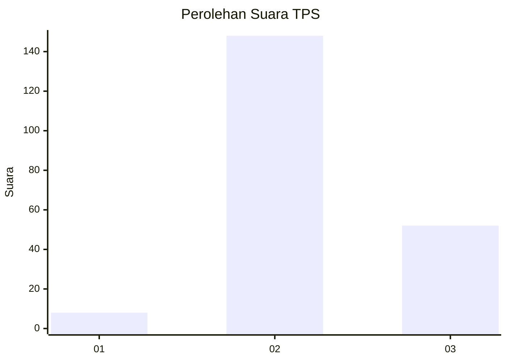
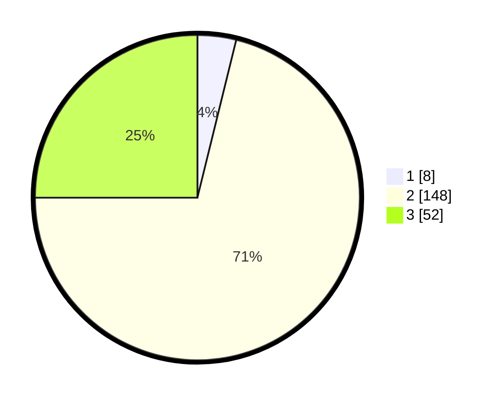

# Hasil

## Grafik

## Tabel

| No. | Nama Paslon    | Suara | Suara (raw) | Persentase |
|:--- |:-------------- | -----:| -----------:| ----------:|
| 1   | ANIES MUHAIMIN | 8     | [8][p-1]    | 3,85       |
| 2   | PRABOWO GIBRAN | 148   | [148][p-2]  | 71,15      |
| 3   | GANJAR MAHFUD  | 52    | [52][p-3]   | 25,00      |

[p-1]: https://github.com/gigit-pemilu/pemilu-2024-35-jawa-timur/blob/main/pilpres/hitung-suara/sub/35-jawa-timur/sub/04-tulungagung/sub/15-besuki/sub/2001-besole/sub/032-tps/sub/paslon-1.txt
[p-2]: https://github.com/gigit-pemilu/pemilu-2024-35-jawa-timur/blob/main/pilpres/hitung-suara/sub/35-jawa-timur/sub/04-tulungagung/sub/15-besuki/sub/2001-besole/sub/032-tps/sub/paslon-2.txt
[p-3]: https://github.com/gigit-pemilu/pemilu-2024-35-jawa-timur/blob/main/pilpres/hitung-suara/sub/35-jawa-timur/sub/04-tulungagung/sub/15-besuki/sub/2001-besole/sub/032-tps/sub/paslon-3.txt

## Foto C Plano

https://sirekap-obj-formc.kpu.go.id/55e4/pemilu/ppwp/35/04/15/20/01/3504152001032-20240214-230855--20c2fc41-1382-4cf6-971a-475c9920cfb8.jpg

https://sirekap-obj-formc.kpu.go.id/55e4/pemilu/ppwp/35/04/15/20/01/3504152001032-20240214-231008--02658ad1-d721-4a68-b284-5a0fdd6d1da0.jpg

https://sirekap-obj-formc.kpu.go.id/55e4/pemilu/ppwp/35/04/15/20/01/3504152001032-20240214-231148--cc8eddf1-5863-4b62-9a56-00c40bd252f0.jpg

## Metadata

| Key        | Value               |
| ---------- | ------------------- |
| Time Stamp | 2024-02-15 15:00:29 |

