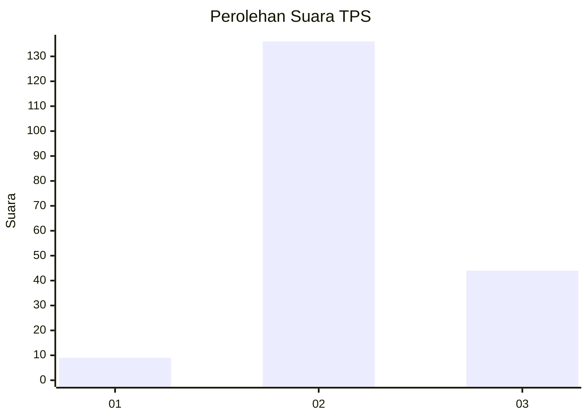
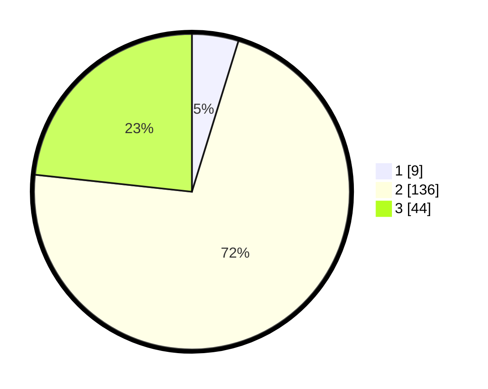

# Hasil

## Grafik

## Tabel

| No. | Nama Paslon    | Suara | Suara (raw) | Persentase |
|:--- |:-------------- | -----:| -----------:| ----------:|
| 1   | ANIES MUHAIMIN | 9     | [9][p-1]    | 4,76       |
| 2   | PRABOWO GIBRAN | 136   | [136][p-2]  | 71,96      |
| 3   | GANJAR MAHFUD  | 44    | [44][p-3]   | 23,28      |

[p-1]: https://github.com/gigit-pemilu/pemilu-2024-35-jawa-timur/blob/main/pilpres/hitung-suara/sub/35-jawa-timur/sub/04-tulungagung/sub/15-besuki/sub/2001-besole/sub/033-tps/sub/paslon-1.txt
[p-2]: https://github.com/gigit-pemilu/pemilu-2024-35-jawa-timur/blob/main/pilpres/hitung-suara/sub/35-jawa-timur/sub/04-tulungagung/sub/15-besuki/sub/2001-besole/sub/033-tps/sub/paslon-2.txt
[p-3]: https://github.com/gigit-pemilu/pemilu-2024-35-jawa-timur/blob/main/pilpres/hitung-suara/sub/35-jawa-timur/sub/04-tulungagung/sub/15-besuki/sub/2001-besole/sub/033-tps/sub/paslon-3.txt

## Foto C Plano

https://sirekap-obj-formc.kpu.go.id/a0bb/pemilu/ppwp/35/04/15/20/01/3504152001033-20240215-014000--61e09f9e-2826-477a-9889-8b78448d38a3.jpg

https://sirekap-obj-formc.kpu.go.id/a0bb/pemilu/ppwp/35/04/15/20/01/3504152001033-20240215-014330--117933e0-b885-42cd-9e06-1bbd38237a59.jpg

https://sirekap-obj-formc.kpu.go.id/a0bb/pemilu/ppwp/35/04/15/20/01/3504152001033-20240215-014429--ee69996a-3943-44bd-bb94-0b8adba69a2c.jpg

## Metadata

| Key        | Value               |
| ---------- | ------------------- |
| Time Stamp | 2024-02-19 06:16:00 |

