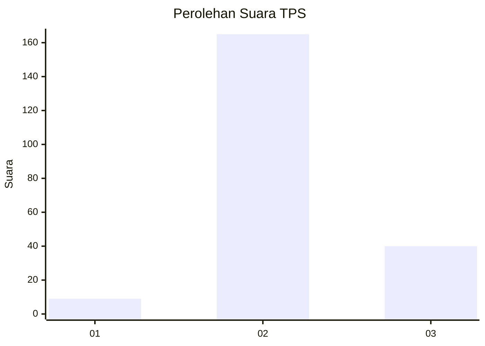
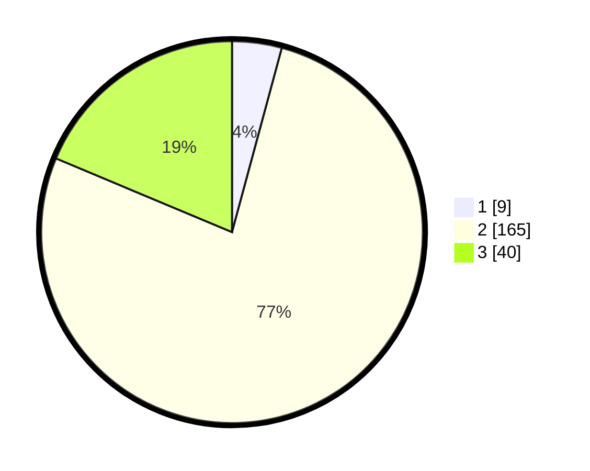

# Hasil

## Grafik

## Tabel

| No. | Nama Paslon    | Suara | Suara (raw) | Persentase |
|:--- |:-------------- | -----:| -----------:| ----------:|
| 1   | ANIES MUHAIMIN | 9     | [9][p-1]    | 4,21       |
| 2   | PRABOWO GIBRAN | 165   | [165][p-2]  | 77,10      |
| 3   | GANJAR MAHFUD  | 40    | [40][p-3]   | 18,69      |

[p-1]: https://github.com/gigit-pemilu/pemilu-2024-35-jawa-timur/blob/main/pilpres/hitung-suara/sub/35-jawa-timur/sub/04-tulungagung/sub/15-besuki/sub/2002-tanggulwelahan/sub/002-tps/sub/paslon-1.txt
[p-2]: https://github.com/gigit-pemilu/pemilu-2024-35-jawa-timur/blob/main/pilpres/hitung-suara/sub/35-jawa-timur/sub/04-tulungagung/sub/15-besuki/sub/2002-tanggulwelahan/sub/002-tps/sub/paslon-2.txt
[p-3]: https://github.com/gigit-pemilu/pemilu-2024-35-jawa-timur/blob/main/pilpres/hitung-suara/sub/35-jawa-timur/sub/04-tulungagung/sub/15-besuki/sub/2002-tanggulwelahan/sub/002-tps/sub/paslon-3.txt

## Foto C Plano

https://sirekap-obj-formc.kpu.go.id/35bd/pemilu/ppwp/35/04/15/20/02/3504152002002-20240214-213306--2145dbe2-45f2-4112-ad31-6ec9860d082f.jpg

https://sirekap-obj-formc.kpu.go.id/35bd/pemilu/ppwp/35/04/15/20/02/3504152002002-20240214-213558--9924a049-9e2f-43a3-a949-3b6bd69e6a87.jpg

https://sirekap-obj-formc.kpu.go.id/35bd/pemilu/ppwp/35/04/15/20/02/3504152002002-20240214-213801--6635f2dd-166a-4367-a128-8be8e17e9daf.jpg

## Metadata

| Key        | Value               |
| ---------- | ------------------- |
| Time Stamp | 2024-02-19 06:16:00 |

