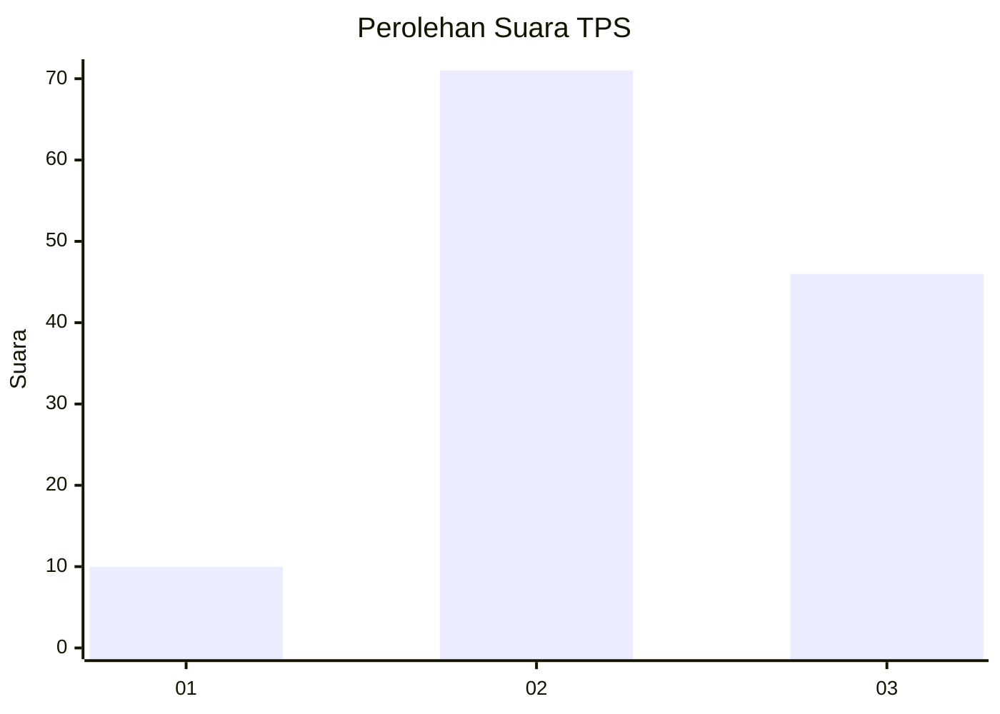
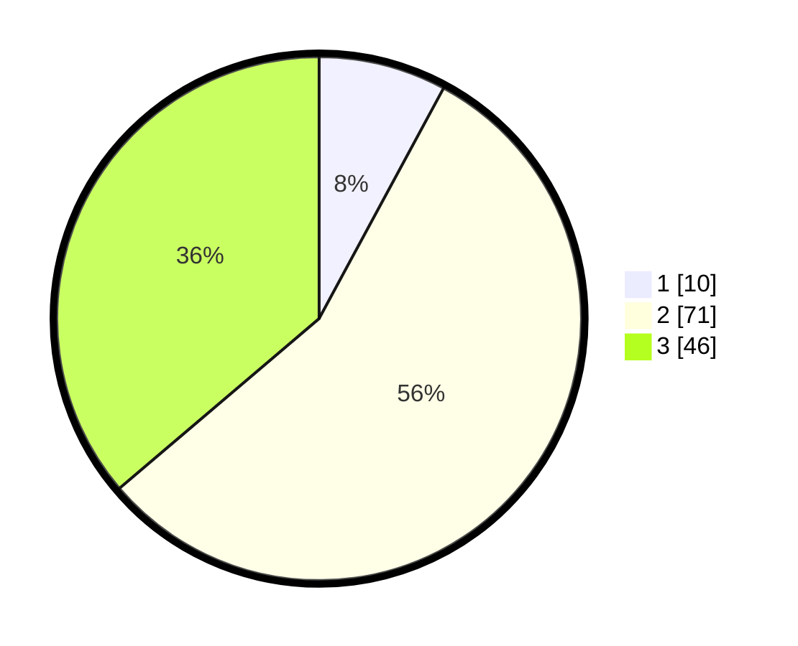

# Hasil

## Grafik

## Tabel

| No. | Nama Paslon    | Suara | Suara (raw) | Persentase |
|:--- |:-------------- | -----:| -----------:| ----------:|
| 1   | ANIES MUHAIMIN | 10    | [10][p-1]   | 7,87       |
| 2   | PRABOWO GIBRAN | 71    | [71][p-2]   | 55,91      |
| 3   | GANJAR MAHFUD  | 46    | [46][p-3]   | 36,22      |

[p-1]: https://github.com/gigit-pemilu/pemilu-2024/blob/main/pilpres/hitung-suara/sub/35-jawa-timur/sub/04-tulungagung/sub/15-besuki/sub/2002-tanggulwelahan/sub/005-tps/sub/paslon-1.txt
[p-2]: https://github.com/gigit-pemilu/pemilu-2024/blob/main/pilpres/hitung-suara/sub/35-jawa-timur/sub/04-tulungagung/sub/15-besuki/sub/2002-tanggulwelahan/sub/005-tps/sub/paslon-2.txt
[p-3]: https://github.com/gigit-pemilu/pemilu-2024/blob/main/pilpres/hitung-suara/sub/35-jawa-timur/sub/04-tulungagung/sub/15-besuki/sub/2002-tanggulwelahan/sub/005-tps/sub/paslon-3.txt

## Foto C Plano

https://sirekap-obj-formc.kpu.go.id/3f33/pemilu/ppwp/35/04/15/20/02/3504152002005-20240214-223636--c4629741-4fbc-461d-b925-3b4e29322423.jpg

https://sirekap-obj-formc.kpu.go.id/3f33/pemilu/ppwp/35/04/15/20/02/3504152002005-20240214-223752--d3633f98-ce9f-439f-89c6-e424a1ff3f05.jpg

https://sirekap-obj-formc.kpu.go.id/3f33/pemilu/ppwp/35/04/15/20/02/3504152002005-20240214-223921--54e19c6b-962d-45a6-bfb8-69dc143156f9.jpg

## Metadata

| Key        | Value               |
| ---------- | ------------------- |
| Time Stamp | 2024-02-19 06:16:00 |

