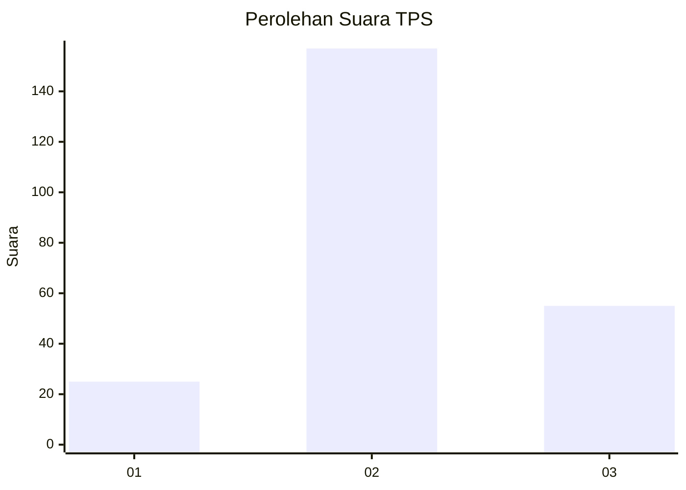
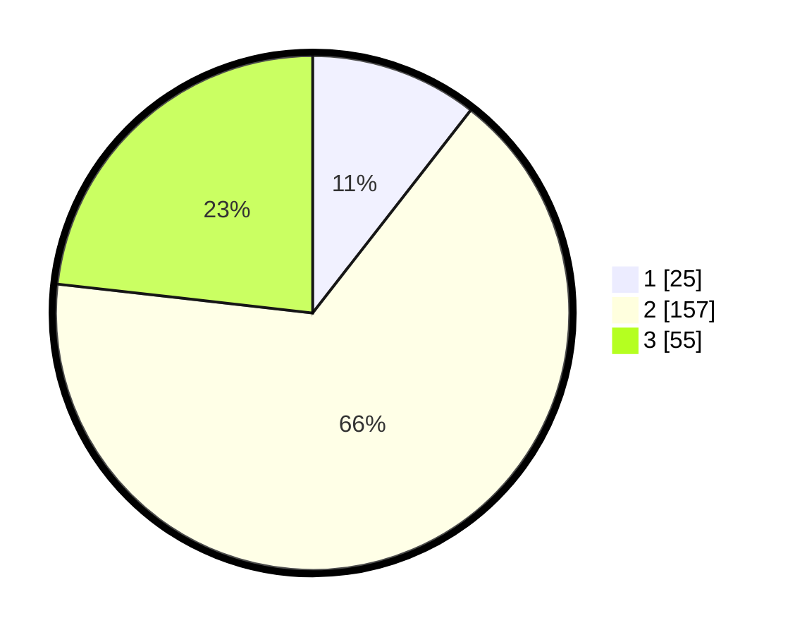

# Hasil

## Grafik

## Tabel

| No. | Nama Paslon    | Suara | Suara (raw) | Persentase |
|:--- |:-------------- | -----:| -----------:| ----------:|
| 1   | ANIES MUHAIMIN | 25    | [25][p-1]   | 10,55      |
| 2   | PRABOWO GIBRAN | 157   | [157][p-2]  | 66,24      |
| 3   | GANJAR MAHFUD  | 55    | [55][p-3]   | 23,21      |

[p-1]: https://github.com/gigit-pemilu/pemilu-2024/blob/main/pilpres/hitung-suara/sub/35-jawa-timur/sub/04-tulungagung/sub/15-besuki/sub/2003-besuki/sub/004-tps/sub/paslon-1.txt
[p-2]: https://github.com/gigit-pemilu/pemilu-2024/blob/main/pilpres/hitung-suara/sub/35-jawa-timur/sub/04-tulungagung/sub/15-besuki/sub/2003-besuki/sub/004-tps/sub/paslon-2.txt
[p-3]: https://github.com/gigit-pemilu/pemilu-2024/blob/main/pilpres/hitung-suara/sub/35-jawa-timur/sub/04-tulungagung/sub/15-besuki/sub/2003-besuki/sub/004-tps/sub/paslon-3.txt

## Foto C Plano

https://sirekap-obj-formc.kpu.go.id/86d9/pemilu/ppwp/35/04/15/20/03/3504152003004-20240214-221115--3e79c1cb-ef69-4d82-995f-ed3a752e87e3.jpg

https://sirekap-obj-formc.kpu.go.id/86d9/pemilu/ppwp/35/04/15/20/03/3504152003004-20240215-015453--3fc2f1e4-1788-4bde-a2ed-21a816782d1d.jpg

https://sirekap-obj-formc.kpu.go.id/86d9/pemilu/ppwp/35/04/15/20/03/3504152003004-20240215-024236--d6b9da13-1bbe-40a1-a62d-5d6a91223e16.jpg

## Metadata

| Key        | Value               |
| ---------- | ------------------- |
| Time Stamp | 2024-02-15 18:30:25 |

