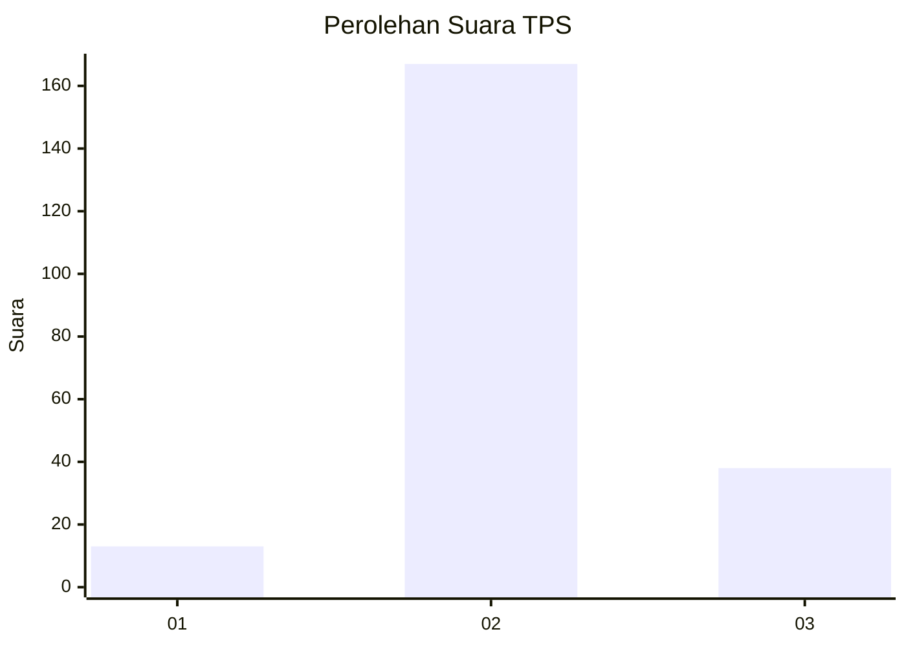

# Hasil

## Grafik

## Tabel

| No. | Nama Paslon    | Suara | Suara (raw) | Persentase |
|:--- |:-------------- | -----:| -----------:| ----------:|
| 1   | ANIES MUHAIMIN | 13    | [13][p-1]   | 5,96       |
| 2   | PRABOWO GIBRAN | 167   | [167][p-2]  | 76,61      |
| 3   | GANJAR MAHFUD  | 38    | [38][p-3]   | 17,43      |

[p-1]: https://github.com/gigit-pemilu/pemilu-2024/blob/main/pilpres/hitung-suara/sub/35-jawa-timur/sub/04-tulungagung/sub/15-besuki/sub/2004-keboireng/sub/005-tps/sub/paslon-1.txt
[p-2]: https://github.com/gigit-pemilu/pemilu-2024/blob/main/pilpres/hitung-suara/sub/35-jawa-timur/sub/04-tulungagung/sub/15-besuki/sub/2004-keboireng/sub/005-tps/sub/paslon-2.txt
[p-3]: https://github.com/gigit-pemilu/pemilu-2024/blob/main/pilpres/hitung-suara/sub/35-jawa-timur/sub/04-tulungagung/sub/15-besuki/sub/2004-keboireng/sub/005-tps/sub/paslon-3.txt

## Foto C Plano

https://sirekap-obj-formc.kpu.go.id/2b29/pemilu/ppwp/35/04/15/20/04/3504152004005-20240214-141851--c2f93add-0717-493e-a630-af3f0bcf254c.jpg

https://sirekap-obj-formc.kpu.go.id/2b29/pemilu/ppwp/35/04/15/20/04/3504152004005-20240214-141937--c8181bee-10cc-4546-8a41-ef9540f75d5e.jpg

https://sirekap-obj-formc.kpu.go.id/2b29/pemilu/ppwp/35/04/15/20/04/3504152004005-20240216-170332--bae133e5-28db-4d83-bc47-cb6c6541d5ec.jpg

## Metadata

| Key        | Value               |
| ---------- | ------------------- |
| Time Stamp | 2024-02-16 17:30:00 |

