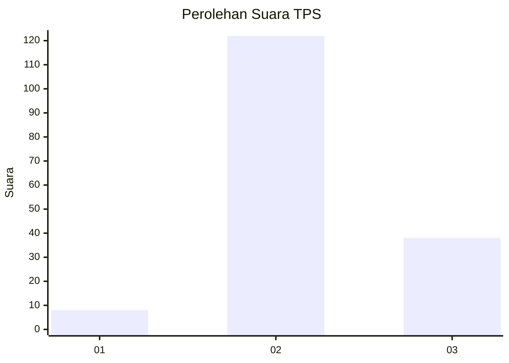
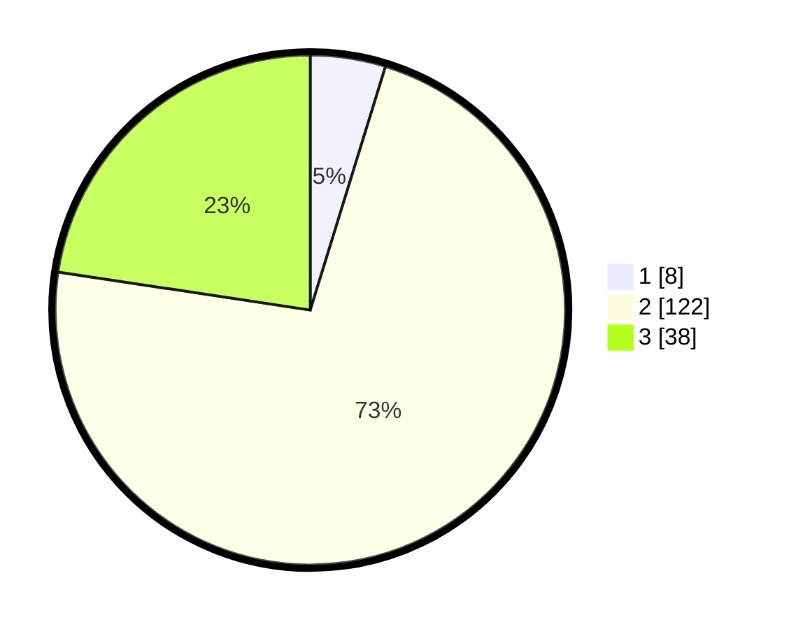

# Hasil

## Grafik

## Tabel

| No. | Nama Paslon    | Suara | Suara (raw) | Persentase |
|:--- |:-------------- | -----:| -----------:| ----------:|
| 1   | ANIES MUHAIMIN | 8     | [8][p-1]    | 4,76       |
| 2   | PRABOWO GIBRAN | 122   | [122][p-2]  | 72,62      |
| 3   | GANJAR MAHFUD  | 38    | [38][p-3]   | 22,62      |

[p-1]: https://github.com/gigit-pemilu/pemilu-2024-35-jawa-timur/blob/main/pilpres/hitung-suara/sub/35-jawa-timur/sub/04-tulungagung/sub/15-besuki/sub/2005-tanggulturus/sub/004-tps/sub/paslon-1.txt
[p-2]: https://github.com/gigit-pemilu/pemilu-2024-35-jawa-timur/blob/main/pilpres/hitung-suara/sub/35-jawa-timur/sub/04-tulungagung/sub/15-besuki/sub/2005-tanggulturus/sub/004-tps/sub/paslon-2.txt
[p-3]: https://github.com/gigit-pemilu/pemilu-2024-35-jawa-timur/blob/main/pilpres/hitung-suara/sub/35-jawa-timur/sub/04-tulungagung/sub/15-besuki/sub/2005-tanggulturus/sub/004-tps/sub/paslon-3.txt

## Foto C Plano

https://sirekap-obj-formc.kpu.go.id/4275/pemilu/ppwp/35/04/15/20/05/3504152005004-20240214-223628--ca914e42-5dbc-425d-9c91-289b446939b5.jpg

https://sirekap-obj-formc.kpu.go.id/4275/pemilu/ppwp/35/04/15/20/05/3504152005004-20240214-202407--200ea25d-8382-4fa5-8849-6a3044843a24.jpg

https://sirekap-obj-formc.kpu.go.id/4275/pemilu/ppwp/35/04/15/20/05/3504152005004-20240214-212105--382030d3-deb1-459c-8200-bb795ccd74d2.jpg

## Metadata

| Key        | Value               |
| ---------- | ------------------- |
| Time Stamp | 2024-02-15 00:41:44 |

