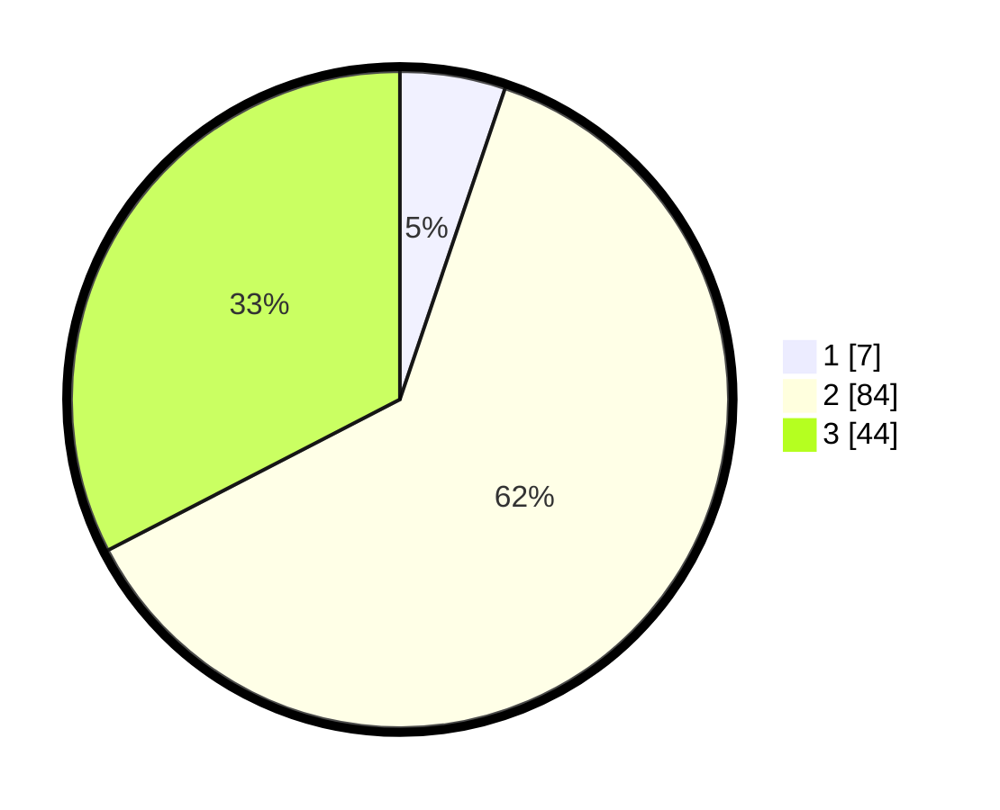

# Hasil

## Grafik

## Tabel

| No. | Nama Paslon    | Suara | Suara (raw) | Persentase |
|:--- |:-------------- | -----:| -----------:| ----------:|
| 1   | ANIES MUHAIMIN | 7     | [7][p-1]    | 5,19       |
| 2   | PRABOWO GIBRAN | 84    | [84][p-2]   | 62,22      |
| 3   | GANJAR MAHFUD  | 44    | [44][p-3]   | 32,59      |

[p-1]: https://github.com/gigit-pemilu/pemilu-2024/blob/main/pilpres/hitung-suara/sub/35-jawa-timur/sub/04-tulungagung/sub/15-besuki/sub/2005-tanggulturus/sub/007-tps/sub/paslon-1.txt
[p-2]: https://github.com/gigit-pemilu/pemilu-2024/blob/main/pilpres/hitung-suara/sub/35-jawa-timur/sub/04-tulungagung/sub/15-besuki/sub/2005-tanggulturus/sub/007-tps/sub/paslon-2.txt
[p-3]: https://github.com/gigit-pemilu/pemilu-2024/blob/main/pilpres/hitung-suara/sub/35-jawa-timur/sub/04-tulungagung/sub/15-besuki/sub/2005-tanggulturus/sub/007-tps/sub/paslon-3.txt

## Foto C Plano

https://sirekap-obj-formc.kpu.go.id/50a6/pemilu/ppwp/35/04/15/20/05/3504152005007-20240214-211201--796b8f3c-c7ce-40c7-874d-1824eebe9829.jpg

https://sirekap-obj-formc.kpu.go.id/50a6/pemilu/ppwp/35/04/15/20/05/3504152005007-20240214-212837--5d560809-b440-4d20-962d-aaa55ccc336f.jpg

https://sirekap-obj-formc.kpu.go.id/50a6/pemilu/ppwp/35/04/15/20/05/3504152005007-20240214-212613--d34834e8-a8d2-46c5-89aa-64a4ebab0a73.jpg

## Metadata

| Key        | Value               |
| ---------- | ------------------- |
| Time Stamp | 2024-02-19 06:16:00 |

