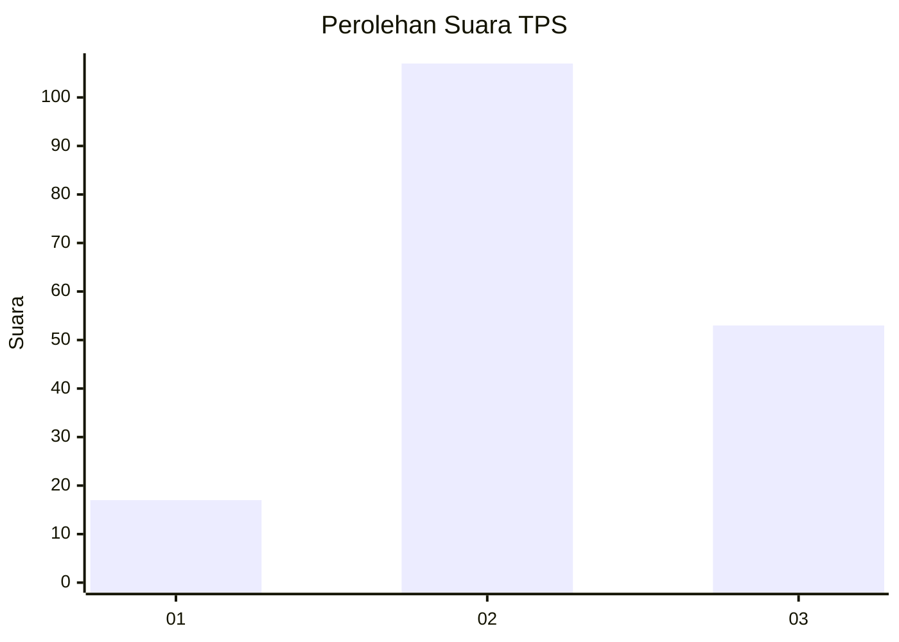
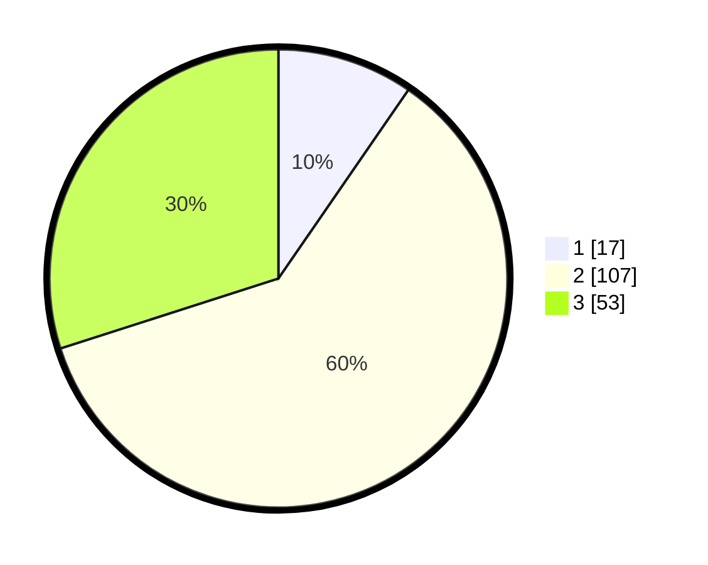

# Hasil

## Grafik

## Tabel

| No. | Nama Paslon    | Suara | Suara (raw) | Persentase |
|:--- |:-------------- | -----:| -----------:| ----------:|
| 1   | ANIES MUHAIMIN | 17    | [17][p-1]   | 9,60       |
| 2   | PRABOWO GIBRAN | 107   | [107][p-2]  | 60,45      |
| 3   | GANJAR MAHFUD  | 53    | [53][p-3]   | 29,94      |

[p-1]: https://github.com/gigit-pemilu/pemilu-2024-35-jawa-timur/blob/main/pilpres/hitung-suara/sub/35-jawa-timur/sub/04-tulungagung/sub/15-besuki/sub/2006-sedayugunung/sub/002-tps/sub/paslon-1.txt
[p-2]: https://github.com/gigit-pemilu/pemilu-2024-35-jawa-timur/blob/main/pilpres/hitung-suara/sub/35-jawa-timur/sub/04-tulungagung/sub/15-besuki/sub/2006-sedayugunung/sub/002-tps/sub/paslon-2.txt
[p-3]: https://github.com/gigit-pemilu/pemilu-2024-35-jawa-timur/blob/main/pilpres/hitung-suara/sub/35-jawa-timur/sub/04-tulungagung/sub/15-besuki/sub/2006-sedayugunung/sub/002-tps/sub/paslon-3.txt

## Foto C Plano

https://sirekap-obj-formc.kpu.go.id/fe62/pemilu/ppwp/35/04/15/20/06/3504152006002-20240214-224934--948567e1-ae2a-4b31-895b-edb7b1dda9b2.jpg

https://sirekap-obj-formc.kpu.go.id/fe62/pemilu/ppwp/35/04/15/20/06/3504152006002-20240214-225127--b37f5cd9-8734-4127-a2cf-467994548680.jpg

https://sirekap-obj-formc.kpu.go.id/fe62/pemilu/ppwp/35/04/15/20/06/3504152006002-20240214-225240--06619dd0-106c-4c04-b48e-53d8c012435b.jpg

## Metadata

| Key        | Value               |
| ---------- | ------------------- |
| Time Stamp | 2024-02-19 06:16:00 |

