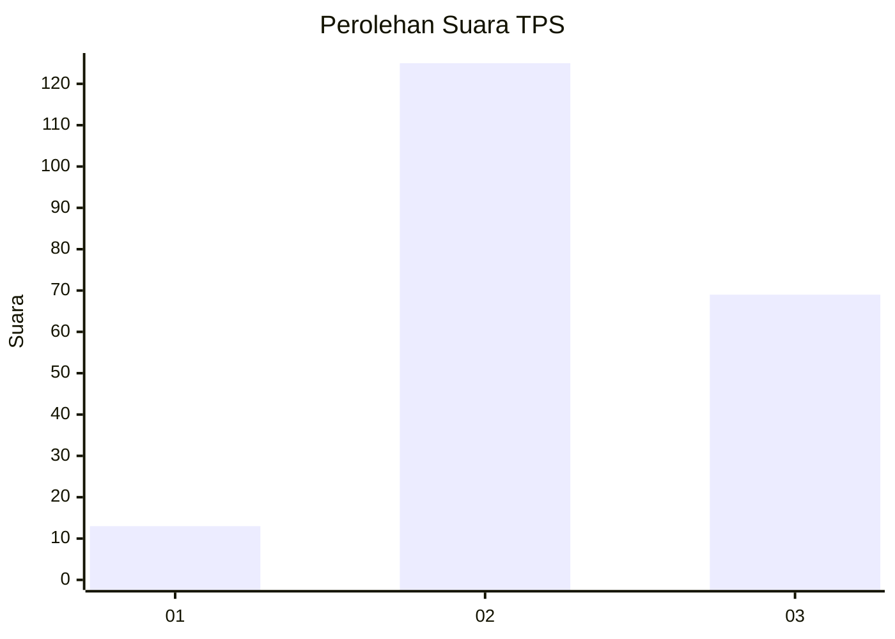
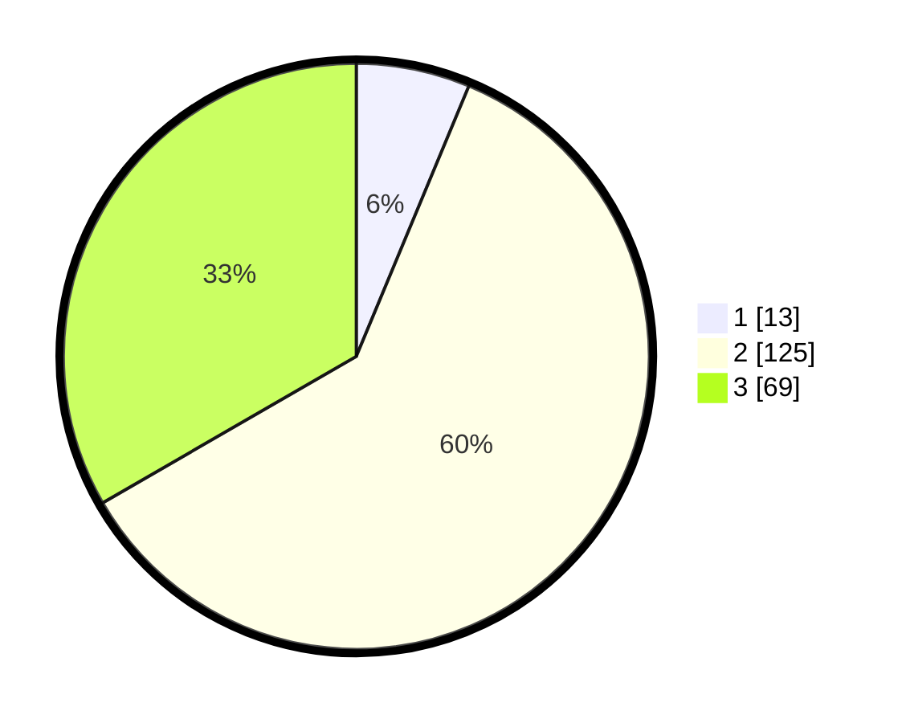

# Hasil

## Grafik

## Tabel

| No. | Nama Paslon    | Suara | Suara (raw) | Persentase |
|:--- |:-------------- | -----:| -----------:| ----------:|
| 1   | ANIES MUHAIMIN | 13    | [13][p-1]   | 6,28       |
| 2   | PRABOWO GIBRAN | 125   | [125][p-2]  | 60,39      |
| 3   | GANJAR MAHFUD  | 69    | [69][p-3]   | 33,33      |

[p-1]: https://github.com/gigit-pemilu/pemilu-2024/blob/main/pilpres/hitung-suara/sub/35-jawa-timur/sub/04-tulungagung/sub/15-besuki/sub/2006-sedayugunung/sub/003-tps/sub/paslon-1.txt
[p-2]: https://github.com/gigit-pemilu/pemilu-2024/blob/main/pilpres/hitung-suara/sub/35-jawa-timur/sub/04-tulungagung/sub/15-besuki/sub/2006-sedayugunung/sub/003-tps/sub/paslon-2.txt
[p-3]: https://github.com/gigit-pemilu/pemilu-2024/blob/main/pilpres/hitung-suara/sub/35-jawa-timur/sub/04-tulungagung/sub/15-besuki/sub/2006-sedayugunung/sub/003-tps/sub/paslon-3.txt

## Foto C Plano

https://sirekap-obj-formc.kpu.go.id/0704/pemilu/ppwp/35/04/15/20/06/3504152006003-20240214-225756--75df0657-6098-41a2-a6ca-a69dcd714819.jpg

https://sirekap-obj-formc.kpu.go.id/0704/pemilu/ppwp/35/04/15/20/06/3504152006003-20240214-211926--67bc0b11-1cd9-4079-9fe3-bdebf98a9953.jpg

https://sirekap-obj-formc.kpu.go.id/0704/pemilu/ppwp/35/04/15/20/06/3504152006003-20240214-214134--dd864dae-2905-4f62-a9f3-c08bf8958f8a.jpg

## Metadata

| Key        | Value               |
| ---------- | ------------------- |
| Time Stamp | 2024-02-15 12:00:28 |

