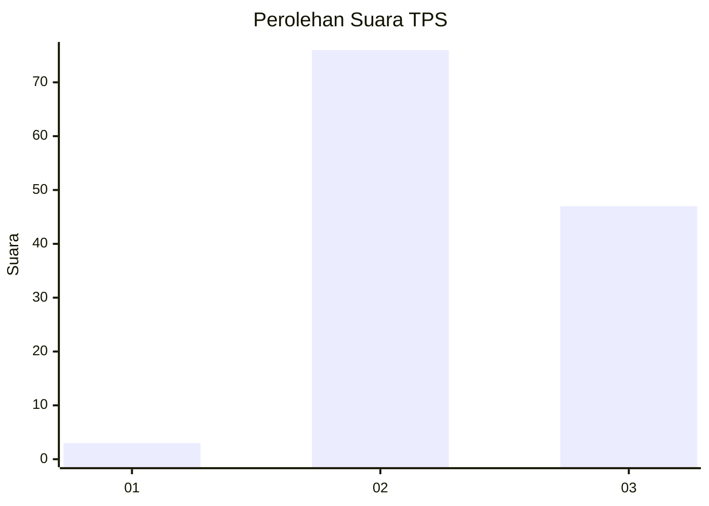
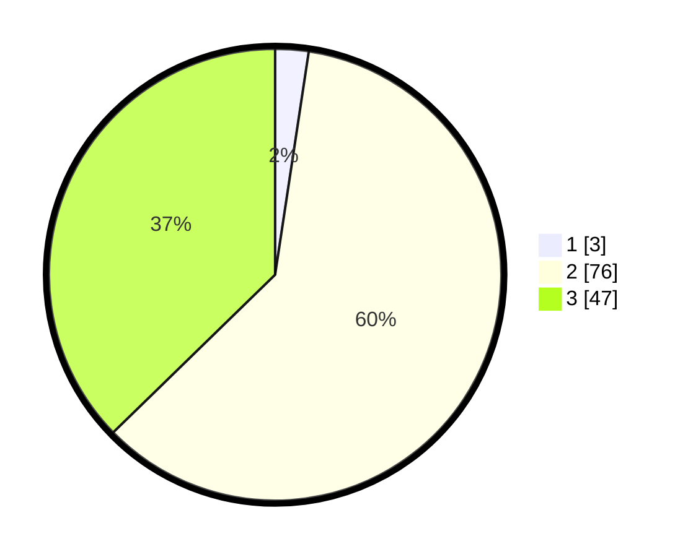

# Hasil

## Grafik

## Tabel

| No. | Nama Paslon    | Suara | Suara (raw) | Persentase |
|:--- |:-------------- | -----:| -----------:| ----------:|
| 1   | ANIES MUHAIMIN | 3     | [3][p-1]    | 2,38       |
| 2   | PRABOWO GIBRAN | 76    | [76][p-2]   | 60,32      |
| 3   | GANJAR MAHFUD  | 47    | [47][p-3]   | 37,30      |

[p-1]: https://github.com/gigit-pemilu/pemilu-2024/blob/main/pilpres/hitung-suara/sub/35-jawa-timur/sub/04-tulungagung/sub/15-besuki/sub/2006-sedayugunung/sub/004-tps/sub/paslon-1.txt
[p-2]: https://github.com/gigit-pemilu/pemilu-2024/blob/main/pilpres/hitung-suara/sub/35-jawa-timur/sub/04-tulungagung/sub/15-besuki/sub/2006-sedayugunung/sub/004-tps/sub/paslon-2.txt
[p-3]: https://github.com/gigit-pemilu/pemilu-2024/blob/main/pilpres/hitung-suara/sub/35-jawa-timur/sub/04-tulungagung/sub/15-besuki/sub/2006-sedayugunung/sub/004-tps/sub/paslon-3.txt

## Foto C Plano

https://sirekap-obj-formc.kpu.go.id/717f/pemilu/ppwp/35/04/15/20/06/3504152006004-20240214-215057--b8f111aa-f0fb-4f5f-af12-ccd535b4ebc3.jpg

https://sirekap-obj-formc.kpu.go.id/717f/pemilu/ppwp/35/04/15/20/06/3504152006004-20240214-214943--9733337a-d358-4c4d-b4ec-83b4d9308dab.jpg

https://sirekap-obj-formc.kpu.go.id/717f/pemilu/ppwp/35/04/15/20/06/3504152006004-20240214-215155--67508f99-3677-43db-b2e4-20e301b03a4e.jpg

## Metadata

| Key        | Value               |
| ---------- | ------------------- |
| Time Stamp | 2024-02-19 06:16:00 |

