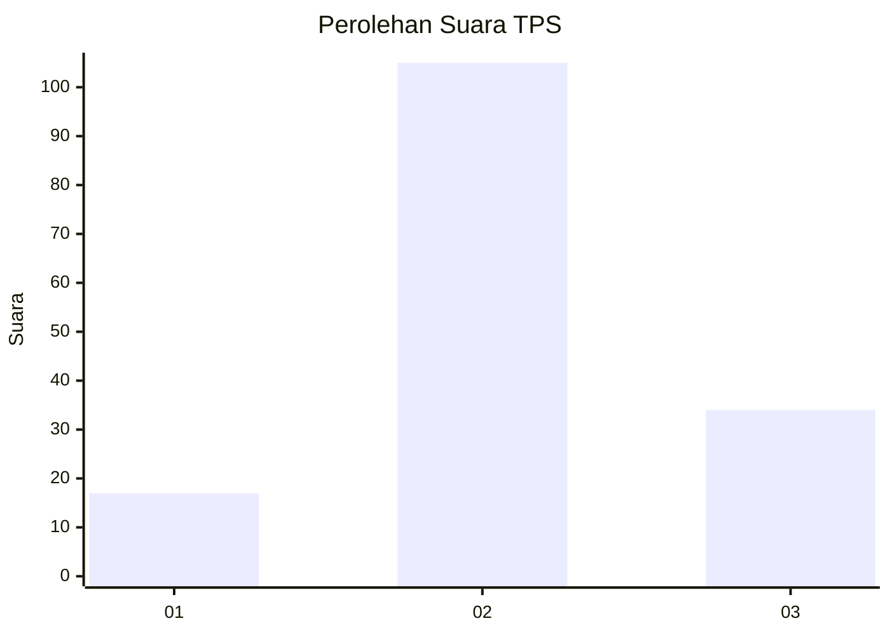
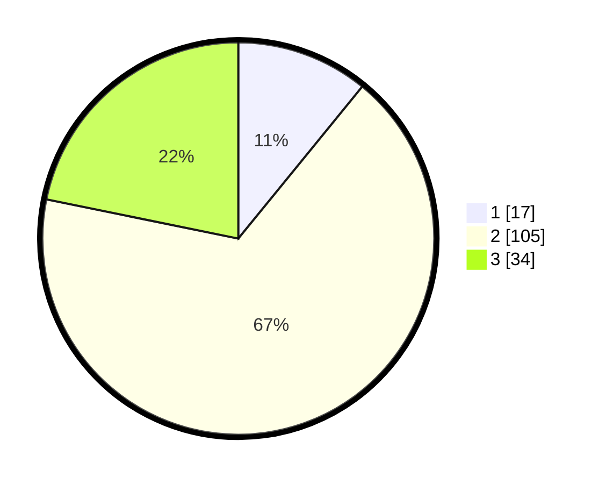

# Hasil

## Grafik

## Tabel

| No. | Nama Paslon    | Suara | Suara (raw) | Persentase |
|:--- |:-------------- | -----:| -----------:| ----------:|
| 1   | ANIES MUHAIMIN | 17    | [17][p-1]   | 10,90      |
| 2   | PRABOWO GIBRAN | 105   | [105][p-2]  | 67,31      |
| 3   | GANJAR MAHFUD  | 34    | [34][p-3]   | 21,79      |

[p-1]: https://github.com/gigit-pemilu/pemilu-2024-35-jawa-timur/blob/main/pilpres/hitung-suara/sub/35-jawa-timur/sub/04-tulungagung/sub/15-besuki/sub/2007-tanggulkundung/sub/012-tps/sub/paslon-1.txt
[p-2]: https://github.com/gigit-pemilu/pemilu-2024-35-jawa-timur/blob/main/pilpres/hitung-suara/sub/35-jawa-timur/sub/04-tulungagung/sub/15-besuki/sub/2007-tanggulkundung/sub/012-tps/sub/paslon-2.txt
[p-3]: https://github.com/gigit-pemilu/pemilu-2024-35-jawa-timur/blob/main/pilpres/hitung-suara/sub/35-jawa-timur/sub/04-tulungagung/sub/15-besuki/sub/2007-tanggulkundung/sub/012-tps/sub/paslon-3.txt

## Foto C Plano

https://sirekap-obj-formc.kpu.go.id/4e77/pemilu/ppwp/35/04/15/20/07/3504152007012-20240215-005746--34b221f9-b46e-40c8-8b89-f23573454532.jpg

https://sirekap-obj-formc.kpu.go.id/4e77/pemilu/ppwp/35/04/15/20/07/3504152007012-20240215-005835--53469e43-4f06-4ff8-8f1e-7a9057cab22b.jpg

https://sirekap-obj-formc.kpu.go.id/4e77/pemilu/ppwp/35/04/15/20/07/3504152007012-20240215-010040--4a9a252b-0c6c-4537-a2d1-41d58b2f3fc1.jpg

## Metadata

| Key        | Value               |
| ---------- | ------------------- |
| Time Stamp | 2024-02-21 18:00:00 |

