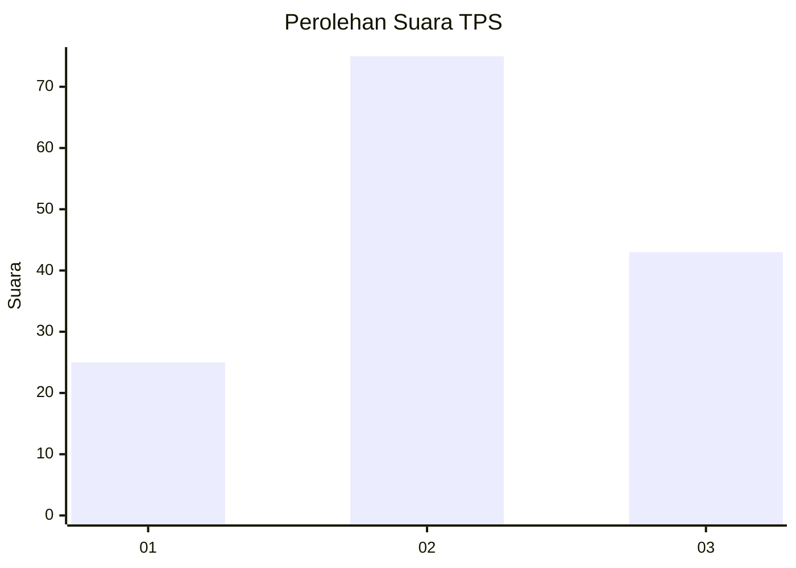
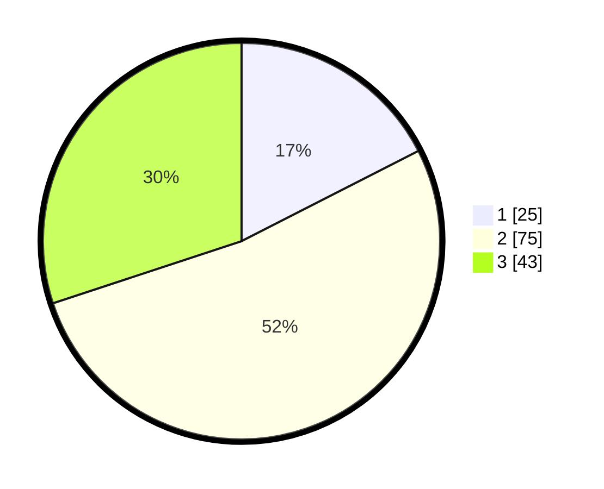

# Hasil

## Grafik

## Tabel

| No. | Nama Paslon    | Suara | Suara (raw) | Persentase |
|:--- |:-------------- | -----:| -----------:| ----------:|
| 1   | ANIES MUHAIMIN | 25    | [25][p-1]   | 17,48      |
| 2   | PRABOWO GIBRAN | 75    | [75][p-2]   | 52,45      |
| 3   | GANJAR MAHFUD  | 43    | [43][p-3]   | 30,07      |

[p-1]: https://github.com/gigit-pemilu/pemilu-2024-35-jawa-timur/blob/main/pilpres/hitung-suara/sub/35-jawa-timur/sub/04-tulungagung/sub/15-besuki/sub/2008-wateskroyo/sub/001-tps/sub/paslon-1.txt
[p-2]: https://github.com/gigit-pemilu/pemilu-2024-35-jawa-timur/blob/main/pilpres/hitung-suara/sub/35-jawa-timur/sub/04-tulungagung/sub/15-besuki/sub/2008-wateskroyo/sub/001-tps/sub/paslon-2.txt
[p-3]: https://github.com/gigit-pemilu/pemilu-2024-35-jawa-timur/blob/main/pilpres/hitung-suara/sub/35-jawa-timur/sub/04-tulungagung/sub/15-besuki/sub/2008-wateskroyo/sub/001-tps/sub/paslon-3.txt

## Foto C Plano

https://sirekap-obj-formc.kpu.go.id/e8f8/pemilu/ppwp/35/04/15/20/08/3504152008001-20240214-195915--9a022a20-7e75-436b-80d6-58c6879f7e9e.jpg

https://sirekap-obj-formc.kpu.go.id/e8f8/pemilu/ppwp/35/04/15/20/08/3504152008001-20240214-203838--b450fdb1-e937-4502-8127-99f36a832d63.jpg

https://sirekap-obj-formc.kpu.go.id/e8f8/pemilu/ppwp/35/04/15/20/08/3504152008001-20240214-232453--063ecc08-c231-4ebf-9423-75014ca83102.jpg

## Metadata

| Key        | Value               |
| ---------- | ------------------- |
| Time Stamp | 2024-02-19 06:16:00 |

