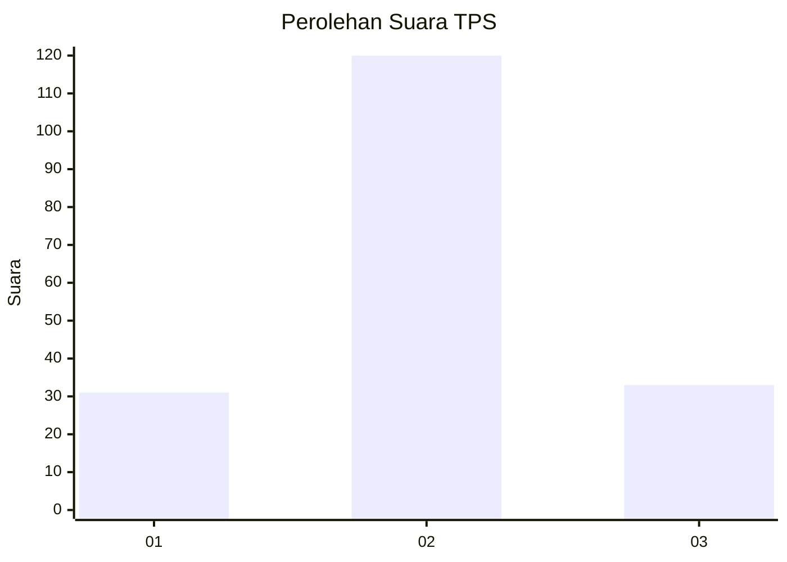
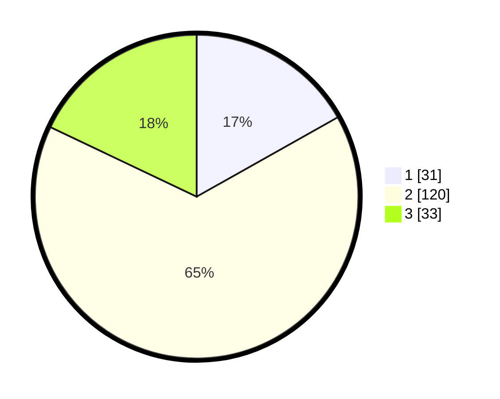

# Hasil

## Grafik

## Tabel

| No. | Nama Paslon    | Suara | Suara (raw) | Persentase |
|:--- |:-------------- | -----:| -----------:| ----------:|
| 1   | ANIES MUHAIMIN | 31    | [31][p-1]   | 16,85      |
| 2   | PRABOWO GIBRAN | 120   | [120][p-2]  | 65,22      |
| 3   | GANJAR MAHFUD  | 33    | [33][p-3]   | 17,93      |

[p-1]: https://github.com/gigit-pemilu/pemilu-2024/blob/main/pilpres/hitung-suara/sub/35-jawa-timur/sub/04-tulungagung/sub/15-besuki/sub/2008-wateskroyo/sub/005-tps/sub/paslon-1.txt
[p-2]: https://github.com/gigit-pemilu/pemilu-2024/blob/main/pilpres/hitung-suara/sub/35-jawa-timur/sub/04-tulungagung/sub/15-besuki/sub/2008-wateskroyo/sub/005-tps/sub/paslon-2.txt
[p-3]: https://github.com/gigit-pemilu/pemilu-2024/blob/main/pilpres/hitung-suara/sub/35-jawa-timur/sub/04-tulungagung/sub/15-besuki/sub/2008-wateskroyo/sub/005-tps/sub/paslon-3.txt

## Foto C Plano

https://sirekap-obj-formc.kpu.go.id/ab1f/pemilu/ppwp/35/04/15/20/08/3504152008005-20240214-193157--2b1c80c0-e16a-4e6d-a07c-98d3e7816fa5.jpg

https://sirekap-obj-formc.kpu.go.id/ab1f/pemilu/ppwp/35/04/15/20/08/3504152008005-20240214-203227--86c1041b-f71e-4364-9faa-cfc3a7b61ec2.jpg

## Metadata

| Key        | Value               |
| ---------- | ------------------- |
| Time Stamp | 2024-02-24 22:31:28 |

